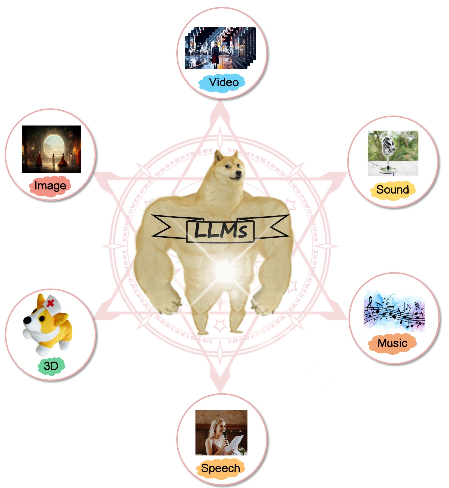

<div align="center">
<h2> LLMs Meet Multimodal Generation and Editing: A Survey </h2> 
<a href='https://arxiv.org/abs/2405.19334'></a>
</div>

# 🤗 Introduction
- This repository contains a curated list of **LLMs meet multimodal generation**. Modalities consist of visual (including image, video and 3D) and audio (including sound, speech and music). 
  <p align="center">
  
</p>

- We welcome any contributions and suggestions to our repository or the addition of your own work. Feel free to make a pull request or leave your comments!!


# 📋 Contents
- [🤗 Introduction](#-introduction)
- [📋 Contents](#-contents)
- [💘 Tips](#-tips)
- [📍 Multimodal Generation](#-multimodal-generation)
  - [Image Generation](#image-generation)
    - [🔅 LLM-based](#-llm-based)
    - [Non-LLM-based (Clip/T5)](#non-llm-based-clipt5)
    - [Datasets](#datasets)
  - [Video Generation](#video-generation)
    - [🔅 LLM-based](#-llm-based-1)
    - [Non-LLM-based](#non-llm-based)
    - [Datasets](#datasets-1)
  - [3D Generation](#3d-generation)
    - [🔅 LLM-based](#-llm-based-2)
    - [Non-LLM-based (Clip/T5)](#non-llm-based-clipt5-1)
    - [Datasets](#datasets-2)
  - [Audio Generation](#audio-generation)
    - [🔅 LLM-based](#-llm-based-3)
    - [Non-LLM-based](#non-llm-based-1)
    - [Datasets](#datasets-3)
  - [Generation with Multiple Modalities](#generation-with-multiple-modalities)
    - [🔅 LLM-based](#-llm-based-4)
    - [Non-LLM-based](#non-llm-based-2)
- [📍 Multimodal Editing](#-multimodal-editing)
  - [Image Editing](#image-editing)
    - [🔅 LLM-based](#-llm-based-5)
    - [Non-LLM-based (Clip/T5)](#non-llm-based-clipt5-2)
  - [Video Editing](#video-editing)
    - [🔅 LLM-based](#-llm-based-6)
    - [Non-LLM-based (Clip/T5)](#non-llm-based-clipt5-3)
  - [3D Editing](#3d-editing)
    - [🔅 LLM-based](#-llm-based-7)
    - [Non-LLM-based (Clip/T5)](#non-llm-based-clipt5-4)
  - [Audio Editing](#audio-editing)
    - [🔅 LLM-based](#-llm-based-8)
    - [Non-LLM-based (Clip/T5)](#non-llm-based-clipt5-5)
- [📍 Multimodal Agents](#-multimodal-agents)
- [📍 Multimodal Understanding with LLMs](#-multimodal-understanding-with-llms)
  - [Multiple modalities](#multiple-modalities)
  - [Image Understanding](#image-understanding)
  - [Video Understanding](#video-understanding)
  - [3D Understanding](#3d-understanding)
  - [Audio Understanding](#audio-understanding)
- [📍 Multimodal LLM Safety](#-multimodal-llm-safety)
  - [Attack](#attack)
  - [Defense and Detect](#defense-and-detect)
  - [Alignment](#alignment)
  - [Datasets](#datasets-4)
  - [3D, Video and Audio Safety](#3d-video-and-audio-safety)
- [📍 Related Surveys](#-related-surveys)
  - [LLM](#llm)
  - [Vision](#vision)
- [👨‍💻 Team](#-team)
- [😉 Citation](#-citation)
- [⭐️ Star History](#️-star-history)


# 💘 Tips
- **✅ Paper searching via catatogue**: directly clicking the content of the catatogue to select the area of your research and browse related papers.
- **✅ Paper searching via author name**: Free feel to search papers of a specific author via `ctrl + F` and then type the author name. The dropdown list of authors will automatically expand when searching.
- **✅ Paper searching via tag**: You can also search the related papers via the following tags: `customization`, `iteractive`, `human motion generation` `tokenizer`. (More tags are ongoing)


# 📍 Multimodal Generation

## Image Generation

### 🔅 LLM-based


+ **Cosmos Tokenizer: A suite of image and video neural tokenizers** (06 Nov 2024)<details><summary>Fitsum Reda, Jinwei Gu, Xian Liu et al.</summary>Fitsum Reda, Jinwei Gu, Xian Liu, Songwei Ge, Ting-Chun Wang, Haoxiang Wang, Ming-Yu Liu</details></details>
[](https://github.com/NVIDIA/Cosmos-Tokenizer?tab=readme-ov-file)
[](https://research.nvidia.com/labs/dir/cosmos-tokenizer/)`tokenizer`


+ **DART: Denoising Autoregressive Transformer for Scalable Text-to-Image Generation** (10 Oct 2024)<details><summary>Jiatao Gu, Yuyang Wang, Yizhe Zhang et al.</summary>Jiatao Gu, Yuyang Wang, Yizhe Zhang, Qihang Zhang, Dinghuai Zhang, Navdeep Jaitly, Josh Susskind, Shuangfei Zhai</details></details>
[](https://arxiv.org/abs/2410.08159)
[](https://www.semanticscholar.org/paper/DART%3A-Denoising-Autoregressive-Transformer-for-Gu-Wang/61bfd967a6ba21e50276e52f353fa74dd68990a6)

+ **OmniTokenizer: A Joint Image-Video Tokenizer for Visual Generation** (13 Jun 2024)<details><summary>Junke Wang, Yi Jiang, Zehuan Yuan et al.</summary>Junke Wang, Yi Jiang, Zehuan Yuan, Binyue Peng, Zuxuan Wu, Yu-Gang Jiang</details></details>
[](https://arxiv.org/abs/2406.09399)
[](https://www.semanticscholar.org/paper/OmniTokenizer%3A-A-Joint-Image-Video-Tokenizer-for-Wang-Jiang/8613c1081a6ab34e2f980e35c06a1af461d7314e)
[](https://github.com/FoundationVision/OmniTokenizer)
`tokenizer`

+ **InstantUnify: Integrates Multimodal LLM into Diffusion Models** (Aug 2024)<details><summary>Qixun Wang, Xu Bai, Rui Wang et al.</summary>Qixun Wang, Xu Bai, Rui Wang, Haofan Wang</details></details>
[](https://github.com/instantX-research/InstantUnify)

+ **Image Textualization: An Automatic Framework for Creating Accurate and Detailed Image Descriptions** (11 Jun 2024)<details><summary>Renjie Pi, Jianshu Zhang, Jipeng Zhang et al.</summary> Renjie Pi, Jianshu Zhang, Jipeng Zhang, Rui Pan, Zhekai Chen, Tong Zhang</details></details>
[](https://arxiv.org/abs/2406.07502)
[](https://www.semanticscholar.org/paper/91b4f447bb06d081a7947b42df57491a04fa46f9)


+ **T2S-GPT: Dynamic Vector Quantization for Autoregressive Sign Language Production from Text** (11 Jun 2024)<details><summary>[ACL 2024] Aoxiong Yin, Haoyuan Li, Kai Shen et al.</summary> Aoxiong Yin, Haoyuan Li, Kai Shen, Siliang Tang, Yueting Zhuang</details></details>
[](https://arxiv.org/abs/2406.07119)
[](https://www.semanticscholar.org/paper/186910d697bf7eb605aa055aee78fd91ce3ce9fe)


+ **Open-World Human-Object Interaction Detection via Multi-modal Prompts** (11 Jun 2024)<details><summary>Jie Yang, Bingliang Li, Ailing Zeng et al.</summary>Jie Yang, Bingliang Li, Ailing Zeng, Lei Zhang, Ruimao Zhang</details></details>
[](https://arxiv.org/abs/2406.07119)
[](https://www.semanticscholar.org/paper/186910d697bf7eb605aa055aee78fd91ce3ce9fe)


+ **Commonsense-T2I Challenge: Can Text-to-Image Generation Models Understand Commonsense?** (11 Jun 2024)<details><summary>Xingyu Fu, Muyu He, Yujie Lu et al.</summary>Xingyu Fu, Muyu He, Yujie Lu, William Yang Wang, Dan Roth</details></details>
[](https://arxiv.org/abs/2406.07221v1)
[](https://www.semanticscholar.org/paper/f0acf2a2293d963c3786e83bb198c75612adc446)


+ **An Image is Worth 32 Tokens for Reconstruction and Generation** (11 Jun 2024)<details><summary>Qihang Yu, Mark Weber, Xueqing Deng et al.</summary> Qihang Yu, Mark Weber, Xueqing Deng, Xiaohui Shen, Daniel Cremers, Liang-Chieh Chen</details></details>
[](https://arxiv.org/abs/2406.07550)
[](https://www.semanticscholar.org/paper/1e31f4a4ccfc0d1e461be05361d77b5e045f4d37)


+ **TRINS: Towards Multimodal Language Models that Can Read** (10 Jun 2024)<details><summary>[CVPR 2024] Ruiyi Zhang, Yanzhe Zhang, Jian Chen et al.</summary> Ruiyi Zhang, Yanzhe Zhang, Jian Chen, Yufan Zhou, Jiuxiang Gu, Changyou Chen, Tong Sun</details></details>
[](https://arxiv.org/abs/2406.06730)
[](https://www.semanticscholar.org/paper/784260e953b2ce34df52086804681e35d57e5843)

+ **[LlamaGen] Autoregressive Model Beats Diffusion: Llama for Scalable Image Generation** (10 Jun 2024)<details><summary>Peize Sun, Yi Jiang, Shoufa Chen et al.</summary>Peize Sun, Yi Jiang, Shoufa Chen, Shilong Zhang, Bingyue Peng, Ping Luo, Zehuan Yuan</details></details>
[](https://arxiv.org/abs/2406.06525)
[](https://www.semanticscholar.org/paper/Autoregressive-Model-Beats-Diffusion%3A-Llama-for-Sun-Jiang/b15e6e2b1d81bc110f8fc98c3caf2e25e2512539)
[](https://github.com/FoundationVision/LlamaGen)


<!-- + **Genie: Generative Interactive Environments** (26 Feb 2024)<details><summary>Jake Bruce, Michael Dennis, Ashley Edwards, et al.</summary> Jake Bruce, Michael Dennis, Ashley Edwards, Jack Parker-Holder, Yuge Shi, Edward Hughes, Matthew Lai, Aditi Mavalankar, Richie Steigerwald, Chris Apps, Yusuf Aytar, Sarah Bechtle, Feryal Behbahani, Stephanie Chan, Nicolas Heess, Lucy Gonzalez, Simon Osindero, Sherjil Ozair, Scott Reed, Jingwei Zhang, Konrad Zolna, Jeff Clune, Nando de Freitas, Satinder Singh, Tim Rocktäschel</details>
[](https://arxiv.org/abs/2402.15391v1) -->

+ **Chameleon: Mixed-Modal Early-Fusion Foundation Models** (16 May 2024)<details><summary>Chameleon Team</details>
[](https://arxiv.org/pdf/2405.09818)
[](https://www.semanticscholar.org/paper/Chameleon%3A-Mixed-Modal-Early-Fusion-Foundation-Team/32112b798f70faab00e14806f51d46058cf5e597?utm_source=direct_link)


+ **Graphic Design with Large Multimodal Model** (22 Apr 2024)<details><summary>Yutao Cheng, Zhao Zhang, Maoke Yang, et al.</summary> Yutao Cheng, Zhao Zhang, Maoke Yang, Hui Nie, Chunyuan Li, Xinglong Wu, and Jie Shao</details>
[](https://arxiv.org/abs/2404.14368)
[](https://www.semanticscholar.org/paper/9259b476c31ba52b7e9ed059e5fbce2125092738)
[](https://github.com/graphic-design-ai/graphist)


+ **PMG : Personalized Multimodal Generation with Large Language Models** (7 Apr 2024)<details><summary>Xiaoteng Shen, Rui Zhang, Xiaoyan Zhao, et al.</summary>Xiaoteng Shen, Rui Zhang, Xiaoyan Zhao, Jieming Zhu, Xi Xiao</details>
[](https://arxiv.org/abs/2404.08677)
[](https://www.semanticscholar.org/paper/PMG-%3A-Personalized-Multimodal-Generation-with-Large-Shen-Zhang/cfb9eba1b5c55bb0052df41eaaff8716f9c420bd)


+ **MineDreamer: Learning to Follow Instructions via Chain-of-Imagination for Simulated-World Control** (19 Mar 2024)<details><summary>Enshen Zhou, Yiran Qin, Zhenfei Yin, et al.</summary>Enshen Zhou, Yiran Qin, Zhenfei Yin, Yuzhou Huang, Ruimao Zhang, Lu Sheng, Yu Qiao, Jing Shao</details>
[](https://arxiv.org/abs/2403.12037)
[](https://www.semanticscholar.org/paper/ae06df762adcc4221162e83a737ea63cff47e65d)
[](https://github.com/Zhoues/MineDreamer)
[](https://sites.google.com/view/minedreamer/main)


+ **ELLA: Equip Diffusion Models with LLM for Enhanced Semantic Alignment** (8 Mar 2024)<details><summary>Xiwei Hu, Rui Wang, Yixiao Fang, et al.</summary> Xiwei Hu, Rui Wang, Yixiao Fang, Bin Fu, Pei Cheng, Gang Yu</details>
[](https://arxiv.org/abs/2403.05135)
[](https://www.semanticscholar.org/paper/da0d382c7fa981ba185ca633868442b75cb76de6)
[](https://github.com/ELLA-Diffusion/ELLA)
[](https://ella-diffusion.github.io/)


+ **StrokeNUWA: Tokenizing Strokes for Vector Graphic Synthesis** (30 Jan 2024)<details><summary>Zecheng Tang, Chenfei Wu, Zekai Zhang, et al.</summary>Zecheng Tang, Chenfei Wu, Zekai Zhang, Mingheng Ni, Shengming Yin, Yu Liu, Zhengyuan Yang, Lijuan Wang, Zicheng Liu, Juntao Li, Nan Duan</details>
[](https://arxiv.org/abs/2401.17093)
[](https://www.semanticscholar.org/paper/StrokeNUWA%3A-Tokenizing-Strokes-for-Vector-Graphic-Tang-Wu/b2f6830afe63eb477294f17f0d3a6923135950f9)
`tokenizer`

+ **DiffusionGPT: LLM-Driven Text-to-Image Generation System** (18 Jan 2024)<details><summary>Jie Qin, Jie Wu, Weifeng Chen, et al.</summary> Jie Qin, Jie Wu, Weifeng Chen, Yuxi Ren, Huixia Li, Hefeng Wu, Xuefeng Xiao, Rui Wang, Shilei Wen</details>
[](https://arxiv.org/abs/2401.10061)
[](https://www.semanticscholar.org/paper/d4b1a1c62a03ccffcf24983eb4fe22335cbb89b6)
[](https://github.com/DiffusionGPT/DiffusionGPT)


+ **StarVector: Generating Scalable Vector Graphics Code from Images** (17 Dec 2023)<details><summary>Juan A. Rodriguez, Shubham Agarwal, Issam H. Laradji, et al.</summary> Juan A. Rodriguez, Shubham Agarwal, Issam H. Laradji, Pau Rodriguez, David Vazquez, Christopher Pal, Marco Pedersoli</details>
[](https://arxiv.org/abs/2312.11556)
[](https://www.semanticscholar.org/paper/60d3ade5c0085f5de1f5ab944cc058c78706ac66)
[](https://github.com/joanrod/star-vector)


+ **VL-GPT: A Generative Pre-trained Transformer for Vision and Language Understanding and Generation** (14 Dec 2023)<details><summary>Jinguo Zhu, Xiaohan Ding, Yixiao Ge, et al.</summary> Jinguo Zhu, Xiaohan Ding, Yixiao Ge, Yuying Ge, Sijie Zhao, Hengshuang Zhao, Xiaohua Wang, Ying Shan</details>
[](https://arxiv.org/abs/2312.09251)
[](https://www.semanticscholar.org/paper/ea6982a936a2b263bbf46ff6eb27fc0b63fddaf7)
[](https://github.com/AILab-CVC/VL-GPT)


+ **StoryGPT-V: Large Language Models as Consistent Story Visualizers** (13 Dec 2023)<details><summary>Xiaoqian Shen, Mohamed Elhoseiny</summary> Xiaoqian Shen, Mohamed Elhoseiny</details>
[](https://arxiv.org/abs/2312.02252)
[](https://www.semanticscholar.org/paper/e49cb2ab3a7990e3d05042197ae8b3fd934453de)


+ **GENIXER: Empowering Multimodal Large Language Models as a Powerful
Data Generator** (11 Dec 2023)<details><summary>Henry Hengyuan Zhao, Pan Zhou, Mike Zheng Shou</summary> Henry Hengyuan Zhao, Pan Zhou, Mike Zheng Shou</details> 
[](https://arxiv.org/abs/2312.06731)
[](https://www.semanticscholar.org/paper/cb2295766b2f8f35524f6a9f93ae39d948d50bd4)


+ **Customization Assistant for Text-to-image Generation** (5 Dec 2023)<details><summary>Yufan Zhou, Ruiyi Zhang, Jiuxiang Gu, et al.</summary> Yufan Zhou, Ruiyi Zhang, Jiuxiang Gu, Tong Sun</details>
[](https://arxiv.org/abs/2312.03045)
[](https://www.semanticscholar.org/paper/f30bb09dbd95845d792bdac217a9a652635ee8a5)`customization`


+ **ChatIllusion: Efficient-Aligning Interleaved Generation ability with Visual Instruction Model** (29 Nov 2023) <details><summary>Xiaowei Chi, Yijiang Liu, Zhengkai Jiang, et al.</summary> Xiaowei Chi, Yijiang Liu, Zhengkai Jiang, Rongyu Zhang, Ziyi Lin, Renrui Zhang, Peng Gao, Chaoyou Fu, Shanghang Zhang, Qifeng Liu, Yike Guo</details>
[](https://arxiv.org/abs/2311.17963)
[](https://www.semanticscholar.org/paper/22d55c52f43f59634586ab95fefbb7dba8c8b190)
[](https://github.com/litwellchi/ChatIllusion)


+ **DreamSync: Aligning Text-to-Image Generation with Image Understanding Feedback** (29 Nov 2023) <details><summary>Jiao Sun, Deqing Fu, Yushi Hu, et al.</summary>Jiao Sun, Deqing Fu, Yushi Hu, Su Wang, Royi Rassin, Da-Cheng Juan, Dana Alon, Charles Herrmann, Sjoerd van Steenkiste, Ranjay Krishna, Cyrus Rashtchian</details>
[](https://arxiv.org/abs/2311.17946)
[](https://www.semanticscholar.org/paper/d16f72b7be526dee5eb49e5afffeea2bddba5e66)


+ **COLE: A Hierarchical Generation Framework for Graphic Design** (28 Nov 2023) <details><summary>Peidong Jia, Chenxuan Li, Zeyu Liu, et al.</summary>Peidong Jia, Chenxuan Li, Zeyu Liu, Yichao Shen, Xingru Chen, Yuhui Yuan, Yinglin Zheng, Dong Chen, Ji Li, Xiaodong Xie, Shanghang Zhang, Baining Guo</details>
[](https://arxiv.org/abs/2311.16974)
[](https://www.semanticscholar.org/paper/8441c30ad4abdca9ee380aa6f22ffd731b10231b)
[](https://graphic-design-generation.github.io/)


+ **TextDiffuser-2: Unleashing the Power of Language Models for Text Rendering** (28 Nov 2023) <details><summary>Jingye Chen, Yupan Huang, Tengchao Lv, et al.</summary>Jingye Chen, Yupan Huang, Tengchao Lv, Lei Cui, Qifeng Chen, Furu Wei</details>
[](https://arxiv.org/abs/2311.16465)
[](https://www.semanticscholar.org/paper/1c6e2a4da1ead685a95c079751bf4d7a727d8180)
[](https://jingyechen.github.io/textdiffuser2/)
[](https://github.com/microsoft/unilm/tree/master/textdiffuser-2)
[](https://huggingface.co/spaces/JingyeChen22/TextDiffuser-2)

+ **LLMGA: Multimodal Large Language Model based Generation Assistant** (27 Nov 2023)<details><summary>Bin Xia, Shiyin Wang, Yingfan Tao, et al.</summary> Bin Xia, Shiyin Wang, Yingfan Tao, Yitong Wang, Jiaya Jia</details>
[](https://arxiv.org/abs/2311.16500)
[](https://www.semanticscholar.org/paper/769a924d0af014acec326f50c15c5d70d258a969)
[](https://github.com/dvlab-research/LLMGA)
[](https://llmga.github.io/)


+ **Self-correcting LLM-controlled Diffusion Models** (27 Nov 2023)<details><summary>Tsung-Han Wu, Long Lian, Joseph E. Gonzalez, et al.</summary> Tsung-Han Wu, Long Lian, Joseph E. Gonzalez, Boyi Li, Trevor Darrell</details>
[](https://arxiv.org/abs/2311.16090)
[](https://www.semanticscholar.org/paper/42c4315b5d2e33d7d9a0afdf84e6a47ccd7a700e)
[](https://github.com/tsunghan-wu/SLD)


+ **Tokenize and Embed ALL for Multi-modal Large Language Models** (8 Nov 2023)<details><summary>Zhen Yang, Yingxue Zhang, Fandong Meng, et al.</summary> Zhen Yang, Yingxue Zhang, Fandong Meng, Jie Zhou</details>
[](https://arxiv.org/abs/2311.04589)
[](https://www.semanticscholar.org/paper/59d716b442ab760a78f58de6748c0fa1d507bfc1)
`tokenizer`


+ **WordArt Designer: User-Driven Artistic Typography Synthesis using Large Language Models** (20 Oct 2023)<details><summary>Jun-Yan He, Zhi-Qi Cheng, Chenyang Li, et al.</summary> Jun-Yan He, Zhi-Qi Cheng, Chenyang Li, Jingdong Sun, Wangmeng Xiang, Xianhui Lin, Xiaoyang Kang, Zengke Jin, Yusen Hu, Bin Luo, Yifeng Geng, Xuansong Xie, Jingren Zhou</details>
[](https://arxiv.org/abs/2310.18332)
[](https://www.semanticscholar.org/paper/58b77dc0603eb52559d98a383bf9649fd31d0bc5)


+ **LLM Blueprint: Enabling Text-to-Image Generation with Complex and Detailed Prompts** (16 Oct 2023)<details><summary>[ICLR 2024] Hanan Gani, Shariq Farooq Bhat, Muzammal Naseer, et al.</summary>Hanan Gani, Shariq Farooq Bhat, Muzammal Naseer, Salman Khan, Peter Wonka</details>
[](https://arxiv.org/abs/2310.10640)
[](https://www.semanticscholar.org/paper/4cb2c262ce34f41974f1b1623fc5a6e32956ded3)
[](https://github.com/hananshafi/llmblueprint)


+ **Making Multimodal Generation Easier: When Diffusion Models Meet LLMs** (13 Oct 2023)<details><summary>Xiangyu Zhao, Bo Liu, Qijiong Liu, et al.</summary>Xiangyu Zhao, Bo Liu, Qijiong Liu, Guangyuan Shi, Xiao-Ming Wu</details>
[](https://arxiv.org/abs/2310.08949v1)
[](https://www.semanticscholar.org/paper/833cdd713c27ab5899bb912a1d511c10af61cefb)
[](https://github.com/zxy556677/EasyGen)


+ **Idea2Img: Iterative Self-Refinement with GPT-4V(ision) for Automatic Image Design and Generation** (12 Oct 2023)<details><summary>Zhengyuan Yang, Jianfeng Wang, Linjie Li, et al.</summary>Zhengyuan Yang, Jianfeng Wang, Linjie Li, Kevin Lin, Chung-Ching Lin, Zicheng Liu, Lijuan Wang</details>
[](https://arxiv.org/abs/2310.08541)
[](https://www.semanticscholar.org/paper/1d14a708622917da4b9820ada6d32af24fc1651a)
[](https://idea2img.github.io/)
[](https://github.com/zyang-ur/Idea2Img)


+ **OpenLEAF: Open-Domain Interleaved Image-Text Generation and Evaluation** (11 Oct 2023)<details><summary>Jie An, Zhengyuan Yang, Linjie Li, et al.</summary>Jie An, Zhengyuan Yang, Linjie Li, Jianfeng Wang, Kevin Lin, Zicheng Liu, Lijuan Wang, Jiebo Luo</details>
[](https://arxiv.org/abs/2310.07749)
[](https://www.semanticscholar.org/paper/7f1ba5630c3baa09b11cc665b3f71cdb117e5ffb)


+ **Mini-DALLE3: Interactive Text to Image by Prompting Large Language Models** (11 Oct 2023)<details><summary>Zeqiang Lai, Xizhou Zhu, Jifeng Dai, et al.</summary>Zeqiang Lai, Xizhou Zhu, Jifeng Dai, Yu Qiao, Wenhai Wang</details>
[](https://arxiv.org/abs/2310.07653)
[](https://www.semanticscholar.org/paper/f669d7a6fab0147253178a6fc854e05e3d92fb3f)
[](https://minidalle3.github.io/)
[](https://github.com/Zeqiang-Lai/Mini-DALLE3)


+ **[DALL-E 3] Improving Image Generation with Better Captions** <details><summary>James Betker, Gabriel Goh, Li Jing, et al.</summary>James Betker, Gabriel Goh, Li Jing, Tim Brooks, Jianfeng Wang, Linjie Li, Long Ouyang, Juntang Zhuang, Joyce Lee, Yufei Guo, Wesam Manassra, Prafulla Dhariwal, Casey Chu, Yunxin Jiao, Aditya Ramesh</details>
[](https://cdn.openai.com/papers/dall-e-3.pdf)
[](https://www.semanticscholar.org/paper/cfee1826dd4743eab44c6e27a0cc5970effa4d80)
[](https://openai.com/dall-e-3)


+ **MiniGPT-5: Interleaved Vision-and-Language Generation via Generative Vokens** (3 Oct 2023)\
Kaizhi Zheng, Xuehai He, Xin Eric Wang.\
[](https://arxiv.org/abs/2310.02239)
[](https://www.semanticscholar.org/paper/e7d09b6f2bc878cf2c993acf675f409d0b55f35a)
[](https://eric-ai-lab.github.io/minigpt-5.github.io/)
[](https://github.com/eric-ai-lab/MiniGPT-5)


+ **Making LLaMA SEE and Draw with SEED Tokenizer** (2 Oct 2023)<details><summary>Yuying Ge, Sijie Zhao, Ziyun Zeng, et al.</summary>Yuying Ge, Sijie Zhao, Ziyun Zeng, Yixiao Ge, Chen Li, Xintao Wang, Ying Shan</details>
[](https://arxiv.org/abs/2310.01218)
[](https://www.semanticscholar.org/paper/5ba1525dc6d382ee0a4a1ca3c64fc5907ca64c67)
[](https://ailab-cvc.github.io/seed/)
[](https://github.com/AILab-CVC/SEED)
[](https://dad1ed9a9fb76fe83b.gradio.live/)
`tokenizer`


+ **InstructCV: Instruction-Tuned Text-to-Image Diffusion Models as Vision Generalists** (30 Sep 2023)<details><summary>Yulu Gan, Sungwoo Park, Alexander Schubert, et al.</summary>Yulu Gan, Sungwoo Park, Alexander Schubert, Anthony Philippakis, Ahmed M. Alaa</details>
[](https://arxiv.org/abs/2310.00390)
[](https://www.semanticscholar.org/paper/819f477065088220a6f706cd9ef76dbcb4b4c134)
[](https://github.com/AlaaLab/InstructCV)
[](https://huggingface.co/spaces/alaa-lab/InstructCV)

+ **InternLM-XComposer: A Vision-Language Large Model for Advanced Text-image Comprehension and Composition** (26 Sep 2023)<details><summary>Pan Zhang, Xiaoyi Dong, Bin Wang, et al.</summary> Pan Zhang, Xiaoyi Dong, Bin Wang, Yuhang Cao, Chao Xu, Linke Ouyang, Zhiyuan Zhao, Haodong Duan, Songyang Zhang, Shuangrui Ding, Wenwei Zhang, Hang Yan, Xinyue Zhang, Wei Li, Jingwen Li, Kai Chen, Conghui He, Xingcheng Zhang, Yu Qiao, Dahua Lin, Jiaqi Wang</details>
[](https://arxiv.org/abs/2309.15112)
[](https://www.semanticscholar.org/paper/c1e450284e7d6cac1855330a1197df8537df653f)
[](https://github.com/InternLM/InternLM-XComposer)


+ **Text-to-Image Generation for Abstract Concepts** (26 Sep 2023) <details><summary>Jiayi Liao, Xu Chen, Qiang Fu, et al.</summary>Jiayi Liao, Xu Chen, Qiang Fu, Lun Du, Xiangnan He, Xiang Wang, Shi Han, Dongmei Zhang</details>
[](https://arxiv.org/abs/2309.14623)
[](https://www.semanticscholar.org/paper/0d38f1edac66b4645cf5fa05abaf9d92cba5d5d3)


+ **DreamLLM: Synergistic Multimodal Comprehension and Creation** (20 Sep 2023)<details><summary>[ICLR 2024] Runpei Dong, Chunrui Han, Yuang Peng, et al.</summary>Runpei Dong, Chunrui Han, Yuang Peng, Zekun Qi, Zheng Ge, Jinrong Yang, Liang Zhao, Jianjian Sun, Hongyu Zhou, Haoran Wei, Xiangwen Kong, Xiangyu Zhang, Kaisheng Ma, Li Yi</details>
[](https://arxiv.org/abs/2309.11499)
[](https://www.semanticscholar.org/paper/7b689adb8c156d6158660f90d1c86888ee281f63)
[](https://dreamllm.github.io/)
[](https://github.com/RunpeiDong/DreamLLM)


+ **SwitchGPT: Adapting Large Language Models for Non-Text Outputs** (14 Sep 2023)\
Wang, Xinyu, Bohan Zhuang, and Qi Wu.\
[](https://arxiv.org/abs/2309.07623)
[](https://www.semanticscholar.org/paper/366564d210768814bc880e391b909cfbd95f8964)
[](https://github.com/xinke-wang/SwitchGPT)

+ **NExT-GPT: Any-to-Any Multimodal LLM** (11 Sep 2023)<details><summary>Shengqiong Wu, Hao Fei, Leigang Qu, et al.</summary>Shengqiong Wu, Hao Fei, Leigang Qu, Wei Ji, Tat-Seng Chua</details>
[](https://arxiv.org/abs/2309.05519)
[](https://www.semanticscholar.org/paper/fa75a55760e6ea49b39b83cb85c99a22e1088254)
[](https://next-gpt.github.io/)
[](https://github.com/NExT-GPT/NExT-GPT)
[](https://9704af1b453125102e.gradio.live/)

+ **LayoutLLM-T2I: Eliciting Layout Guidance from LLM for Text-to-Image Generation** (9 Aug 2023)<details><summary>Leigang Qu, Shengqiong Wu, Hao Fei, et al. ACM MM 2023</summary>Leigang Qu, Shengqiong Wu, Hao Fei, Liqiang Nie, Tat-Seng Chua</details>
[](https://arxiv.org/abs/2308.05095)
[](https://www.semanticscholar.org/paper/7d78238a9bad60433d616abdd93c735087d99670)
[](https://layoutllm-t2i.github.io/)
[](https://github.com/LayoutLLM-T2I/LayoutLLM-T2I)

+ **Planting a SEED of Vision in Large Language Model** (16 Jul 2023)<details><summary>Yuying Ge, Yixiao Ge, Ziyun Zeng, et al.</summary>Yuying Ge, Yixiao Ge, Ziyun Zeng, Xintao Wang, Ying Shan</details>
[](https://arxiv.org/abs/2307.08041)
[](https://www.semanticscholar.org/paper/40298b8d50109c52fc10763eddc64a07cf8acb31)
[](https://ailab-cvc.github.io/seed/)
[](https://github.com/AILab-CVC/SEED)

+ **Generative Pretraining in Multimodality** (11 Jul 2023)<details><summary>Quan Sun, Qiying Yu, Yufeng Cui, et al.</summary>Quan Sun, Qiying Yu, Yufeng Cui, Fan Zhang, Xiaosong Zhang, Yueze Wang, Hongcheng Gao, Jingjing Liu, Tiejun Huang, Xinlong Wang</details>
[](https://arxiv.org/abs/2307.05222)
[](https://www.semanticscholar.org/paper/94053805cd59f2e9a47fe3f080c7e7afefb337cc)
[](https://github.com/baaivision/Emu)
[](http://218.91.113.230:9002)

+ **SPAE: Semantic Pyramid AutoEncoder for Multimodal Generation with Frozen LLMs** (30 Jun 2023) <details><summary>[NeurIPS 2023 Spotlight] Lijun Yu, Yong Cheng, Zhiruo Wang, et al.</summary>Lijun Yu, Yong Cheng, Zhiruo Wang, Vivek Kumar, Wolfgang Macherey, Yanping Huang, David A. Ross, Irfan Essa, Yonatan Bisk, Ming-Hsuan Yang, Kevin Murphy, Alexander G. Hauptmann, Lu Jiang</details>
[](https://arxiv.org/abs/2306.17842)
[](https://www.semanticscholar.org/paper/376f494126d1ea4f571ea0263c43ac2b6331800a)

+ **Controllable Text-to-Image Generation with GPT-4** (29 May 2023) <details><summary>Tianjun Zhang, Yi Zhang, Vibhav Vineet, et al.</summary>Tianjun Zhang, Yi Zhang, Vibhav Vineet, Neel Joshi, Xin Wang</details>
[](https://arxiv.org/abs/2305.18583)
[](https://www.semanticscholar.org/paper/3a79545719fb193a6b4042ef7d1d87cfd267be06)
[](https://github.com/tianjunz/Control-GPT) 

+ **Generating Images with Multimodal Language Models** (26 May 2023)\
[NeurIPS 2023] Koh, Jing Yu, Daniel Fried, and Ruslan Salakhutdinov. \
[](https://arxiv.org/abs/2305.17216)
[](https://www.semanticscholar.org/paper/6fb5c0eff3696ef252aca9638e10176ecce7cecb)
[](https://jykoh.com/gill)
[](https://github.com/kohjingyu/gill)

+ **LayoutGPT: Compositional Visual Planning and Generation with Large Language Models** (24 May 2023)<details><summary>[NeurIPS 2023] Weixi Feng, Wanrong Zhu, Tsu-jui Fu, et al.</summary>Weixi Feng, Wanrong Zhu, Tsu-jui Fu, Varun Jampani, Arjun Akula, Xuehai He, Sugato Basu, Xin Eric Wang, William Yang Wang</details>
[](https://arxiv.org/abs/2305.15393)
[](https://www.semanticscholar.org/paper/66d755730f5d08a6f4fcc5e81f24982ba389dca9)
[](https://layoutgpt.github.io/)
[](https://github.com/weixi-feng/LayoutGPT)

+ **Visual Programming for Text-to-Image Generation and Evaluation** (24 May 2023)\
[NeurIPS 2023] Jaemin Cho, Abhay Zala, Mohit Bansal.\
[](https://arxiv.org/abs/2305.15328)
[](https://www.semanticscholar.org/paper/9837349417e36ef5be06da0fd6c74042148bdaa2)
[](https://vp-t2i.github.io/)
[](https://github.com/j-min/VPGen)

+ **LLM-grounded Diffusion: Enhancing Prompt Understanding of Text-to-Image Diffusion Models with Large Language Models** (23 May 2023) <details><summary>Long Lian, Boyi Li, Adam Yala, et al.</summary>Long Lian, Boyi Li, Adam Yala, Trevor Darrell</details>[](https://arxiv.org/abs/2305.13655)
[](https://www.semanticscholar.org/paper/e9ae0c76a71b8f302eb17b1c4462b9cc97d87cd0)
[](https://llm-grounded-diffusion.github.io/)
[](https://github.com/TonyLianLong/LLM-groundedDiffusion)

+ **Interactive Data Synthesis for Systematic Vision Adaptation via LLMs-AIGCs Collaboration** (22 May 2023)<details><summary>Qifan Yu, Juncheng Li, Wentao Ye, et al.</summary>Qifan Yu, Juncheng Li, Wentao Ye, Siliang Tang, Yueting Zhuang</details>
[](https://arxiv.org/abs/2305.12799)
[](https://www.semanticscholar.org/paper/43a55dbd95c9d5cd82de8db276f41adeec4a937d)
[](https://github.com/Yuqifan1117/Labal-Anything-Pipeline)

+ **LLMScore: Unveiling the Power of Large Language Models in Text-to-Image Synthesis Evaluation** (18 May 2023)<details><summary>[NeurIPS 2023] Yujie Lu, Xianjun Yang, Xiujun Li, et al.</summary>Yujie Lu, Xianjun Yang, Xiujun Li, Xin Eric Wang, William Yang Wang</details>
[](https://arxiv.org/abs/2305.11116)
[](https://www.semanticscholar.org/paper/972501b057e2b84d6ce6506f70bcac697bab7872)
[](https://github.com/YujieLu10/LLMScore)

+ **SUR-adapter: Enhancing Text-to-Image Pre-trained Diffusion Models with Large Language Models** (9 May 2023)<details><summary>[ACM MM 2023] Shanshan Zhong, Zhongzhan Huang, Wushao Wen, et al.</summary>Shanshan Zhong, Zhongzhan Huang, Wushao Wen, Jinghui Qin, Liang Lin</details>
[](https://arxiv.org/abs/2305.05189)
[](https://github.com/Qrange-group/SUR-adapter)

+ **Grounding Language Models to Images for Multimodal Inputs and Outputs** (31 Jan 2023)\
[ICML 2023] Koh, Jing Yu, Ruslan Salakhutdinov, and Daniel Fried.\
[](https://arxiv.org/abs/2301.13823)
[](https://www.semanticscholar.org/paper/6173520a1eb2814d067e8c5fd16212b7cbf6ee78)
[](https://jykoh.com/fromage)
[](https://github.com/kohjingyu/fromage)

+ **[RPG-DiffusionMaster] Mastering Text-to-Image Diffusion: Recaptioning, Planning, and Generating with Multimodal LLMs** (22 Jan 2024) <details><summary>[ICML 2024] Ling Yang, Zhaochen Yu, Chenlin Meng, et al.</summary>Ling Yang, Zhaochen Yu, Chenlin Meng, Minkai Xu, Stefano Ermon, Bin Cui</details>
[](https://arxiv.org/abs/2401.11708)
[](https://www.semanticscholar.org/paper/140cfda71bfff852c3e205b7ad61854b78c76982)
[](https://github.com/YangLing0818/RPG-DiffusionMaster)

+ **RealCompo: Balancing Realism and Compositionality Improves Text-to-Image Diffusion Models** (20 Feb 2024)<details><summary>Xinchen Zhang, Ling Yang, Yaqi Cai, et al.</summary>Xinchen Zhang, Ling Yang, Yaqi Cai, Zhaochen Yu, Kai-Ni Wang, Jiake Xie, Ye Tian, Minkai Xu, Yong Tang, Yujiu Yang, Bin Cui</details>
[](https://arxiv.org/abs/2402.12908)
[](https://www.semanticscholar.org/paper/9c2ba04c376f127da506b63c566887fca2861b25)
[](https://cominclip.github.io/RealCompo_Page/)
[](https://github.com/YangLing0818/RealCompo)

### Non-LLM-based (Clip/T5)
+ **Edify Image: High-Quality Image Generation with Pixel Space Laplacian Diffusion Models** (11 Nov 2024)<details><summary>NVIDIA: Yuval Atzmon, Maciej Bala, Yogesh Balaji, et al.</summary>NVIDIA: Yuval Atzmon, Maciej Bala, Yogesh Balaji, Tiffany Cai, Yin Cui, Jiaojiao Fan, Yunhao Ge, Siddharth Gururani, Jacob Huffman, Ronald Isaac, Pooya Jannaty, Tero Karras, Grace Lam, J. P. Lewis, Aaron Licata, Yen-Chen Lin, Ming-Yu Liu, Qianli Ma, Arun Mallya, Ashlee Martino-Tarr, Doug Mendez, Seungjun Nah, Chris Pruett, Fitsum Reda, Jiaming Song, Ting-Chun Wang, Fangyin Wei, Xiaohui Zeng, Yu Zeng, Qinsheng Zhang</details>
[](https://arxiv.org/abs/2411.06959)
[](https://research.nvidia.com/labs/dir/edify-image/)


+ **InstantStyle: Free Lunch towards Style-Preserving in Text-to-Image Generation** (3 Apr 2024)<details><summary>Haofan Wang, Matteo Spinelli, Qixun Wang, et al.</summary>Haofan Wang, Matteo Spinelli, Qixun Wang, Xu Bai, Zekui Qin, Anthony Chen</details>
[](https://arxiv.org/abs/2404.02733)
[](https://www.semanticscholar.org/paper/InstantStyle%3A-Free-Lunch-towards-Style-Preserving-Wang-Spinelli/6b5fc164c4f21e4a4f151df60bfd5e32b061a903)
[](https://instantstyle.github.io/)
[](https://github.com/instantX-research/InstantStyle)

+ **InstantID: Zero-shot Identity-Preserving Generation in Seconds** (15 Jan 2024)<details><summary>Qixun Wang, Xu Bai, Haofan Wang, et al.</summary>Qixun Wang, Xu Bai, Haofan Wang, Zekui Qin, Anthony Chen, Huaxia Li, Xu Tang, Yao Hu</details>
[](https://arxiv.org/abs/2401.07519)
[](https://www.semanticscholar.org/paper/InstantID%3A-Zero-shot-Identity-Preserving-Generation-Wang-Bai/0f9b66c9208b11369e9d94d85b7dc23bcc5115e9)
[](https://instantid.github.io/)
[](https://github.com/instantX-research/InstantID)

+ **PIXART-α: Fast Training of Diffusion Transformer for Photorealistic Text-to-Image Synthesis** (30 Sep 2023)<details><summary>[ICLR 2024] Junsong Chen, Jincheng Yu, Chongjian Ge, et al.</summary>Junsong Chen, Jincheng Yu, Chongjian Ge, Lewei Yao, Enze Xie, Yue Wu, Zhongdao Wang, James Kwok, Ping Luo, Huchuan Lu, Zhenguo Li</details>
[](https://arxiv.org/abs/2310.00426)
[](https://www.semanticscholar.org/paper/7dfe1c9f1d7120102499c7e561efc2326e7a0358)
[](https://pixart-alpha.github.io/)
[](https://github.com/PixArt-alpha/PixArt-alpha)
[](https://huggingface.co/spaces/PixArt-alpha/PixArt-alpha)

+ **TextDiffuser: Diffusion Models as Text Painters** (18 May 2023) <details><summary>[NeurIPS 2023] Jingye Chen, Yupan Huang, Tengchao Lv, et al.</summary>Jingye Chen, Yupan Huang, Tengchao Lv, Lei Cui, Qifeng Chen, Furu Wei</details>
[](https://arxiv.org/abs/2305.10855)
[](https://www.semanticscholar.org/paper/e779781f1bea273573fc9d3f1a5e874bcff2cd2b)
[](https://jingyechen.github.io/textdiffuser/)
[](https://github.com/microsoft/unilm/tree/master/textdiffuser)
[](https://huggingface.co/spaces/JingyeChen22/TextDiffuser)

+ **TiGAN: Text-Based Interactive Image Generation and Manipulation** (Dec 2022)<details><summary>[AAAI 2022] Yufan Zhou, Ruiyi Zhang, Jiuxiang Gu, et al.</summary>Yufan Zhou, Ruiyi Zhang, Jiuxiang Gu, Chris Tensmeyer, Tong Yu,Changyou Chen, Jinhui Xu, Tong Sun</details>
[](https://ojs.aaai.org/index.php/AAAI/article/view/20270)
[](https://www.semanticscholar.org/paper/839dc73c1adae268144d9cfb9d70985b2001304f)
Tags: `iteractive`

+ **Multi-Concept Customization of Text-to-Image Diffusion** (8 Dec 2022)<details><summary>[CVPR 2023] Nupur Kumari, Bingliang Zhang, Richard Zhang, et al.</summary>Nupur Kumari, Bingliang Zhang, Richard Zhang, Eli Shechtman, Jun-Yan Zhu</details>
[](https://arxiv.org/abs/2212.04488)
[](https://www.semanticscholar.org/paper/144eca44e250cc462f6fc3a172abb865978f66f5)
[](https://www.cs.cmu.edu/~custom-diffusion/)
[](https://github.com/adobe-research/custom-diffusion)\
Tags: `customization`

+ **DreamBooth: Fine Tuning Text-to-Image Diffusion Models for Subject-Driven Generation** (25 Aug 2022)<details><summary>[CVPR 2023] Nataniel Ruiz, Yuanzhen Li, Varun Jampani, et al.</summary>Nataniel Ruiz, Yuanzhen Li, Varun Jampani, Yael Pritch, Michael Rubinstein, Kfir Aberman</details>
[](https://arxiv.org/abs/2208.12242)
[](https://www.semanticscholar.org/paper/5b19bf6c3f4b25cac96362c98b930cf4b37f6744)
[](https://dreambooth.github.io/)\
Tags: `customization`

+ **An Image is Worth One Word: Personalizing Text-to-Image Generation using Textual Inversion** (2 Aug 2022)<details><summary>Rinon Gal, Yuval Alaluf, Yuval Atzmon, et al. </summary>Rinon Gal, Yuval Alaluf, Yuval Atzmon, Or Patashnik, Amit H. Bermano, Gal Chechik, Daniel Cohen-Or</details>
[](https://arxiv.org/abs/2208.01618)
[](https://www.semanticscholar.org/paper/5b19bf6c3f4b25cac96362c98b930cf4b37f6744)
[](https://dreambooth.github.io/)
[](https://github.com/rinongal/textual_inversion)\
Tags: `customization`

+ **Photorealistic Text-to-Image Diffusion Models with Deep Language Understanding** (23 May 2022)\
[NeurIPS 2022] <details><summary>Saharia, Chitwan Chan, William Saxena, Saurabh Li, Lala Whang, Jay Denton, Emily L Ghasemipour, Kamyar Gontijo Lopes, Raphael Karagol Ayan, Burcu Salimans, Tim others</details>
[](https://arxiv.org/abs/2205.11487)
[](https://www.semanticscholar.org/paper/9695824d7a01fad57ba9c01d7d76a519d78d65e7)
[](https://imagen.research.google/) 

+ **High-Resolution Image Synthesis with Latent Diffusion Models** (20 Dec 2021)\
[CVPR 2022 (Oral)] <details><summary>Rombach, Robin Blattmann, Andreas Lorenz, et al. </summary>Rombach, Robin Blattmann, Andreas Lorenz, Dominik Esser, Patrick Ommer, Bj{\"o}rn</details>
[](https://arxiv.org/abs/2112.10752)
[](https://www.semanticscholar.org/paper/c10075b3746a9f3dd5811970e93c8ca3ad39b39d)
[](https://ommer-lab.com/research/latent-diffusion-models/)
[](https://github.com/CompVis/stable-diffusion)

### Datasets


+ **MIMIC-IT: Multi-Modal In-Context Instruction Tuning** (8 Jun 2023)<details><summary>[NeurIPS 2023] Bo Li, Yuanhan Zhang, Liangyu Chen, et al.</summary>Bo Li, Yuanhan Zhang, Liangyu Chen, Jinghao Wang, Fanyi Pu, Jingkang Yang, Chunyuan Li, Ziwei Liu</details>
[](https://arxiv.org/abs/2306.05425)
[](https://www.semanticscholar.org/paper/d47524cd5c3c4b57af2e5a29f6f91c420310f236)
[](https://github.com/Luodian/otter)


+ **[LAION-Glyph] GlyphControl: Glyph Conditional Control for Visual Text Generation** (29 May 2023)<details><summary>[NeurIPS 2023] Yukang Yang, Dongnan Gui, Yuhui Yuan, et al.</summary>Yukang Yang, Dongnan Gui, Yuhui Yuan, Weicong Liang, Haisong Ding, Han Hu, Kai Chen</details>
[](https://arxiv.org/abs/2305.18259)
[](https://www.semanticscholar.org/paper/5fbe4c92791fbecb179c1ab79bba9a59b2e155ba)
[](https://github.com/AIGText/GlyphControl-release)


+ **[MARIO-10M] TextDiffuser: Diffusion Models as Text Painters** (18 May 2023)<details><summary>[NeurIPS 2023] Jingye Chen, Yupan Huang, Tengchao Lv, et al.</summary>Jingye Chen, Yupan Huang, Tengchao Lv, Lei Cui, Qifeng Chen, Furu Wei</details>
[](https://arxiv.org/abs/2304.14108)
[](https://www.semanticscholar.org/paper/e779781f1bea273573fc9d3f1a5e874bcff2cd2b)
[](https://jingyechen.github.io/textdiffuser/)
[](https://github.com/microsoft/unilm)


+ **DataComp: In search of the next generation of multimodal datasets** (27 Apr 2023)<details><summary>[NeurIPS 2023] Samir Yitzhak Gadre, Gabriel Ilharco, Alex Fang, et al.</summary>Samir Yitzhak Gadre, Gabriel Ilharco, Alex Fang, Jonathan Hayase, Georgios Smyrnis, Thao Nguyen, Ryan Marten, Mitchell Wortsman, Dhruba Ghosh, Jieyu Zhang, Eyal Orgad, Rahim Entezari, Giannis Daras, Sarah Pratt, Vivek Ramanujan, Yonatan Bitton, Kalyani Marathe, Stephen Mussmann, Richard Vencu, Mehdi Cherti, Ranjay Krishna, Pang Wei Koh, Olga Saukh, Alexander Ratner, Shuran Song, Hannaneh Hajishirzi, Ali Farhadi, Romain Beaumont, Sewoong Oh, Alex Dimakis, Jenia Jitsev, Yair Carmon, Vaishaal Shankar, Ludwig Schmidt</details>
[](https://arxiv.org/abs/2304.14108)
[](https://www.semanticscholar.org/paper/f9570989919338079088270a9cf1a7afc8db8093)
[](https://www.datacomp.ai/)
[](https://github.com/mlfoundations/datacomp)

+ **[LLava-instruct] Visual Instruction Tuning** (17 Apr 2023)<details><summary>[NeurIPS 2023] Haotian Liu, Chunyuan Li, Qingyang Wu, et al.</summary>Haotian Liu, Chunyuan Li, Qingyang Wu, Yong Jae Lee</details>
[](https://arxiv.org/abs/2304.08485)
[](https://www.semanticscholar.org/paper/a5036f31f0e629dc661f120b8c3b1f374d479ab8)
[](https://llava-vl.github.io//)
[](https://github.com/haotian-liu/LLaVA)


+ **Multimodal C4: An Open, Billion-scale Corpus of Images Interleaved with Text** (14 Apr 2023)<details><summary>[NeurIPS 2023] Wanrong Zhu, Jack Hessel, Anas Awadalla, et al.</summary>Wanrong Zhu, Jack Hessel, Anas Awadalla, Samir Yitzhak Gadre, Jesse Dodge, Alex Fang, Youngjae Yu, Ludwig Schmidt, William Yang Wang, Yejin Choi</details>
[](https://arxiv.org/abs/2304.06939)
[](https://www.semanticscholar.org/paper/df958800014d310b6df34ad83d771314d68fbb2d)
[](https://github.com/allenai/mmc4)


+ **Language Is Not All You Need: Aligning Perception with Language Models** (27 Feb 2023)<details><summary>[NeurIPS 2023] Shaohan Huang, Li Dong, Wenhui Wang, et al.</summary>Shaohan Huang, Li Dong, Wenhui Wang, Yaru Hao, Saksham Singhal, Shuming Ma, Tengchao Lv, Lei Cui, Owais Khan Mohammed, Barun Patra, Qiang Liu, Kriti Aggarwal, Zewen Chi, Johan Bjorck, Vishrav Chaudhary, Subhojit Som, Xia Song, Furu Wei</details>
[](https://arxiv.org/abs/2302.14045)
[](https://www.semanticscholar.org/paper/fbfef4723d8c8467d7bd523e1d0b703cce0e0f9c)


+ **COYO-700M: Image-Text Pair Dataset** (31 Aug 2022)\
[](https://github.com/kakaobrain/coyo-dataset)


+ **LAION-5B: An open large-scale dataset for training next generation image-text models** (16 Oct 2022)<details><summary>[NeurIPS 2022] Christoph Schuhmann, Romain Beaumont, Richard Vencu, et al. </summary>Christoph Schuhmann, Romain Beaumont, Richard Vencu, Cade Gordon, Ross Wightman, Mehdi Cherti, Theo Coombes, Aarush Katta, Clayton Mullis, Mitchell Wortsman, Patrick Schramowski, Srivatsa Kundurthy, Katherine Crowson, Ludwig Schmidt, Robert Kaczmarczyk, Jenia Jitsev</details>
[](https://arxiv.org/abs/2210.08402)
[](https://www.semanticscholar.org/paper/e5c8960eb2ec034ffbd353ef39fd1cb541d3c7c9)
[](https://laion.ai/blog/laion-5b/)


+ **LAION COCO: 600M SYNTHETIC CAPTIONS FROM LAION2B-EN** (15 Sep 2022)<details><summary>Christoph Schuhmann, Andreas Köpf , Theo Coombes, et al.</summary>Christoph Schuhmann, Andreas Köpf , Theo Coombes, Richard Vencu, Benjamin Trom , Romain Beaumont</details>
[](https://laion.ai/blog/laion-coco/)


+ **[M3W] Flamingo: a Visual Language Model for Few-Shot Learning** (29 Apr 2022)<details><summary>[NeurIPS 2022] Jean-Baptiste Alayrac, Jeff Donahue, Pauline Luc, et al.</summary>Jean-Baptiste Alayrac, Jeff Donahue, Pauline Luc, Antoine Miech, Iain Barr, Yana Hasson, Karel Lenc, Arthur Mensch, Katie Millican, Malcolm Reynolds, Roman Ring, Eliza Rutherford, Serkan Cabi, Tengda Han, Zhitao Gong, Sina Samangooei, Marianne Monteiro, Jacob Menick, Sebastian Borgeaud, Andrew Brock, Aida Nematzadeh, Sahand Sharifzadeh, Mikolaj Binkowski, Ricardo Barreira, Oriol Vinyals, Andrew Zisserman, Karen Simonyan</details>
[](https://arxiv.org/abs/2204.14198)
[](https://www.semanticscholar.org/paper/26218bdcc3945c7edae7aa2adbfba4cd820a2df3)


+ **[LAION-FACE]General Facial Representation Learning in a Visual-Linguistic Manner** (6 Dec 2021)<details><summary>[NeurIPS 2021] Yinglin Zheng, Hao Yang, Ting Zhang, et al.</summary>Yinglin Zheng, Hao Yang, Ting Zhang, Jianmin Bao, Dongdong Chen, Yangyu Huang, Lu Yuan, Dong Chen, Ming Zeng, Fang Wen</details>
[](https://arxiv.org/abs/2112.03109)
[](https://www.semanticscholar.org/paper/037bab9d26ef7da11ee32d7682836604d2cc8a72)
[](https://github.com/FacePerceiver/FaRL)


+ **[LAION-400M] Open Dataset of CLIP-Filtered 400 Million Image-Text Pairs** (3 Nov 2021)<details><summary>[NeurIPS 2021] Christoph Schuhmann, Richard Vencu, Romain Beaumont, et al. </summary>Christoph Schuhmann, Richard Vencu, Romain Beaumont, Robert Kaczmarczyk, Clayton Mullis, Aarush Katta, Theo Coombes, Jenia Jitsev, Aran Komatsuzaki</details>
[](https://arxiv.org/abs/2111.02114)
[](https://www.semanticscholar.org/paper/b668ce936cff0b0ca8b635cd5f25a62eaf4eb3df)
[](https://laion.ai/laion-400-open-dataset/)


+ **WIT: Wikipedia-based Image Text Dataset for Multimodal Multilingual Machine Learning** (2 Mar 2021)<details><summary>[SIGIR 2021] Krishna Srinivasan, Karthik Raman, Jiecao Chen, et al.</summary>Krishna Srinivasan, Karthik Raman, Jiecao Chen, Michael Bendersky, Marc Najork</details>
[](https://arxiv.org/abs/2103.01913)
[](https://www.semanticscholar.org/paper/98e565fa06f6c7bf7c46833b5106b26dc45130c4)
[](https://github.com/google-research-datasets/wit)

+ **Conceptual 12M: Pushing Web-Scale Image-Text Pre-Training To Recognize Long-Tail Visual Concepts** (17 Feb 2021)<details><summary>[CVPR 2021] Soravit Changpinyo, Piyush Sharma, Nan Ding, et al.</summary>Soravit Changpinyo, Piyush Sharma, Nan Ding, Radu Soricut</details>
[](https://arxiv.org/abs/2102.08981)
[](https://www.semanticscholar.org/paper/394be105b87e9bfe72c20efe6338de10604e1a11)
[](https://github.com/google-research-datasets/conceptual-12m)


+ **[ALIGN] Scaling Up Visual and Vision-Language Representation Learning With Noisy Text Supervision** (11 Feb 2021)<details><summary>[ICML 2021] Chao Jia, Yinfei Yang, Ye Xia, et al. </summary>Chao Jia, Yinfei Yang, Ye Xia, Yi-Ting Chen, Zarana Parekh, Hieu Pham, Quoc V. Le, Yunhsuan Sung, Zhen Li, Tom Duerig</details>
[](https://arxiv.org/abs/2102.05918)
[](https://www.semanticscholar.org/paper/141a5033d9994242b18bb3b217e79582f1ee9306)


+ **[MS COCO] Microsoft COCO: Common Objects in Context** (1 May 2014)<details><summary>[ECCV 2014] Tsung-Yi Lin, Michael Maire, Serge Belongie, et al. </summary>Tsung-Yi Lin, Michael Maire, Serge Belongie, Lubomir Bourdev, Ross Girshick, James Hays, Pietro Perona, Deva Ramanan, C. Lawrence Zitnick, Piotr Dollár</details>
[](https://arxiv.org/abs/1405.0312)
[](https://www.semanticscholar.org/paper/71b7178df5d2b112d07e45038cb5637208659ff7)
[](https://cocodataset-org.translate.goog/?_x_tr_sl=en&_x_tr_tl=zh-CN&_x_tr_hl=zh-CN&_x_tr_pto=sc#home)


+ **[Im2Text] Describing Images Using 1 Million Captioned Photographs** (12 Dec 2011)\
[NeurIPS 2011] Vicente Ordonez, Girish Kulkarni, Tamara Berg\
[](https://papers.nips.cc/paper_files/paper/2011/hash/5dd9db5e033da9c6fb5ba83c7a7ebea9-Abstract.html)
[](https://www.semanticscholar.org/paper/8e080b98efbe65c02a116439205ca2344b9f7cd4)


## Video Generation

### 🔅 LLM-based


+ **Loong: Generating Minute-level Long Videos with Autoregressive Language Models** (3 Oct 2024)<details><summary>Yuqing Wang, Tianwei Xiong, Daquan Zhou, et al.</summary>Yuqing Wang, Tianwei Xiong, Daquan Zhou, Zhijie Lin, Yang Zhao, Bingyi Kang, Jiashi Feng, Xihui Liu</details>
[](https://arxiv.org/abs/2410.02757)
[](https://www.semanticscholar.org/paper/Loong%3A-Generating-Minute-level-Long-Videos-with-Wang-Xiong/1ac7fc5a55ce5843fb8a19d9f62b623e822bb7de)
[](https://epiphqny.github.io/Loong-video/)


+ **Compositional 3D-aware Video Generation with LLM Director** (31 Aug 2024)<details><summary>Hanxin Zhu, Tianyu He, Anni Tang, et al.</summary>Hanxin Zhu, Tianyu He, Anni Tang, Junliang Guo, Zhibo Chen, Jiang Bian</details>
[](https://arxiv.org/abs/2409.00558)
[](https://www.microsoft.com/en-us/research/project/compositional-3d-aware-video-generation/)


+ **Anim-Director: A Large Multimodal Model Powered Agent for Controllable Animation Video Generation** (19 Aug 2024)<details><summary>[SIGGRAPH Asia 2024] Yunxin Li, Haoyuan Shi, Baotian Hu, et al.</summary>Yunxin Li, Haoyuan Shi, Baotian Hu, Longyue Wang, Jiashun Zhu, Jinyi Xu, Zhen Zhao, Min Zhang</details>
[](https://arxiv.org/abs/2408.09787)
[](https://github.com/HITsz-TMG/Anim-Director?tab=readme-ov-file)

+ **[BSQ-ViT] Image and Video Tokenization with Binary Spherical Quantization** (11 Jun 2024)\
[Tech Report]Yue Zhao, Yuanjun Xiong, Philipp Krähenbühl\
[](https://arxiv.org/abs/2406.07548v1)  `tokenizer`


+ **DriveDreamer-2: LLM-Enhanced World Models for Diverse Driving Video Generation** (11 Mar 2024)<details><summary>Guosheng Zhao, Xiaofeng Wang, Zheng Zhu, et al.</summary>Guosheng Zhao, Xiaofeng Wang, Zheng Zhu, Xinze Chen, Guan Huang, Xiaoyi Bao, Xingang Wang</details>
[](https://arxiv.org/abs/2403.06845)
[](https://www.semanticscholar.org/paper/DriveDreamer-2%3A-LLM-Enhanced-World-Models-for-Video-Zhao-Wang/b34fb645165da381e27077282d69ff224dd2d5f5)
[](https://drivedreamer2.github.io/)


+ **[Sora] Video generation models as world simulators** (15 Feb 2024)<details><summary>Tim Brooks, Bill Peebles, Connor Holmes, et al.</summary>Tim Brooks and Bill Peebles and Connor Holmes and Will DePue and Yufei Guo and Li Jing and David Schnurr and Joe Taylor and Troy Luhman and Eric Luhman and Clarence Ng and Ricky Wang and Aditya Ramesh</details>
[](https://openai.com/research/video-generation-models-as-world-simulators)

+ **[LGVI] Towards Language-Driven Video Inpainting via Multimodal Large Language Models** (18 Jan 2024)<details><summary>Jianzong Wu, Xiangtai Li, Chenyang Si, et al.</summary>Jianzong Wu, Xiangtai Li, Chenyang Si, Shangchen Zhou, Jingkang Yang, Jiangning Zhang, Yining Li, Kai Chen, Yunhai Tong, Ziwei Liu, Chen Change Loy</details>
[](https://arxiv.org/abs/2401.10226)
[](https://www.semanticscholar.org/paper/Towards-Language-Driven-Video-Inpainting-via-Large-Wu-Li/02d96eb0da4a282831f14923d1a65976952b7177)
[](https://jianzongwu.github.io/projects/rovi/)

+ **Video-LaVIT: Unified Video-Language Pre-training with Decoupled Visual-Motional Tokenization: Content-Consistent Multi-Scene Video Generation with LLM** (2 Jan 2024)<details><summary>Yang Jin, Zhicheng Sun, Kun Xu, et al.</summary>Yang Jin, Zhicheng Sun, Kun Xu, Kun Xu, Liwei Chen, Hao Jiang, Quzhe Huang, Chengru Song, Yuliang Liu, Di Zhang, Yang Song, Kun Gai, Yadong Mu</details>
[](https://arxiv.org/abs/2402.03161)
[](https://www.semanticscholar.org/paper/c1b5195bc09a2232ec2b69e5a2a6bd39b3162c62)
[](https://video-lavit.github.io/)
`tokenizer`

+ **VideoDrafter: Content-Consistent Multi-Scene Video Generation with LLM** (2 Jan 2024)<details><summary>Fuchen Long, Zhaofan Qiu, Ting Yao, et al.</summary>Fuchen Long, Zhaofan Qiu, Ting Yao, Tao Mei</details>
[](https://arxiv.org/abs/2401.01256)
[](https://www.semanticscholar.org/paper/fc84fcf269a37ed7ddcb1b0f2d7d1a00f677eaea)
[](https://videodrafter.github.io/)

+ **[PRO-Motion] Plan, Posture and Go: Towards Open-World Text-to-Motion Generation** (22 Dec 2023)<details><summary>Jinpeng Liu, Wenxun Dai, Chunyu Wang, et al.</summary>Jinpeng Liu, Wenxun Dai, Chunyu Wang, Yiji Cheng, Yansong Tang, Xin Tong</details>
[](https://arxiv.org/abs/2312.14828)
[](https://www.semanticscholar.org/paper/4599d5af850da482f591a02a3b17d56e0d358771)
[](https://moonsliu.github.io/Pro-Motion/)

+ **VideoPoet: A Large Language Model for Zero-Shot Video Generation** (21 Dec 2023)<details><summary>Dan Kondratyuk, Lijun Yu, Xiuye Gu, et al.</summary>Dan Kondratyuk, Lijun Yu, Xiuye Gu, José Lezama, Jonathan Huang, Rachel Hornung, Hartwig Adam, Hassan Akbari, Yair Alon, Vighnesh Birodkar, Yong Cheng, Ming-Chang Chiu, Josh Dillon, Irfan Essa, Agrim Gupta, Meera Hahn, Anja Hauth, David Hendon, Alonso Martinez, David Minnen, David Ross, Grant Schindler, Mikhail Sirotenko, Kihyuk Sohn, Krishna Somandepalli, Huisheng Wang, Jimmy Yan, Ming-Hsuan Yang, Xuan Yang, Bryan Seybold, Lu Jiang</details>
[](https://arxiv.org/abs/2312.14125)
[](https://www.semanticscholar.org/paper/0c4f46e4dcae5527018e6432fb60cfe8c3354e97)
[](https://sites.research.google/videopoet/)

+ **FlowZero: Zero-Shot Text-to-Video Synthesis with LLM-Driven Dynamic Scene Syntax** (27 Nov 2023)<details><summary>[arXiv 2023] Yu Lu, Linchao Zhu, Hehe Fan, et al.</summary>Yu Lu, Linchao Zhu, Hehe Fan, Yi Yang</details>
[](https://arxiv.org/abs/2311.15813)
[](https://www.semanticscholar.org/paper/8feb33300c04fffa050e0dca59c3fdcafc920a3b)

+ **InterControl: Generate Human Motion Interactions by Controlling Every Joint** (27 Nov 2023)<details><summary>Zhenzhi Wang, Jingbo Wang, Dahua Lin, et al.</summary>Zhenzhi Wang, Jingbo Wang, Dahua Lin, Bo Dai</details>
[](https://arxiv.org/abs/2311.15864)
[](https://www.semanticscholar.org/paper/9cdb7e415a96795dc6705e66f3b798238b4dec2c)
[](https://github.com/zhenzhiwang/intercontrol)\
Tags: `human motion generation`
+ **MotionLLM: Multimodal Motion-Language Learning with Large Language Models** (27 May 2024)<details><summary>Qi Wu, Yubo Zhao, Yifan Wang, et al.</summary>Qi Wu, Yubo Zhao, Yifan Wang, Yu-Wing Tai, Chi-Keung Tang</details>
[](https://arxiv.org/abs/2405.17013)
[](https://www.semanticscholar.org/paper/480da1ac2d39b5e036ce786af081366c23f08d1b)
[](https://knoxzhao.github.io/MotionLLM/)\
Tags: `general human motion generation`
+ **GPT4Motion: Scripting Physical Motions in Text-to-Video Generation via Blender-Oriented GPT Planning** (21 Nov 2023)<details><summary>Jiaxi Lv, Yi Huang, Mingfu Yan, et al.</summary>Jiaxi Lv, Yi Huang, Mingfu Yan, Jiancheng Huang, Jianzhuang Liu, Yifan Liu, Yafei Wen, Xiaoxin Chen, Shifeng Chen</details>
[](https://arxiv.org/abs/2311.12631)
[](https://www.semanticscholar.org/paper/9cdb7e415a96795dc6705e66f3b798238b4dec2c)
[](https://gpt4motion.github.io/)

+ **[MAGVIT-v2] Language Model Beats Diffusion -- Tokenizer is Key to Visual Generation** (9 Oct 2023)<details><summary>Lijun Yu, José Lezama, Nitesh B. Gundavarapu, et al.</summary>Lijun Yu, José Lezama, Nitesh B. Gundavarapu, Luca Versari, Kihyuk Sohn, David Minnen, Yong Cheng, Agrim Gupta, Xiuye Gu, Alexander G. Hauptmann, Boqing Gong, Ming-Hsuan Yang, Irfan Essa, David A. Ross, Lu Jiang</details>
[](https://arxiv.org/abs/2310.05737)
[](https://www.semanticscholar.org/paper/985f0c89c5a607742ec43c1fdc2cbfe54541cbad)
`tokenizer`

+ **[LVD] LLM-grounded Video Diffusion Models** (29 Sep 2023)<details><summary>Long Lian, Baifeng Shi, Adam Yala, et al.</summary>Long Lian, Baifeng Shi, Adam Yala, Trevor Darrell, Boyi Li</details>
[](https://arxiv.org/abs/2309.17444)
[](https://www.semanticscholar.org/paper/87bf66eb6d22df17f70170a0e575b4f12c4813ef)
[](https://llm-grounded-video-diffusion.github.io/)
[](https://github.com/TonyLianLong/LLM-groundedVideoDiffusion)

+ **VideoDirectorGPT: Consistent Multi-scene Video Generation via LLM-Guided Planning** (26 Sep 2023)<details><summary>[arXiv 2023] Han Lin, Abhay Zala, Jaemin Cho, et al.</summary>Han Lin, Abhay Zala, Jaemin Cho, Mohit Bansal</details>
[](https://arxiv.org/abs/2309.15091)
[](https://www.semanticscholar.org/paper/16753e0317730e8c1b297338300a8c6163dd06f2)
[](https://videodirectorgpt.github.io/)
[](https://github.com/HL-hanlin/VideoDirectorGPT)

+ **Free-Bloom: Zero-Shot Text-to-Video Generator with LLM Director and LDM Animator** (25 Sep 2023)<details><summary>[NIPS 2023] Hanzhuo Huang, Yufan Feng, Cheng Shi, et al.</summary>Hanzhuo Huang, Yufan Feng, Cheng Shi, Lan Xu, Jingyi Yu, Sibei Yang</details>
[](https://arxiv.org/abs/2309.14494)
[](https://www.semanticscholar.org/paper/120aca3e415b6641a0b0cd20695ab85ed7789612)
[](https://github.com/SooLab/Free-Bloom)

+ **[Dysen-VDM] Empowering Dynamics-aware Text-to-Video Diffusion with Large Language Models** (26 Aug 2023)<details><summary>[CVPR 2024] Hao Fei, Shengqiong Wu, Wei Ji, et al.</summary>Hao Fei, Shengqiong Wu, Wei Ji, Hanwang Zhang, Tat-Seng Chua</details>
[](https://arxiv.org/abs/2308.13812)
[](https://www.semanticscholar.org/paper/d0a7f7fe31e0e0c42b471b4c47a313bd8c8e5206)
[](http://haofei.vip/Dysen-VDM/)
[](https://github.com/scofield7419/Dysen)

+ **[DirecT2V] Large Language Models are Frame-level Directors for Zero-shot Text-to-Video Generation** (23 May 2023)<details><summary>[arXiv 2023] Susung Hong, Junyoung Seo, Sunghwan Hong, et al.</summary>Susung Hong, Junyoung Seo, Sunghwan Hong, Heeseong Shin, Seungryong Kim</details>
[](https://arxiv.org/abs/2305.14330)
[](https://www.semanticscholar.org/paper/b1750d2a6e3480e690999916a86c8b3876577b39)
[](https://github.com/KU-CVLAB/DirecT2V)

+ **Text2Motion: From Natural Language Instructions to Feasible Plans** (21 Mar 2023)<details><summary>[Autonomous Robots 2023] Kevin Lin, Christopher Agia, Toki Migimatsu, et al.</summary>Kevin Lin, Christopher Agia, Toki Migimatsu, Marco Pavone, Jeannette Bohg</details>
[](https://arxiv.org/abs/2303.12153)
[](https://www.semanticscholar.org/paper/8f2d4758e6d525509ae36bb30224dc9259027e6b)
[](https://sites.google.com/stanford.edu/text2motion)
[](https://github.com/KU-CVLAB/DirecT2V)

### Non-LLM-based


+ **OSV: One Step is Enough for High-Quality Image to Video Generation** (17 Sep 2024)<details><summary>Xiaofeng Mao, Zhengkai Jiang, Fu-Yun Wang, et al.</summary>Xiaofeng Mao, Zhengkai Jiang, Fu-Yun Wang, Wenbing Zhu, Jiangning Zhang, Hao Chen, Mingmin Chi, Yabiao Wang</details>
[](https://www.arxiv.org/abs/2409.11367)

+ **[PAB] Real-Time Video Generation with Pyramid Attention Broadcast** (26 Jun 2024)<details><summary>Xuanlei Zhao, Xiaolong Jin, Kai Wang, et al.</summary>Xuanlei Zhao,  Xiaolong Jin,  Kai Wang,  Yang You</details>
[](https://oahzxl.github.io/PAB/)
[](https://github.com/NUS-HPC-AI-Lab/OpenDiT)


+ **Video-Infinity: Distributed Long Video Generation** (24 Jun 2024)<details><summary>Zhenxiong Tan, Xingyi Yang, Songhua Liu, et al.</summary>Zhenxiong Tan, Xingyi Yang, Songhua Liu, Xinchao Wang</details>
[](https://arxiv.org/abs/2406.16260)


+ **Pandora: Towards General World Model with Natural Language Actions and Video** (12 Jun 2024)<details><summary>Jiannan Xiang, Guangyi Liu, Yi Gu, et al.</summary>Jiannan Xiang, Guangyi Liu, Yi Gu, Qiyue Gao, Yuting Ning, Yuheng Zha, Zeyu Feng, Tianhua Tao, Shibo Hao, Yemin Shi, Zhengzhong Liu, Eric P. Xing, Zhiting Hu</details>
[](https://arxiv.org/abs/2406.09455)
[](https://world-model.maitrix.org/)
[](https://github.com/maitrix-org/Pandora)


+ **Text-Animator: Controllable Visual Text Video Generation** (25 Jun 2024)<details><summary>Lin Liu, Quande Liu, Shengju Qian, et al.</summary>Lin Liu, Quande Liu, Shengju Qian, Yuan Zhou, Wengang Zhou, Houqiang Li, Lingxi Xie, Qi Tian</details>
[](https://arxiv.org/abs/2406.09455)
[](https://laulampaul.github.io/text-animator.html)


+ **MotionBooth: Motion-Aware Customized Text-to-Video Generation** (25 Jun 2024)<details><summary>Jianzong Wu, Xiangtai Li, Yanhong Zeng, et al.</summary>Jianzong Wu, Xiangtai Li, Yanhong Zeng, Jiangning Zhang, Qianyu Zhou, Yining Li, Yunhai Tong, Kai Chen</details>
[](https://arxiv.org/abs/2406.17758v1)
[](https://jianzongwu.github.io/projects/motionbooth/)
[](https://www.semanticscholar.org/paper/MotionBooth%3A-Motion-Aware-Customized-Text-to-Video-Wu-Li/7178bbc5e8d2d9b11c890c60486ba2cc2b79b784)

+ **FreeTraj: Tuning-Free Trajectory Control in Video Diffusion Models** (24 Jun 2024)<details><summary>Haonan Qiu, Zhaoxi Chen, Zhouxia Wang, et al.</summary>Haonan Qiu, Zhaoxi Chen, Zhouxia Wang, Yingqing He, Menghan Xia, Ziwei Liu</details>
[](https://arxiv.org/abs/2406.16863)
[](http://haonanqiu.com/projects/FreeTraj.html)
[](https://www.semanticscholar.org/paper/FreeTraj%3A-Tuning-Free-Trajectory-Control-in-Video-Qiu-Chen/1868d2c2f56a92044908a789049fdd44094fc8f2)
[](https://github.com/arthur-qiu/FreeTraj)


+ **Identifying and Solving Conditional Image Leakage in Image-to-Video Diffusion Model** (22 Jun 2024)<details><summary>Min Zhao, Hongzhou Zhu, Chendong Xiang, et al.</summary>Min Zhao, Hongzhou Zhu, Chendong Xiang, Kaiwen Zheng, Chongxuan Li, Jun Zhu</details>
[](https://arxiv.org/abs/2406.15735v1)
[](https://cond-image-leak.github.io/)
[](https://www.semanticscholar.org/paper/Identifying-and-Solving-Conditional-Image-Leakage-Zhao-Zhu/ebf4f746d24d79d61c070f8c354b3371f461aafb)
[](https://github.com/thu-ml/cond-image-leakage/)


+ **Image Conductor: Precision Control for Interactive Video Synthesis** (21 Jun 2024)<details><summary>Yaowei Li, Xintao Wang, Zhaoyang Zhang, et al.</summary>Yaowei Li, Xintao Wang, Zhaoyang Zhang, Zhouxia Wang, Ziyang Yuan, Liangbin Xie, Yuexian Zou, Ying Shan</details>
[](https://arxiv.org/abs/2406.15339)
[](https://cond-image-leak.github.io/)
[](https://www.semanticscholar.org/paper/Image-Conductor%3A-Precision-Control-for-Interactive-Li-Wang/b0bd64273dc8075db530fd696ee7eecb179bb908)
[](https://github.com/liyaowei-stu/ImageConductor)


+ **VIDEOSCORE: Building Automatic Metrics to Simulate Fine-grained Human Feedback for Video Generation** (21 Jun 2024)<details><summary>Xuan He, Dongfu Jiang, Ge Zhang, et al.</summary>Xuan He, Dongfu Jiang, Ge Zhang, Max Ku, Achint Soni, Sherman Siu, Haonan Chen, Abhranil Chandra, Ziyan Jiang, Aaran Arulraj, Kai Wang, Quy Duc Do, Yuansheng Ni, Bohan Lyu, Yaswanth Narsupalli, Rongqi Fan, Zhiheng Lyu, Yuchen Lin, Wenhu Chen</details>
[](https://arxiv.org/abs/2406.15252)
[](https://tiger-ai-lab.github.io/VideoScore/)
[](https://www.semanticscholar.org/paper/VideoScore%3A-Building-Automatic-Metrics-to-Simulate-He-Jiang/1680eedc706ef081c0b103457bb52c071ab924b8)
[](https://github.com/TIGER-AI-Lab/VideoScore/)


+ **Dreamitate: Real-World Visuomotor Policy Learning via Video Generation** (24 Jun 2024)<details><summary>Junbang Liang, Ruoshi Liu, Ege Ozguroglu, et al.</summary>Junbang Liang, Ruoshi Liu, Ege Ozguroglu, Sruthi Sudhakar, Achal Dave, Pavel Tokmakov, Shuran Song, Carl Vondrick</details>
[](https://arxiv.org/abs/2406.16862)
[](https://dreamitate.cs.columbia.edu/)
[](https://www.semanticscholar.org/paper/Dreamitate%3A-Real-World-Visuomotor-Policy-Learning-Liang-Liu/b0ac4f62f55bcf0427008e18f1b4b5bf7ee43df2)


+ **ChronoMagic-Bench: A Benchmark for Metamorphic Evaluation of Text-to-Time-lapse Video Generation** (26 Jun 2024)<details><summary>Shenghai Yuan, Jinfa Huang, Yongqi Xu, et al.</summary>Shenghai Yuan, Jinfa Huang, Yongqi Xu, Yaoyang Liu, Shaofeng Zhang, Yujun Shi, Ruijie Zhu, Xinhua Cheng, Jiebo Luo, Li Yuan</details>
[](https://arxiv.org/abs/2406.18522v1)
[](https://pku-yuangroup.github.io/ChronoMagic-Bench/)
[](https://github.com/PKU-YuanGroup/ChronoMagic-Bench)

+ **[MCM] Motion Consistency Model: Accelerating Video Diffusion with Disentangled Motion-Appearance Distillation** (11 Jun 2024)<details><summary>Yuanhao Zhai, Kevin Lin, Zhengyuan Yang, et al.</summary>Yuanhao Zhai, Kevin Lin, Zhengyuan Yang, Linjie Li, Jianfeng Wang, Chung-Ching Lin, David Doermann, Junsong Yuan, Lijuan Wang</details>
[](https://arxiv.org/abs/2406.06890v1)
[](https://yhzhai.github.io/mcm/)
[](https://github.com/yhZhai/mcm)


+ **Searching Priors Makes Text-to-Video Synthesis Better** (5 Jun 2024)<details><summary>Haoran Cheng, Liang Peng, Linxuan Xia, et al.</summary>Haoran Cheng, Liang Peng, Linxuan Xia, Yuepeng Hu, Hengjia Li, Qinglin Lu, Xiaofei He, Boxi Wu</details>
[](https://arxiv.org/abs/2406.03215)
[](https://www.semanticscholar.org/paper/Searching-Priors-Makes-Text-to-Video-Synthesis-Cheng-Peng/0dd0e0bdff37973e102a042f82cd882b890476cc)
[](https://hrcheng98.github.io/Search_T2V/)

+ **ZeroSmooth: Training-free Diffuser Adaptation for High Frame Rate Video Generation** (3 Jun 2024)<details><summary>Shaoshu Yang, Yong Zhang, Xiaodong Cun, et al.</summary>Shaoshu Yang, Yong Zhang, Xiaodong Cun, Ying Shan, Ran He</details>
[](https://arxiv.org/abs/2406.00908v1)
[](https://www.semanticscholar.org/paper/ZeroSmooth%3A-Training-free-Diffuser-Adaptation-for-Yang-Zhang/2917706886df4e3bf57acd0b41bd4e396be77506#cited-papers)
[](https://ssyang2020.github.io/zerosmooth.github.io/)

+ **CV-VAE: A Compatible Video VAE for Latent Generative Video Models** (29 May 2024)<details><summary>Jiaqi Xu, Xinyi Zou, Kunzhe Huang, et al.</summary>Jiaqi Xu, Xinyi Zou, Kunzhe Huang, Yunkuo Chen, Bo Liu, MengLi Cheng, Xing Shi, Jun Huang</details>
[](https://arxiv.org/abs/2405.18991)
[](https://www.semanticscholar.org/paper/EasyAnimate%3A-A-High-Performance-Long-Video-Method-Xu-Zou/40122a222374504fda4997ef6204dcdcee1678da)
[](https://ssyang2020.github.io/zerosmooth.github.io/)
[](https://github.com/aigc-apps/EasyAnimate)


+ **EasyAnimate: A High-Performance Long Video Generation Method based on Transformer Architecture** (30 May 2024)<details><summary>Sijie Zhao, Yong Zhang, Xiaodong Cun, et al.</summary>Sijie Zhao, Yong Zhang, Xiaodong Cun, Shaoshu Yang, Muyao Niu, Xiaoyu Li, Wenbo Hu, Ying Shan</details>
[](https://arxiv.org/abs/2405.20279)
[](https://www.semanticscholar.org/paper/CV-VAE%3A-A-Compatible-Video-VAE-for-Latent-Video-Zhao-Zhang/70569a07d841f86faf8914aea435a1696f911a32)
[](https://ailab-cvc.github.io/cvvae/index.html)
[](https://github.com/AILab-CVC/CV-VAE)

+ **[MOFT] Video Diffusion Models are Training-free Motion Interpreter and Controller** (23 Mar 2024)<details><summary>Zeqi Xiao, Yifan Zhou, Shuai Yang, et al.</summary>Zeqi Xiao, Yifan Zhou, Shuai Yang, Xingang Pan</details>
[](https://arxiv.org/abs/2405.14864)
[](https://www.semanticscholar.org/paper/Video-Diffusion-Models-are-Training-free-Motion-and-Xiao-Zhou/4f3e62c0fea3dc43f345e775192c972760b9d113)
[](https://xizaoqu.github.io/moft/)

+ **StreamingT2V: Consistent, Dynamic, and Extendable Long Video Generation from Text** (21 Mar 2024)<details><summary>Roberto Henschel, Levon Khachatryan, Daniil Hayrapetyan, et al.</summary>Roberto Henschel, Levon Khachatryan, Daniil Hayrapetyan, Hayk Poghosyan, Vahram Tadevosyan, Zhangyang Wang, Shant Navasardyan, Humphrey Shi</details>
[](https://arxiv.org/abs/2403.14773)
[](https://www.semanticscholar.org/paper/StreamingT2V%3A-Consistent%2C-Dynamic%2C-and-Extendable-Henschel-Khachatryan/21a77ed349c8621d0a0ef8407eb744e3de3b13c5)
[](https://github.com/Picsart-AI-Research/StreamingT2V)

+ **Snap Video: Scaled Spatiotemporal Transformers for Text-to-Video Synthesis** (22 Feb 2024)<details><summary>Willi Menapace, Aliaksandr Siarohin, Ivan Skorokhodov, et al.</summary>Willi Menapace, Aliaksandr Siarohin, Ivan Skorokhodov, Ekaterina Deyneka, Tsai-Shien Chen, Anil Kag, Yuwei Fang, Aleksei Stoliar, Elisa Ricci, Jian Ren, Sergey Tulyakov</details>
[](https://arxiv.org/abs/2402.14797)
[](https://www.semanticscholar.org/paper/Snap-Video%3A-Scaled-Spatiotemporal-Transformers-for-Menapace-Siarohin/97cb2eb0d0517e34bf4202f0593600bb6fa043cd)
[](https://snap-research.github.io/snapvideo/)

+ **VideoCrafter2: Overcoming Data Limitations for High-Quality Video Diffusion Models** (17 Jan 2024)<details><summary>Haoxin Chen, Yong Zhang, Xiaodong Cun, et al.</summary>Haoxin Chen, Yong Zhang, Xiaodong Cun, Menghan Xia, Xintao Wang, Chao Weng, Ying Shan</details>
[](https://arxiv.org/abs/2401.09047)
[](https://www.semanticscholar.org/paper/VideoCrafter2%3A-Overcoming-Data-Limitations-for-Chen-Zhang/492bc8339d8aac442c4ec13f8c1d59e980a3af2f)
[](https://ailab-cvc.github.io/videocrafter2/)
[](https://github.com/AILab-CVC/VideoCrafter)

+ **VBench: Comprehensive Benchmark Suite for Video Generative Models** (29 Nov 2023)<details><summary>Ziqi Huang, Yinan He, Jiashuo Yu, et al.</summary>Ziqi Huang, Yinan He, Jiashuo Yu, Fan Zhang, Chenyang Si, Yuming Jiang, Yuanhan Zhang, Tianxing Wu, Qingyang Jin, Nattapol Chanpaisit, Yaohui Wang, Xinyuan Chen, Limin Wang, Dahua Lin, Yu Qiao, Ziwei Liu</details>
[](https://arxiv.org/abs/2311.17982)
[](https://www.semanticscholar.org/paper/4e9a8141da2a8c603722b07d096109207f8e0b66)
[](https://vchitect.github.io/VBench-project/)
[](https://github.com/Vchitect/VBench)
[](https://huggingface.co/spaces/Vchitect/VBench_Leaderboard)

+ **Stable Video Diffusion: Scaling Latent Video Diffusion Models to Large Datasets** (25 Nov 2023)<details><summary>Andreas Blattmann, Tim Dockhorn, Sumith Kulal, et al.</summary>Andreas Blattmann, Tim Dockhorn, Sumith Kulal, Daniel Mendelevitch, Maciej Kilian, Dominik Lorenz, Yam Levi, Zion English, Vikram Voleti, Adam Letts, Varun Jampani, Robin Rombach</details>
[](https://arxiv.org/abs/2311.15127)
[](https://www.semanticscholar.org/paper/1206b05eae5a06ba662ae79fb291b50e359c4f42)
[](https://stability.ai/research/stable-video-diffusion-scaling-latent-video-diffusion-models-to-large-datasets)
[](https://github.com/Stability-AI/generative-models)

+ **VideoCrafter1: Open Diffusion Models for High-Quality Video Generation** (30 Oct 2023)<details><summary>Haoxin Chen, Menghan Xia, Yingqing He, et al.</summary>Haoxin Chen, Menghan Xia, Yingqing He, Yong Zhang, Xiaodong Cun, Shaoshu Yang, Jinbo Xing, Yaofang Liu, Qifeng Chen, Xintao Wang, Chao Weng, Ying Shan</details>
[](https://arxiv.org/abs/2310.19512)
[](https://www.semanticscholar.org/paper/1891c3756f870d902a0b793a1dcd5cc34c778612)
[](https://ailab-cvc.github.io/videocrafter/)
[](https://github.com/AILab-CVC/VideoCrafter)
[](https://huggingface.co/spaces/VideoCrafter/VideoCrafter)

+ **DynamiCrafter: Animating Open-domain Images with Video Diffusion Priors** (18 Oct 2023)<details><summary>Jinbo Xing, Menghan Xia, Yong Zhang, et al.</summary>Jinbo Xing, Menghan Xia, Yong Zhang, Haoxin Chen, Wangbo Yu, Hanyuan Liu, Xintao Wang, Tien-Tsin Wong, Ying Shan</details>
[](https://arxiv.org/abs/2310.12190)
[](https://www.semanticscholar.org/paper/DynamiCrafter%3A-Animating-Open-domain-Images-with-Xing-Xia/083bab4a967c2221d9f4da9110fe37d8ca679078)
[](https://doubiiu.github.io/projects/DynamiCrafter/)
[](https://github.com/Doubiiu/DynamiCrafter)

+ **FreeNoise: Tuning-Free Longer Video Diffusion via Noise Rescheduling** (23 Oct 2023)<details><summary>Haonan Qiu, Menghan Xia, Yong Zhang, et al.</summary>Haonan Qiu, Menghan Xia, Yong Zhang, Yingqing He, Xintao Wang, Ying Shan, Ziwei Liu</details>
[](https://arxiv.org/abs/2310.15169)
[](https://www.semanticscholar.org/paper/d831988859f0c077b38094446d8585a8340af223)
[](http://haonanqiu.com/projects/FreeNoise.html)
[](https://github.com/arthur-qiu/LongerCrafter)
[](https://huggingface.co/spaces/MoonQiu/LongerCrafter)

+ **Animate-A-Story: Storytelling with Retrieval-Augmented Video Generation** (13 Jul 2023)<details><summary>Yingqing He, Menghan Xia, Haoxin Chen, et al.</summary>Yingqing He, Menghan Xia, Haoxin Chen, Xiaodong Cun, Yuan Gong, Jinbo Xing, Yong Zhang, Xintao Wang, Chao Weng, Ying Shan, Qifeng Chen</details>
[](https://arxiv.org/abs/2307.06940)
[](https://www.semanticscholar.org/paper/77040969110fab39a55699cb06f9edf68789445a)
[](https://ailab-cvc.github.io/Animate-A-Story/)
[](https://github.com/AILab-CVC/Animate-A-Story)

+ **Make-Your-Video: Customized Video Generation Using Textual and Structural Guidance** (1 Jun 2023)<details><summary>Jinbo Xing, Menghan Xia, Yuxin Liu, et al.</summary>Jinbo Xing, Menghan Xia, Yuxin Liu, Yuechen Zhang, Yong Zhang, Yingqing He, Hanyuan Liu, Haoxin Chen, Xiaodong Cun, Xintao Wang, Ying Shan, Tien-Tsin Wong</details>
[](https://arxiv.org/abs/2306.00943)
[](https://www.semanticscholar.org/paper/52b10ae66d025e99fbb602935e155f97f4f0696f)
[](https://doubiiu.github.io/projects/Make-Your-Video/)
[](https://github.com/AILab-CVC/Make-Your-Video)

+ **Follow Your Pose: Pose-Guided Text-to-Video Generation using Pose-Free Videos** (3 Apr 2023)<details><summary>Yue Ma, Yingqing He, Xiaodong Cun, et al.</summary>Yue Ma, Yingqing He, Xiaodong Cun, Xintao Wang, Siran Chen, Ying Shan, Xiu Li, Qifeng Chen</details>
[](https://arxiv.org/abs/2304.01186)
[](https://www.semanticscholar.org/paper/ee73edebd42626d9c2d91e35fd2ed3cdb0fb26d0)
[](https://follow-your-pose.github.io/)
[](https://github.com/mayuelala/FollowYourPose)
[](https://huggingface.co/spaces/YueMafighting/FollowYourPose)

+ **Real-time Controllable Denoising for Image and Video** (29 Mar 2023)<details><summary>[CVPR 2023] Zhaoyang Zhang, Yitong Jiang, Wenqi Shao, et al.</summary>Zhaoyang Zhang, Yitong Jiang, Wenqi Shao, Xiaogang Wang, Ping Luo, Kaimo Lin, Jinwei Gu</details>
[](https://arxiv.org/abs/2303.16425)
[](https://www.semanticscholar.org/paper/Real-Time-Controllable-Denoising-for-Image-and-Zhang-Jiang/3f3746c3c64212e97c877bd3d862b578fa24632c)

+ **VideoFusion: Decomposed Diffusion Models for High-Quality Video Generation** (15 Mar 2023)<details><summary>Zhengxiong Luo, Dayou Chen, Yingya Zhang, et al.</summary>Zhengxiong Luo, Dayou Chen, Yingya Zhang, Yan Huang, Liang Wang, Yujun Shen, Deli Zhao, Jingren Zhou, Tieniu Tan</details>
[](https://arxiv.org/abs/2303.08320)
[](https://www.semanticscholar.org/paper/26c6090b7e7ba4513f82aa28d41360c60770c618)


### Datasets

+ **VidGen-1M: A Large-Scale Dataset for Text-to-video Generation** (5 Aug 2024)<details><summary>Zhiyu Tan, Xiaomeng Yang, Luozheng Qin, et al.</summary>Zhiyu Tan, Xiaomeng Yang, Luozheng Qin, Hao Li</details>
[](https://arxiv.org/abs/2408.02629)
[](https://www.semanticscholar.org/paper/VidGen-1M%3A-A-Large-Scale-Dataset-for-Text-to-video-Tan-Yang/8af933a6e0d45e041a1ca35d461aad92022aa957)
[](https://github.com/SAIS-FUXI/VidGen)
[](https://sais-fuxi.github.io/projects/vidgen-1m/)


+ **Vript: A Video Is Worth Thousands of Words** (10 Jun 2024)<details><summary>[NIPS 2024 Dataset & Benchmark track] Dongjie Yang, Suyuan Huang, Chengqiang Lu, et al.</summary>Dongjie Yang, Suyuan Huang, Chengqiang Lu, Xiaodong Han, Haoxin Zhang, Yan Gao, Yao Hu, Hai Zhao</details>
[](https://arxiv.org/abs/2406.06040)
[](https://www.semanticscholar.org/paper/Vript%3A-A-Video-Is-Worth-Thousands-of-Words-Yang-Huang/2fb2a76be0f261fb2660457a6cec8a8384b33a19)
[](https://github.com/mutonix/Vript)

+ **InternVid: A Large-scale Video-Text Dataset for Multimodal Understanding and Generation** (13 Jul 2023)<details><summary>[ICLR 2024 Spotlight] Yi Wang, Yinan He, Yizhuo Li, et al.</summary>Yi Wang, Yinan He, Yizhuo Li, Kunchang Li, Jiashuo Yu, Xin Ma, Xinhao Li, Guo Chen, Xinyuan Chen, Yaohui Wang, Conghui He, Ping Luo, Ziwei Liu, Yali Wang, Limin Wang, Yu Qiao</details>
[](https://arxiv.org/abs/2307.06942)
[](https://www.semanticscholar.org/paper/369b449415d50387fba048bbd4d26ee890df84b5)
[](https://github.com/OpenGVLab/InternVideo)
[](https://huggingface.co/datasets/OpenGVLab/InternVid)

+ **[HD-VG-130M] VideoFactory: Swap Attention in Spatiotemporal Diffusions for Text-to-Video Generation** (18 May 2023)<details><summary>Wenjing Wang, Huan Yang, Zixi Tuo, et al.</summary>Wenjing Wang, Huan Yang, Zixi Tuo, Huiguo He, Junchen Zhu, Jianlong Fu, Jiaying Liu</details>
[](https://arxiv.org/abs/2305.10874)
[](https://www.semanticscholar.org/paper/50bbf2c11984d18aa14f964a4909ac25f07e50ea)
[](https://github.com/daooshee/HD-VG-130M?tab=readme-ov-file)

+ **[VideoCC3M] Learning Audio-Video Modalities from Image Captions** (18 May 2023)<details><summary>[ECCV 2022] Arsha Nagrani, Paul Hongsuck Seo, Bryan Seybold, et al.</summary>Arsha Nagrani, Paul Hongsuck Seo, Bryan Seybold, Anja Hauth, Santiago Manen, Chen Sun, Cordelia Schmid</details>
[](https://arxiv.org/abs/2204.00679)
[](https://www.semanticscholar.org/paper/aa1b722485106c84e52c5e35b2d4b2f8c7fb3135)
[](https://github.com/google-research-datasets/videoCC-data)

+ **CelebV-Text: A Large-Scale Facial Text-Video Dataset** (26 Mar 2023)<details><summary>[CVPR 2023] Jianhui Yu, Hao Zhu, Liming Jiang, et al.</summary>Jianhui Yu, Hao Zhu, Liming Jiang, Chen Change Loy, Weidong Cai, Wayne Wu</details>
[](https://arxiv.org/abs/2303.14717)
[](https://www.semanticscholar.org/paper/484d2194ce8459bfa9da906e556f63812c6ca999)
[](https://celebv-text.github.io/)
[](https://github.com/CelebV-Text/CelebV-Text)
[](https://www.youtube.com/watch?v=0TS1hQwjNWw)

+ **[HD-VILA-100M] Advancing High-Resolution Video-Language Representation
with Large-Scale Video Transcriptions** (19 Nov 2021)<details><summary>[CVPR 2022] Hongwei Xue, Tiankai Hang, Yanhong Zeng, et al. </summary>Hongwei Xue, Tiankai Hang, Yanhong Zeng, Yuchong Sun, Bei Liu, Huan Yang, Jianlong Fu, Baining Guo</details>
[](https://arxiv.org/abs/2111.10337)
[](https://www.semanticscholar.org/paper/e1a3e6856b6ac6af3600b5954392e5368603fd1b)
[](https://github.com/microsoft/XPretrain/blob/main/hd-vila-100m/README.md)

+ **[YT-Temporal-180M] MERLOT: Multimodal Neural Script Knowledge Models** (4 Jun 2021)<details><summary>[NeurIPS 2021] Rowan Zellers, Ximing Lu, Jack Hessel, et al. </summary>Rowan Zellers, Ximing Lu, Jack Hessel, Youngjae Yu, Jae Sung Park, Jize Cao, Ali Farhadi, Yejin Choi</details>
[](https://arxiv.org/abs/2106.02636)
[](https://www.semanticscholar.org/paper/90357a6dc817e2f7cec477a51156675fbf545cf1)
[](https://github.com/rowanz/merlot)

+ **[WebVid-10M] Frozen in Time: A Joint Video and Image Encoder for End-to-End Retrieval** (1 Apr 2021)<details><summary>[ICCV 2021] Max Bain, Arsha Nagrani, Gül Varol, et al. </summary>Max Bain, Arsha Nagrani, Gül Varol, Andrew Zisserman</details>
[](https://arxiv.org/abs/2104.00650)
[](https://www.semanticscholar.org/paper/bac87bdb1cabc35fafb8176a234d332ebcc02864)

+ **[WTS70M] Learning Video Representations from Textual Web Supervision** (29 Jul 2020)<details><summary>Jonathan C. Stroud, Zhichao Lu, Chen Sun, et al.</summary>Jonathan C. Stroud, Zhichao Lu, Chen Sun, Jia Deng, Rahul Sukthankar, Cordelia Schmid, David A. Ross</details>
[](https://arxiv.org/abs/2007.14937)
[](https://www.semanticscholar.org/paper/da55208bc9b56b5f394c242239d8cd0734bd5a87)

+ **HowTo100M: Learning a Text-Video Embedding by Watching Hundred Million Narrated Video Clips** (7 Jun 2019)<details><summary>[ICCV 2019] Antoine Miech, Dimitri Zhukov, Jean-Baptiste Alayrac, et al. </summary>Antoine Miech, Dimitri Zhukov, Jean-Baptiste Alayrac, Makarand Tapaswi, Ivan Laptev, Josef Sivic</details>
[](https://arxiv.org/abs/1906.03327)
[](https://www.semanticscholar.org/paper/9311779489e597315488749ee6c386bfa3f3512e)
[](https://www.di.ens.fr/willow/research/howto100m/)
[](https://github.com/antoine77340/howto100m?tab=readme-ov-file)

+ **VATEX: A Large-Scale, High-Quality Multilingual Dataset for Video-and-Language Research** (6 Apr 2019)<details><summary>[ICCV 2019 Oral] Xin Wang, Jiawei Wu, Junkun Chen, et al. </summary>Xin Wang, Jiawei Wu, Junkun Chen, Lei Li, Yuan-Fang Wang, William Yang Wang</details>
[](https://arxiv.org/abs/1904.03493)
[](https://www.semanticscholar.org/paper/28b74bb7c8b08cceb2430ec2d54dfa0f3225d796)

+ **How2: A Large-scale Dataset for Multimodal Language Understanding** (7 Jun 2019)<details><summary>[NeurIPS 2018] Ramon Sanabria, Ozan Caglayan, Shruti Palaskar, et al. </summary>Ramon Sanabria, Ozan Caglayan, Shruti Palaskar, Desmond Elliott, Loïc Barrault, Lucia Specia, Florian Metze</details>
[](https://arxiv.org/abs/1811.00347)
[](https://www.semanticscholar.org/paper/f56cb5dc32b5b280546998418fda7769d0858629)
[](https://srvk.github.io/how2-dataset/)
[](https://github.com/srvk/how2-dataset)

+ **[ActivityNet Captions] Dense-Captioning Events in Videos** (2 May 2017)<details><summary>[ICCV 2017] Ranjay Krishna, Kenji Hata, Frederic Ren, et al. </summary>Ranjay Krishna, Kenji Hata, Frederic Ren, Li Fei-Fei, Juan Carlos Niebles</details>
[](https://arxiv.org/abs/1705.00754)
[](https://www.semanticscholar.org/paper/96dd1fc39a368d23291816d57763bc6eb4f7b8d6)
[](https://cs.stanford.edu/people/ranjaykrishna/densevid/)

+ **[LSMDC] Movie Description** (12 May 2016)<details><summary>[IJCV 2017] Anna Rohrbach, Atousa Torabi, Marcus Rohrbach, et al. </summary>Anna Rohrbach, Atousa Torabi, Marcus Rohrbach, Niket Tandon, Christopher Pal, Hugo Larochelle, Aaron Courville, Bernt Schiele</details>
[](https://arxiv.org/abs/1605.03705)
[](https://www.semanticscholar.org/paper/154c22ca5eef149aedc8a986fa684ca1fd14e7dc)
[](https://www.mpi-inf.mpg.de/departments/computer-vision-and-machine-learning/research/vision-and-language/mpii-movie-description-dataset)


+ **MSR-VTT: A Large Video Description Dataset for Bridging Video and Language** (1 Apr 2021)<details><summary>[CVPR 2016] Jun Xu , Tao Mei , Ting Yao, et al. </summary>Jun Xu , Tao Mei , Ting Yao and Yong Rui</details>
[](https://openaccess.thecvf.com/content_cvpr_2016/papers/Xu_MSR-VTT_A_Large_CVPR_2016_paper.pdf)
[](https://www.semanticscholar.org/paper/b8e2e9f3ba008e28257195ec69a00e07f260131d)
[](https://github.com/crux82/msr-vtt-it)


## 3D Generation

### 🔅 LLM-based
+ **SceneCraft: An LLM Agent for Synthesizing 3D Scene as Blender Code** (2 Mar 2024)<details><summary>Ziniu Hu, Ahmet Iscen, Aashi Jain, et al. </summary>Ziniu Hu, Ahmet Iscen, Aashi Jain, Thomas Kipf, Yisong Yue, David A. Ross, Cordelia Schmid, Alireza Fathi</details>
[](https://arxiv.org/abs/2403.01248v1)


+ **MotionScript: Natural Language Descriptions for Expressive 3D Human Motions** (19 Dec 2023)<details><summary>Payam Jome Yazdian, Eric Liu, Li Cheng, et al. </summary>Payam Jome Yazdian, Eric Liu, Li Cheng, Angelica Lim</details>
[](https://arxiv.org/abs/2312.12634)
[](https://www.semanticscholar.org/paper/816792e66f463be2aa1888e4ecb51f8fb2b4dd79)

+ **HOLODECK: Language Guided Generation of 3D Embodied AI Environments** (19 Dec 2023)<details><summary>[CVPR 2024]Yue Yang, Fan-Yun Sun, Luca Weihs, et al. </summary>Yue Yang, Fan-Yun Sun, Luca Weihs, Eli VanderBilt, Alvaro Herrasti, Winson Han, Jiajun Wu, Nick Haber, Ranjay Krishna, Lingjie Liu, Chris Callison-Burch, Mark Yatskar, Aniruddha Kembhavi, Christopher Clark</details>
[](https://arxiv.org/abs/2312.09067)
[](https://www.semanticscholar.org/paper/1dbc2cdcae3e17c3d721d12a5a2d98ced727681a)
[](https://github.com/allenai/Holodeck)

+ **PoseGPT: Chatting about 3D Human Pose** (30 Nov 2023)<details><summary>Yao Feng, Jing Lin, Sai Kumar Dwivedi, et al. </summary>[CVPR 2024] Yao Feng, Jing Lin, Sai Kumar Dwivedi, Yu Sun, Priyanka Patel, Michael J. Black</details>
[](https://arxiv.org/abs/2311.18836)
[](https://www.semanticscholar.org/paper/4673c2ac4abb4b055da87171231acb60801ffe74)
[](https://github.com/yfeng95/PoseGPT)


+ **3D-GPT: Procedural 3D MODELING WITH LARGE LANGUAGE MODELS** (19 Oct 2023)<details><summary>Chunyi Sun*, Junlin Han*, Weijian Deng, et al. </summary>Chunyi Sun, Junlin Han, Weijian Deng, Xinlong Wang, Zishan Qin, Stephen Gould</details>
[](https://arxiv.org/abs/2310.12945)
[](https://www.semanticscholar.org/paper/588930cdd801f335b5e524d13f99aa94136a20a0)
[](https://github.com/Chuny1/3DGPT)


### Non-LLM-based (Clip/T5)
+ **DreamPolisher: Towards High-Quality Text-to-3D Generation via Geometric Diffusion** (12 Mar 2024)<details><summary>Yuanze Lin, Ronald Clark, Philip Torr. </summary>Yuanze Lin, Ronald Clark, Philip Torr</details>
[](https://arxiv.org/abs/2403.17237)
[](https://www.semanticscholar.org/paper/72e54db6eebb99d4039cd66cb5dad6a40b31cf87)
[](https://github.com/yuanze-lin/DreamPolisher)

+ **Consistent3D: Towards Consistent High-Fidelity Text-to-3D Generation with Deterministic Sampling Prior** (12 Mar 2024)<details><summary>Zike Wu, Pan Zhou, Xuanyu Yi, et al. </summary>[CVPR 2024]Zike Wu, Pan Zhou, Xuanyu Yi, Xiaoding Yuan, Hanwang Zhang</details>
[](https://arxiv.org/abs/2401.09050)
[](https://www.semanticscholar.org/paper/834f595fb25b8306b46f9e744ef8150f4971322f)
[](https://github.com/sail-sg/Consistent3D)

+ **AToM: Amortized Text-to-Mesh using 2D Diffusion** (1 Feb 2024)<details><summary>Guocheng Qian, Junli Cao, Aliaksandr Siarohin, et al. </summary>Guocheng Qian, Junli Cao, Aliaksandr Siarohin, Yash Kant, Chaoyang Wang, Michael Vasilkovsky, Hsin-Ying Lee, Yuwei Fang, Ivan Skorokhodov, Peiye Zhuang, Igor Gilitschenski, Jian Ren, Bernard Ghanem, Kfir Aberman, Sergey Tulyakov</details>
[](https://arxiv.org/abs/2402.00867)
[](https://www.semanticscholar.org/paper/ce2edcc6a0ef7592c385c5d8fd0924f79707e223)
[](https://github.com/snap-research/AToM)


+ **DreamControl: Control-Based Text-to-3D Generation with 3D Self-Prior** ( 12 Mar 2024)<details><summary>Tianyu Huang, Yihan Zeng, Zhilu Zhang, et al. </summary>[CVPR 2024]Tianyu Huang, Yihan Zeng, Zhilu Zhang, Wan Xu, Hang Xu, Songcen Xu, Rynson W. H. Lau, Wangmeng Zuo</details>
[](https://arxiv.org/abs/2312.06439)
[](https://www.semanticscholar.org/paper/c15380dcda5a010827e3b014dcebe95b1218c680)
[](https://github.com/tyhuang0428/DreamControl)


+ **UniDream: Unifying Diffusion Priors for Relightable Text-to-3D Generation** (14 Dec 2023)<details><summary>Zexiang Liu, Yangguang Li, Youtian Lin, et al. </summary>Zexiang Liu, Yangguang Li, Youtian Lin, Xin Yu, Sida Peng, Yan-Pei Cao, Xiaojuan Qi, Xiaoshui Huang, Ding Liang, Wanli Ouyang</details>
[](https://arxiv.org/abs/2312.08754)
[](https://www.semanticscholar.org/paper/210e63599d49abdb848a4440d4244cdcdedeadff)
[](https://github.com/YG256Li/UniDream)

+ **Sherpa3D: Boosting High-Fidelity Text-to-3D Generation via Coarse 3D Prior** (11 Dec 2023)<details><summary>[CVPR 2024] Fangfu Liu, Diankun Wu, Yi Wei, et al. </summary>Fangfu Liu, Diankun Wu, Yi Wei, Yongming Rao, Yueqi Duan</details>
[](https://arxiv.org/abs/2312.06655)
[](https://www.semanticscholar.org/paper/fe1b3f0d074974ce946f10f3bbf52e8351bc0156)
[](https://github.com/liuff19/Sherpa3D)

+ **Learn to Optimize Denoising Scores for 3D Generation: A Unified and Improved Diffusion Prior on NeRF and 3D Gaussian Splatting** (8 Dec 2023)<details><summary>Xiaofeng Yang, Yiwen Chen, Cheng Chen, et al. </summary>Xiaofeng Yang, Yiwen Chen, Cheng Chen, Chi Zhang, Yi Xu, Xulei Yang, Fayao Liu, Guosheng Lin</details>
[](https://arxiv.org/abs/2312.04820)
[](https://www.semanticscholar.org/paper/6d10f9b0e0a579a1359df7dfbdef00bc798d5714)
[](https://github.com/yangxiaofeng/LODS)

+ **DreamPropeller: Supercharge Text-to-3D Generation with Parallel Sampling** (28 Nov 2023)<details><summary>Linqi Zhou, Andy Shih, Chenlin Meng, et al. </summary>Linqi Zhou, Andy Shih, Chenlin Meng, Stefano Ermon</details>
[](https://arxiv.org/abs/2311.16918)
[](https://www.semanticscholar.org/paper/e88d5399956c9d9519a5cfd49308b7d439167543)
[](https://github.com/alexzhou907/DreamPropeller)

+ **RichDreamer: A Generalizable Normal-Depth Diffusion Model for Detail Richness in Text-to-3D** (28 Nov 2023)<details><summary>[CVPR 2024] Lingteng Qiu, Guanying Chen, Xiaodong Gu, et al. </summary>Lingteng Qiu, Guanying Chen, Xiaodong Gu, Qi Zuo, Mutian Xu, Yushuang Wu, Weihao Yuan, Zilong Dong, Liefeng Bo, Xiaoguang Han</details>
[](https://arxiv.org/abs/2311.17082)
[](https://www.semanticscholar.org/paper/cf60a639add75cdea4273697269ee463024b7926)
[](https://github.com/modelscope/richdreamer)

+ **DreamAvatar: Text-and-Shape Guided 3D Human Avatar Generation via Diffusion Models** (30 Nov 2023)<details><summary>[CVPR 2024] Yukang Cao, Yan-Pei Cao, Kai Han, et al. </summary>Yukang Cao, Yan-Pei Cao, Kai Han, Ying Shan, Kwan-Yee K. Wong</details>
[](https://arxiv.org/abs/2304.00916)
[](https://www.semanticscholar.org/paper/0fa1501c7378a0dca2ac913fce9dcdcc2b1958a7)
[](https://github.com/yukangcao/DreamAvatar)

+ **LucidDreamer: Towards High-Fidelity Text-to-3D Generation via Interval Score Matching** (2 Dec 2023)<details><summary>[CVPR 2024] Yixun Liang, Xin Yang, Jiantao Lin, et al. </summary>Yixun Liang, Xin Yang, Jiantao Lin, Haodong Li, Xiaogang Xu, Yingcong Chen</details>
[](https://arxiv.org/abs/2311.11284)
[](https://www.semanticscholar.org/paper/6f709278506813d04a074e6fa20188cce9bb927b)
[](https://github.com/EnVision-Research/LucidDreamer)


+ **GaussianDreamer: Fast Generation from Text to 3D Gaussians by Bridging 2D and 3D Diffusion Models** (12 Oct 2023)<details><summary>[CVPR 2024] Taoran Yi, Jiemin Fang, Junjie Wang, et al. </summary>Taoran Yi, Jiemin Fang, Junjie Wang, Guanjun Wu, Lingxi Xie, Xiaopeng Zhang, Wenyu Liu, Qi Tian, Xinggang Wang</details>
[](https://arxiv.org/abs/2310.08529)
[](https://www.semanticscholar.org/paper/c5e9fd131cde68c218d0ea69cd617a67c7f35d42)
[](https://github.com/hustvl/GaussianDreamer)

+ **Text-to-3D using Gaussian Splatting** (28 Sep 2023)<details><summary>[CVPR 2024] Zilong Chen, Feng Wang, Huaping Liu </summary>Zilong Chen, Feng Wang, Huaping Liu</details>
[](https://arxiv.org/abs/2309.16585)
[](https://www.semanticscholar.org/paper/86b5318b0a69ccdeec17abb0120e4bd7688a4b59)
[](https://github.com/gsgen3d/gsgen)

+ **EfficientDreamer: High-Fidelity and Robust 3D Creation via Orthogonal-view Diffusion Prior** (10 Sep 2023)<details><summary>[CVPR 2024] Zhipeng Hu, Minda Zhao, Chaoyi Zhao, Xinyue Liang, Lincheng Li, Zeng Zhao, Changjie Fan, Xiaowei Zhou, Xin Yu</details>
[](https://arxiv.org/abs/2308.13223)
[](https://www.semanticscholar.org/paper/fec17239569efd6914f0df9e25b66b310969d3c5)

+ **TADA! Text to Animatable Digital Avatars** (21 Aug 2023)<details><summary>[3DV 2024] Tingting Liao, Hongwei Yi, Yuliang Xiu, et al.</summary>Tingting Liao, Hongwei Yi, Yuliang Xiu, Jiaxaing Tang, Yangyi Huang, Justus Thies, Michael J. Black</details>
[](https://arxiv.org/abs/2308.10899)
[](https://www.semanticscholar.org/paper/303f466fb823112f79a9f36637c7084dd8363fc5)
[](https://github.com/TingtingLiao/TADA)

+ **SweetDreamer: Aligning Geometric Priors in 2D Diffusion for Consistent Text-to-3D** (20 Oct 2023 )<details><summary>[ICLR 2024] Weiyu Li, Rui Chen, Xuelin Chen, et al.</summary>Weiyu Li, Rui Chen, Xuelin Chen, Ping Tan</details>
[](https://arxiv.org/abs/2310.02596)
[](https://www.semanticscholar.org/paper/438e9fb79c9e37d43223e61bb575ebd2dae0b0a7)
[](https://github.com/wyysf-98/SweetDreamer)

+ **Noise-Free Score Distillation** (26 Oct 2023)<details><summary>[ICLR 2024] Oren Katzir, Or Patashnik, Daniel Cohen-Or, et al.</summary>Oren Katzir, Or Patashnik, Daniel Cohen-Or, Dani Lischinski</details>
[](https://arxiv.org/abs/2310.17590)
[](https://www.semanticscholar.org/paper/85a70c0a048cba4f53dcf332ee73f6032a2e53bc)
[](https://github.com/orenkatzir/nfsd)

+ **Text-to-3D with Classifier Score Distillation** (26 Oct 2023 )<details><summary>[ICLR 2024] Xin Yu, Yuan-Chen Guo, Yangguang Li, et al. </summary>Xin Yu, Yuan-Chen Guo, Yangguang Li, Ding Liang, Song-Hai Zhang, Xiaojuan Qi</details>
[](https://arxiv.org/abs/2310.19415)
[](https://www.semanticscholar.org/paper/4e21879b564cc2e803b16edf0dda9f1edb91b497)
[](https://github.com/CVMI-Lab/Classifier-Score-Distillation)

+ **HiFA: High-fidelity Text-to-3D Generation with Advanced Diffusion Guidance** (28 Nov 2023)<details><summary>[ICLR 2024] Junzhe Zhu, Peiye Zhuang. </summary>Junzhe Zhu, Peiye Zhuang</details>
[](https://arxiv.org/abs/2305.18766)
[](https://www.semanticscholar.org/paper/daf3b117f789b2b95223e58592979fb57627515e)
[](https://github.com/JunzheJosephZhu/HiFA)

+ **MVDream: Multi-view Diffusion for 3D Generation** (31 Aug 2023)<details><summary>[ICLR 2024] Yichun Shi, Peng Wang, Jianglong Ye, et al. </summary>Yichun Shi, Peng Wang, Jianglong Ye, Mai Long, Kejie Li, Xiao Yang</details>
[](https://arxiv.org/abs/2308.16512)
[](https://www.semanticscholar.org/paper/9aa01997226b5c4d705ae2e2f52c32681006654b)
[](https://github.com/bytedance/MVDream)

+ **DreamGaussian: Generative Gaussian Splatting for Efficient 3D Content Creation** (28 Sep 2023)<details><summary>[ICLR 2024] Jiaxiang Tang, Jiawei Ren, Hang Zhou, et al.</summary>Jiaxiang Tang, Jiawei Ren, Hang Zhou, Ziwei Liu, Gang Zeng</details>
[](https://arxiv.org/abs/2309.16653)
[](https://www.semanticscholar.org/paper/cc1a674bb164d09a060cf5b26fe518c02fae0ddc)
[](https://github.com/dreamgaussian/dreamgaussian)

+ **Let 2D Diffusion Model Know 3D-Consistency for Robust Text-to-3D Generation** (11 Apr 2023)<details><summary>[ICLR 2024] Junyoung Seo, Wooseok Jang, Min-Seop Kwak, et al.</summary>Junyoung Seo, Wooseok Jang, Min-Seop Kwak, Hyeonsu Kim, Jaehoon Ko, Junho Kim, Jin-Hwa Kim, Jiyoung Lee, Seungryong Kim</details>
[](https://arxiv.org/abs/2303.07937)
[](https://www.semanticscholar.org/paper/5356c3dac654854a0842753bcc2e3433dc4a2afd)
[](https://github.com/eladrich/latent-nerf)


+ **IT3D: Improved Text-to-3D Generation with Explicit View Synthesis** (22 Aug 2023)<details><summary>[AAAI 2024] Yiwen Chen, Chi Zhang, Xiaofeng Yang, et al. </summary>Yiwen Chen, Chi Zhang, Xiaofeng Yang, Zhongang Cai, Gang Yu, Lei Yang, Guosheng Lin</details>
[](https://arxiv.org/abs/2308.11473)
[](https://www.semanticscholar.org/paper/2b94785cbfd865a01cc68d7d4c7500b710e5e2fb)
[](https://github.com/buaacyw/IT3D-text-to-3D)


+ **HD-Fusion: Detailed Text-to-3D Generation Leveraging Multiple Noise Estimation** (30 Jul 2023)<details><summary>[WACV 2024] Jinbo Wu, Xiaobo Gao, Xing Liu, et al. </summary>Jinbo Wu, Xiaobo Gao, Xing Liu, Zhengyang Shen, Chen Zhao, Haocheng Feng, Jingtuo Liu, Errui Ding</details>
[](https://arxiv.org/abs/2307.16183)
[](https://www.semanticscholar.org/paper/d8aaed01dffc621488aecbb0ef01b50f86e44bc1)


+ **Re-imagine the Negative Prompt Algorithm: Transform 2D Diffusion into 3D, alleviate Janus problem and Beyond** (11 Apr 2023)<details><summary>Mohammadreza Armandpour, Ali Sadeghian, Huangjie Zheng, et al. </summary>Mohammadreza Armandpour, Ali Sadeghian, Huangjie Zheng, Amir Sadeghian, Mingyuan Zhou</details>
[](https://arxiv.org/abs/2304.04968)
[](https://www.semanticscholar.org/paper/b19ca192a5bebbc3473be61989baf085ff21daa5)
[](https://github.com/Perp-Neg/Perp-Neg-stablediffusion)


+ **Latent-NeRF for Shape-Guided Generation of 3D Shapes and Textures** (14 Nov 2022)<details><summary>[CVPR 2023] Gal Metzer, Elad Richardson, Or Patashnik, et al.</summary>Gal Metzer, Elad Richardson, Or Patashnik, Raja Giryes, Daniel Cohen-Or</details>
[](https://arxiv.org/abs/2211.07600)
[](https://www.semanticscholar.org/paper/793939b83e10903f58d8edbb7534963df627a1fe)
[](https://github.com/eladrich/latent-nerf)

+ **Magic3D: High-Resolution Text-to-3D Content Creation** (18 Nov 2022)<details><summary>[CVPR 2023 Highlight] Chen-Hsuan Lin, Jun Gao, Luming Tang, et al. </summary>Chen-Hsuan Lin, Jun Gao, Luming Tang, Towaki Takikawa, Xiaohui Zeng, Xun Huang, Karsten Kreis, Sanja Fidler, Ming-Yu Liu, Tsung-Yi Lin</details>
[](https://openaccess.thecvf.com/content/CVPR2023/papers/Lin_Magic3D_High-Resolution_Text-to-3D_Content_Creation_CVPR_2023_paper.pdf)
[](https://www.semanticscholar.org/paper/bdf4af8311637c681904e71cf50f96fd0026f578)

+ **Score Jacobian Chaining: Lifting Pretrained 2D Diffusion Models for 3D Generation** (1 Dec 2022)<details><summary>[CVPR 2023] Haochen Wang, Xiaodan Du, Jiahao Li, et al. </summary>Haochen Wang, Xiaodan Du, Jiahao Li, Raymond A. Yeh, Greg Shakhnarovich</details>
[](https://arxiv.org/abs/2212.00774)
[](https://www.semanticscholar.org/paper/fc011ed5ee986332523a62d2783adee1179dc1ed)
[](https://github.com/pals-ttic/sjc)

+ **High-fidelity 3D Face Generation from Natural Language Descriptions** (5 May 2023)<details><summary>[CVPR 2023] Menghua Wu, Hao Zhu, Linjia Huang, et al. </summary>Menghua Wu, Hao Zhu, Linjia Huang, Yiyu Zhuang, Yuanxun Lu, Xun Cao</details>
[](https://arxiv.org/abs/2305.03302)
[](https://www.semanticscholar.org/paper/012d7d3ee690e5acadf416787651a8fe425e8eb3)
[](https://github.com/zhuhao-nju/describe3d)

+ **RODIN: A Generative Model for Sculpting 3D Digital Avatars Using Diffusion** (12 Dec 2022)<details><summary>[CVPR 2023 Highlight] Tengfei Wang, Bo Zhang, Ting Zhang, et al. </summary>Tengfei Wang, Bo Zhang, Ting Zhang, Shuyang Gu, Jianmin Bao, Tadas Baltrusaitis, Jingjing Shen, Dong Chen, Fang Wen, Qifeng Chen, Baining Guo</details>
[](https://arxiv.org/abs/2212.06135)
[](https://www.semanticscholar.org/paper/7e993a9ca01dcd4538362454aaac29a18a63c000)

+ **ClipFace: Text-guided Editing of Textured 3D Morphable Models** (24 Apr 2023)<details><summary>[SIGGRAPH 2023] Tengfei Wang, Bo Zhang, Ting Zhang, et al. </summary>Tengfei Wang, Bo Zhang, Ting Zhang, Shuyang Gu, Jianmin Bao, Tadas Baltrusaitis, Jingjing Shen, Dong Chen, Fang Wen, Qifeng Chen, Baining Guo</details>
[](https://arxiv.org/abs/2212.01406)
[](https://www.semanticscholar.org/paper/f21e8eddf42580d1f38a11ec5acd8891c0454a1f)
[](https://github.com/shivangi-aneja/ClipFace)

+ **DreamFusion: Text-to-3D using 2D Diffusion** (29 Sep 2022)<details><summary>[ICLR 2023 Oral] Ben Poole, Ajay Jain, Jonathan T. Barron, et al.</summary>Ben Poole, Ajay Jain, Jonathan T. Barron, Ben Mildenhall</details>
[](https://arxiv.org/abs/2209.14988)
[](https://www.semanticscholar.org/paper/4c94d04afa4309ec2f06bdd0fe3781f91461b362)

+ **ProlificDreamer: High-Fidelity and Diverse Text-to-3D Generation with Variational Score Distillation** (25 May 2023)<details><summary>[NeurIPS 2023 Spotlight] Zhengyi Wang, Cheng Lu, Yikai Wang, et al. </summary>Zhengyi Wang, Cheng Lu, Yikai Wang, Fan Bao, Chongxuan Li, Hang Su, Jun Zhu</details>
[](https://arxiv.org/abs/2303.13873)
[](https://www.semanticscholar.org/paper/c5e9fd131cde68c218d0ea69cd617a67c7f35d42)
[](https://github.com/KU-CVLAB/3DFuse-threestudio)

+ **HeadSculpt: Crafting 3D Head Avatars with Text** (25 May 2023)<details><summary>[NeurIPS 2023] Xiao Han, Yukang Cao, Kai Han, et al. </summary>Xiao Han, Yukang Cao, Kai Han, Xiatian Zhu, Jiankang Deng, Yi-Zhe Song, Tao Xiang, Kwan-Yee K. Wong</details>
[](https://arxiv.org/abs/2306.03038)
[](https://www.semanticscholar.org/paper/4e8cf9602d4ef714dcdb8580de40e1a2a717ab11)
[](https://github.com/BrandonHanx/HeadSculpt)

+ **ATT3D: Amortized Text-to-3D Object Synthesis** (6 Jun 2023)<details><summary>[ICCV 2023] Jonathan Lorraine, Kevin Xie, Xiaohui Zeng, et al. </summary>Jonathan Lorraine, Kevin Xie, Xiaohui Zeng, Chen-Hsuan Lin, Towaki Takikawa, Nicholas Sharp, Tsung-Yi Lin, Ming-Yu Liu, Sanja Fidler, James Lucas</details>
[](https://arxiv.org/abs/2306.07349)
[](https://www.semanticscholar.org/paper/1e8403af2e1e7a8f803d8df9e8daac584f99c2a0)

+ **Fantasia3D: Disentangling Geometry and Appearance for High-quality Text-to-3D Content Creation** (24 Mar 2023)<details><summary>[ICCV 2023] Rui Chen, Yongwei Chen, Ningxin Jiao, et al. </summary>Rui Chen, Yongwei Chen, Ningxin Jiao, Kui Jia</details>
[](https://arxiv.org/abs/2303.13873)
[](https://www.semanticscholar.org/paper/0cbb518c364067200476a51e5ce7476a4f582770)
[](https://github.com/Gorilla-Lab-SCUT/Fantasia3D)

+ **Text2Room: Extracting Textured 3D Meshes from 2D Text-to-Image Models** (10 Sep 2023)<details><summary>[ICCV 2023] Lukas Höllein, Ang Cao, Andrew Owens, et al. </summary>Lukas Höllein, Ang Cao, Andrew Owens, Justin Johnson, Matthias Nießner</details>
[](https://arxiv.org/abs/2303.11989)
[](https://www.semanticscholar.org/paper/95aa6fa4e42387561cff22378348d528adea37f2)
[](https://github.com/lukasHoel/text2room)

+ **X-Mesh: Towards Fast and Accurate Text-driven 3D Stylization via Dynamic Textual Guidance** (28 Mar 2023) <details><summary>[ICCV 2023] Yiwei Ma, Xiaioqing Zhang, Xiaoshuai Sun, et al.</summary>Yiwei Ma, Xiaioqing Zhang, Xiaoshuai Sun, Jiayi Ji, Haowei Wang, Guannan Jiang, Weilin Zhuang, Rongrong Ji</details>
[](https://arxiv.org/abs/2303.15764)
[](https://www.semanticscholar.org/paper/f8bf2225a2993e3ead73d886b5797378d6e53186)
[](https://github.com/xmu-xiaoma666/X-Mesh)

+ **StyleAvatar3D: Leveraging Image-Text Diffusion Models for High-Fidelity 3D Avatar Generation** (31 May 2023) <details><summary> Chi Zhang, Yiwen Chen, Yijun Fu, et al.</summary>Chi Zhang, Yiwen Chen, Yijun Fu, Zhenglin Zhou, Gang YU, Billzb Wang, Bin Fu, Tao Chen, Guosheng Lin, Chunhua Shen</details>
[](https://arxiv.org/abs/2305.19012)
[](https://www.semanticscholar.org/paper/b980d98c81252dfbed334728c46625e58f54dd9d)
[](https://github.com/icoz69/StyleAvatar3D)

+ **TextMesh: Generation of Realistic 3D Meshes From Text Prompts** (24 Apr 2023) <details><summary>[3DV 2023] Christina Tsalicoglou, Fabian Manhardt, Alessio Tonioni, et al.</summary>Christina Tsalicoglou, Fabian Manhardt, Alessio Tonioni, Michael Niemeyer, Federico Tombari</details>
[](https://arxiv.org/abs/2304.12439)
[](https://www.semanticscholar.org/paper/2c6392491b6a942e08db46c8fff0ef5ba1fd9de8)
[](https://github.com/threestudio-project/threestudio)

+ **Clip-forge: Towards zero-shot text-to-shape generation** (28 Apr 2022)<details><summary>[CVPR 2022] Aditya Sanghi, Hang Chu, Joseph G. Lambourne, et al. </summary>Aditya Sanghi, Hang Chu, Joseph G. Lambourne, Ye Wang, Chin-Yi Cheng, Marco Fumero, Kamal Rahimi Malekshan</details>
[](https://arxiv.org/abs/2110.02624)
[](https://www.semanticscholar.org/paper/738e3e0623054da29dc57fc6aee5e6711867c4e8)
[](https://github.com/AutodeskAILab/Clip-Forge)


+ **Zero-Shot Text-Guided Object Generation with Dream Fields** (2 Dec 2021) <details><summary>[CVPR 2022] Ajay Jain, Ben Mildenhall, Jonathan T. Barron, et al.</summary>Ajay Jain, Ben Mildenhall, Jonathan T. Barron, Pieter Abbeel, Ben Poole</details>
[](https://arxiv.org/abs/2112.01455)
[](https://www.semanticscholar.org/paper/03e1c3b5fdad9b21bbed3d13af7e8d6c73cbcfa6)
[](https://ajayj.com/dreamfields)
[](https://github.com/google-research/google-research/)

+ **Text2Mesh: Text-Driven Neural Stylization for Meshes** (6 Dec 2021) <details><summary>[CVPR 2022] Oscar Michel, Roi Bar-On, Richard Liu, et al. </summary>Oscar Michel, Roi Bar-On, Richard Liu, Sagie Benaim, Rana Hanocka</details>
[](https://arxiv.org/abs/2110.02624)
[](https://www.semanticscholar.org/paper/d15b27edf3630728cdb40f49946365d9011641cf)
[](https://github.com/threedle/text2mesh)

+ **TANGO: Text-driven Photorealistic and Robust 3D Stylization via Lighting Decomposition** (20 Oct 2022) <details><summary>[NeurIPS 2022 Spotlight] Yongwei Chen, Rui Chen, Jiabao Lei, et al. </summary>Yongwei Chen, Rui Chen, Jiabao Lei, Yabin Zhang, Kui Jia</details>
[](https://arxiv.org/abs/2210.11277)
[](https://www.semanticscholar.org/paper/44e49f72fb6b97f52c25a30f0adc68c2384430ba)
[](https://github.com/Gorilla-Lab-SCUT/tango)

+ **CLIP-Mesh: Generating textured meshes from text using pretrained image-text models** (24 Mar 2022) <details><summary>[SIGGRAPH ASIA 2022] Nasir Mohammad Khalid, Tianhao Xie, Eugene Belilovsky, et al. </summary>Nasir Mohammad Khalid, Tianhao Xie, Eugene Belilovsky, Tiberiu Popa</details>
[](https://arxiv.org/abs/2203.13333)
[](https://www.semanticscholar.org/paper/8941e477b2f39eb92712f04400412da60d349ec1)
[](https://github.com/NasirKhalid24/CLIP-Mesh)

+ **MotionCLIP: Exposing Human Motion Generation to CLIP Space** (15 Mar 2022) <details><summary>[ECCV 2022] Guy Tevet, Brian Gordon, Amir Hertz, et al. </summary>Guy Tevet, Brian Gordon, Amir Hertz, Amit H. Bermano, Daniel Cohen-Or</details>
[](https://arxiv.org/abs/2203.08063)
[](https://www.semanticscholar.org/paper/e82df4b6a3628501fce67835ad8316d6525ad133)
[](https://github.com/GuyTevet/MotionCLIP)

  
### Datasets

+ **Objaverse-XL: A Universe of 10M+ 3D Objects** (11 Jul 2023) <details><summary>Matt Deitke, Dustin Schwenk, Jordi Salvador, et al. </summary>Matt Deitke, Ruoshi Liu, Matthew Wallingford, Huong Ngo, Oscar Michel, Aditya Kusupati, Alan Fan, Christian Laforte, Vikram Voleti, Samir Yitzhak Gadre, Eli VanderBilt, Aniruddha Kembhavi, Carl Vondrick, Georgia Gkioxari, Kiana Ehsani, Ludwig Schmidt, Ali Farhadi</details>
[](https://arxiv.org/abs/2307.05663)
[](https://www.semanticscholar.org/paper/1b90e9e9734bed6b379ae87d688cb3b887baf597)
[](https://github.com/allenai/objaverse-xl)

+ **Objaverse: A Universe of Annotated 3D Objects** (15 Dec 2022) <details><summary>[CVPR 2023] Matt Deitke, Dustin Schwenk, Jordi Salvador, et al. </summary>Matt Deitke, Dustin Schwenk, Jordi Salvador, Luca Weihs, Oscar Michel, Eli VanderBilt, Ludwig Schmidt, Kiana Ehsani, Aniruddha Kembhavi, Ali Farhadi</details>
[](https://arxiv.org/abs/2212.08051)
[](https://www.semanticscholar.org/paper/1b31dbf44e68b698120552366df03e6e35a1e428)
[](https://github.com/allenai/objaverse-xl)

 
## Audio Generation

### 🔅 LLM-based

+ **SongComposer: A Large Language Model for Lyric and Melody Composition in Song Generation** (27 Feb 2024)<details><summary>Shuangrui Ding, Zihan Liu, Xiaoyi Dong, et al.</summary>Shuangrui Ding, Zihan Liu, Xiaoyi Dong, Pan Zhang, Rui Qian, Conghui He, Dahua Lin, Jiaqi Wang</details>
[](https://arxiv.org/abs/2402.17645)
[](https://www.semanticscholar.org/paper/e7c8a74423a5811a3aac5f33001fce32d2e2386c)
[](https://pjlab-songcomposer.github.io/)
[](https://github.com/pjlab-songcomposer/songcomposer)

+ **ChatMusician: Understanding and Generating Music Intrinsically with LLM** (25 Feb 2024)<details><summary>Ruibin Yuan, Hanfeng Lin, Yi Wang, et al.</summary>Ruibin Yuan, Hanfeng Lin, Yi Wang, Zeyue Tian, Shangda Wu, Tianhao Shen, Ge Zhang, Yuhang Wu, Cong Liu, Ziya Zhou, Ziyang Ma, Liumeng Xue, Ziyu Wang, Qin Liu, Tianyu Zheng, Yizhi Li, Yinghao Ma, Yiming Liang, Xiaowei Chi, Ruibo Liu, Zili Wang, Pengfei Li, Jingcheng Wu, Chenghua Lin, Qifeng Liu, Tao Jiang, Wenhao Huang, Wenhu Chen, Emmanouil Benetos, Jie Fu, Gus Xia, Roger Dannenberg, Wei Xue, Shiyin Kang, Yike Guo</details>
[](https://arxiv.org/abs/2402.16153)
[](https://www.semanticscholar.org/paper/48494aa30f35a64858644aba839c8cba38c0cf2a)
[](https://shanghaicannon.github.io/ChatMusician/)
[](https://github.com/hf-lin/ChatMusician)
[](https://huggingface.co/m-a-p/ChatMusician)

+ **AnyGPT: Unified Multimodal LLM with Discrete Sequence Modeling** (19 Feb 2024)<details><summary>Jun Zhan, Junqi Dai, Jiasheng Ye, et al.</summary>Jun Zhan, Junqi Dai, Jiasheng Ye, Yunhua Zhou, Dong Zhang, Zhigeng Liu, Xin Zhang, Ruibin Yuan, Ge Zhang, Linyang Li, Hang Yan, Jie Fu, Tao Gui, Tianxiang Sun, Yugang Jiang, Xipeng Qiu</details>
[](https://arxiv.org/abs/2402.12226)
[](https://www.semanticscholar.org/paper/14191e9f12913ad8c7ac6e1188682afac04aad09)
[](https://junzhan2000.github.io/AnyGPT.github.io/)
[](https://github.com/OpenMOSS/AnyGPT)

+ **Boosting Large Language Model for Speech Synthesis: An Empirical Study** (30 Dec 2023)<details><summary>Hongkun Hao, Long Zhou, Shujie Liu, et al.</summary>Hongkun Hao, Long Zhou, Shujie Liu, Jinyu Li, Shujie Hu, Rui Wang, Furu Wei</details>
[](https://arxiv.org/abs/2401.00246)
[](https://www.semanticscholar.org/paper/c1dd77e48dd615ee6881b2cc876a00a92cae6eac)

+ **Unified-IO 2: Scaling Autoregressive Multimodal Models with Vision, Language, Audio, and Action** (28 Dec 2023)<details><summary>Jiasen Lu, Christopher Clark, Sangho Lee, et al.</summary>Jiasen Lu, Christopher Clark, Sangho Lee, Zichen Zhang, Savya Khosla, Ryan Marten, Derek Hoiem, Aniruddha Kembhavi</details>
[](https://arxiv.org/abs/2312.17172)
[](https://www.semanticscholar.org/paper/6c64ddd2190909de2c680dd18abc9b92e80c39f9)
[](https://unified-io-2.allenai.org/)
[](https://github.com/allenai/unified-io-2)

+ **M2UGen: Multi-modal Music Understanding and Generation with the Power of Large Language Models** (19 Nov 2023)<details><summary>Atin Sakkeer Hussain, Shansong Liu, Chenshuo Sun, et al.</summary>Atin Sakkeer Hussain, Shansong Liu, Chenshuo Sun, Ying Shan</details>
[](https://arxiv.org/abs/2311.11255)
[](https://www.semanticscholar.org/paper/1e84d7c45f70038574fcdb7bc1b20da9b348a092)
[](https://crypto-code.github.io/M2UGen-Demo/)
[](https://github.com/shansongliu/M2UGen)
[](https://huggingface.co/spaces/M2UGen/M2UGen-Demo)

+ **LauraGPT: Listen, Attend, Understand, and Regenerate Audio with GPT** (7 Oct 2023)<details><summary>Jiaming Wang, Zhihao Du, Qian Chen, et al.</summary>Jiaming Wang, Zhihao Du, Qian Chen, Yunfei Chu, Zhifu Gao, Zerui Li, Kai Hu, Xiaohuan Zhou, Jin Xu, Ziyang Ma, Wen Wang, Siqi Zheng, Chang Zhou, Zhijie Yan, Shiliang Zhang</details>
[](https://arxiv.org/abs/2310.04673)
[](https://www.semanticscholar.org/paper/ffa05cb5504ba08254f498223f613b3ebcf87692)
[](https://lauragpt.github.io/)

+ **LLaSM: Large Language and Speech Model** (30 Aug 2023)<details><summary>Yu Shu, Siwei Dong, Guangyao Chen, et al.</summary>Yu Shu, Siwei Dong, Guangyao Chen, Wenhao Huang, Ruihua Zhang, Daochen Shi, Qiqi Xiang, Yemin Shi</details>
[](https://arxiv.org/abs/2308.15930)
[](https://www.semanticscholar.org/paper/7b22ecd9f1ced58c1704ac6191e029b98054e330)
[](https://huggingface.co/spaces/LinkSoul/LLaSM)
[](https://github.com/LinkSoul-AI/LLaSM)
[](https://huggingface.co/spaces/LinkSoul/LLaSM)

+ **AudioPaLM: A Large Language Model That Can Speak and Listen** (22 Jun 2023)<details><summary>Paul K. Rubenstein, Chulayuth Asawaroengchai, Duc Dung Nguyen, et al.</summary>Paul K. Rubenstein, Chulayuth Asawaroengchai, Duc Dung Nguyen, Ankur Bapna, Zalán Borsos, Félix de Chaumont Quitry, Peter Chen, Dalia El Badawy, Wei Han, Eugene Kharitonov, Hannah Muckenhirn, Dirk Padfield, James Qin, Danny Rozenberg, Tara Sainath, Johan Schalkwyk, Matt Sharifi, Michelle Tadmor Ramanovich, Marco Tagliasacchi, Alexandru Tudor, Mihajlo Velimirović, Damien Vincent, Jiahui Yu, Yongqiang Wang, Vicky Zayats, Neil Zeghidour, Yu Zhang, Zhishuai Zhang, Lukas Zilka, Christian Frank</details>
[](https://arxiv.org/abs/2306.12925)
[](https://www.semanticscholar.org/paper/3efb81de24eb88017d6dbcf22cb4215084223fd8)
[](https://google-research.github.io/seanet/audiopalm/examples/)

+ **Pengi: An Audio Language Model for Audio Tasks** (19 May 2023)<details><summary>Soham Deshmukh, Benjamin Elizalde, Rita Singh, et al.</summary>Soham Deshmukh, Benjamin Elizalde, Rita Singh, Huaming Wang</details>
[](https://arxiv.org/abs/2305.11834)
[](https://www.semanticscholar.org/paper/ad22af138fa1d1490cda0301abf8159a7c30c5a2)
[](https://github.com/microsoft/Pengi)
[](https://github.com/microsoft/Pengi)

+ **Speechgpt: Empowering large language models with intrinsic cross-modal conversational abilities** (18 May 2023)<details><summary>Dong Zhang, Shimin Li, Xin Zhang, et al.</summary>Dong Zhang, Shimin Li, Xin Zhang, Jun Zhan, Pengyu Wang, Yaqian Zhou, Xipeng Qiu</details>
[](https://arxiv.org/abs/2305.11000)
[](https://www.semanticscholar.org/paper/5cac6430bd379c9d2fe13137dfd6ae7721a2679f)
[](https://0nutation.github.io/SpeechGPT.github.io/)
[](https://github.com/0nutation/SpeechGPT)

+ **Sparks of Artificial General Intelligence: Early experiments with GPT-4** (22 Mar 2023)<details><summary>Sébastien Bubeck, Varun Chandrasekaran, Ronen Eldan, et al.</summary>Sébastien Bubeck, Varun Chandrasekaran, Ronen Eldan, Johannes Gehrke, Eric Horvitz, Ece Kamar, Peter Lee, Yin Tat Lee, Yuanzhi Li, Scott Lundberg, Harsha Nori, Hamid Palangi, Marco Tulio Ribeiro, Yi Zhang</details>
[](https://arxiv.org/abs/2303.12712)
[](https://www.semanticscholar.org/paper/574beee702be3856d60aa482ec725168fe64fc99)

### Non-LLM-based
+ **Audiobox: Unified Audio Generation with Natural Language Prompts** (25 Dec 2023)\
Apoorv Vyas, Bowen Shi, Matthew Le\
[](https://arxiv.org/abs/2312.15821)
[](https://www.semanticscholar.org/paper/f124ae1e4663359193be32adb37b07b3252d5329)
[](https://audiobox.metademolab.com/)
[](https://audiobox.metademolab.com/capabilities)

+ **Music ControlNet: Multiple Time-varying Controls for Music Generation** (13 Nov 2023)<details><summary>Shih-Lun Wu, Chris Donahue, Shinji Watanabe, et al.</summary>Shih-Lun Wu, Chris Donahue, Shinji Watanabe, Nicholas J. Bryan</details>
[](https://arxiv.org/abs/2311.07069)
[](https://www.semanticscholar.org/paper/42239e71a712d70cd24e06ffc0cf0d22fc628a36)
[](https://musiccontrolnet.github.io/web/)

+ **Loop Copilot: Conducting AI Ensembles for Music Generation and Iterative Editing** (19 Oct 2023)<details><summary>Yixiao Zhang, Akira Maezawa, Gus Xia, et al.</summary>Yixiao Zhang, Akira Maezawa, Gus Xia, Kazuhiko Yamamoto, Simon Dixon</details>
[](https://arxiv.org/abs/2310.12404)
[](https://www.semanticscholar.org/paper/cca4218dd7c10c1614bbd84aa7cd7e00027bdc7c)
[](https://sites.google.com/view/loop-copilot)
[](https://github.com/ldzhangyx/loop-copilot/)

+ **MusicAgent: An AI Agent for Music Understanding and Generation with Large Language Models** (18 Oct 2023)<details><summary>Dingyao Yu, Kaitao Song, Peiling Lu, et al.</summary>Dingyao Yu, Kaitao Song, Peiling Lu, Tianyu He, Xu Tan, Wei Ye, Shikun Zhang, Jiang Bian</details>
[](https://arxiv.org/abs/2310.11954)
[](https://www.semanticscholar.org/paper/beaf64df85f8204b8cd89a7f46827608e6d16922)
[](https://github.com/microsoft/muzic/tree/main/musicagent)

+ **UniAudio: An Audio Foundation Model Toward Universal Audio Generation** (1 Oct 2023)\
Dongchao Yang, Jinchuan Tian, Xu Tan\
[](https://arxiv.org/abs/2310.00704)
[](https://www.semanticscholar.org/paper/74bfbbb7307a7af2686043ea97ab8b34cb062ba8)
[](https://dongchaoyang.top/UniAudio_demo/)
[](https://github.com/yangdongchao/UniAudio)

+ **AudioLM: a Language Modeling Approach to Audio Generation** (7 Sep 2022)<details><summary>Zalán Borsos, Raphaël Marinier, Damien Vincent, et al. (IEEE/ACM Transactions on Audio, Speech, and Language Processing)</summary>Zalán Borsos, Raphaël Marinier, Damien Vincent, Eugene Kharitonov, Olivier Pietquin, Matt Sharifi, Dominik Roblek, Olivier Teboul, David Grangier, Marco Tagliasacchi, Neil Zeghidour</details>[](https://arxiv.org/abs/2209.03143)
[](https://www.semanticscholar.org/paper/8c870bef01a4fbb20f60722ffc2f6bee3870b18b)

+ **Wavjourney: Compositional audio creation with large language models** (26 Jul 2023)<details><summary>Xubo Liu, Zhongkai Zhu, Haohe Liu, et al.</summary>Xubo Liu, Zhongkai Zhu, Haohe Liu, Yi Yuan, Meng Cui, Qiushi Huang, Jinhua Liang, Yin Cao, Qiuqiang Kong, Mark D. Plumbley, Wenwu Wang</details>
[](https://arxiv.org/abs/2307.14335)
[](https://www.semanticscholar.org/paper/aa7bcd1f9453c9096ec78900a7b94e816ed0e1c5)
[](https://audio-agi.github.io/WavJourney_demopage/)
[](https://github.com/Audio-AGI/WavJourney)
[](https://huggingface.co/spaces/Audio-AGI/WavJourney)

+ **Investigating the Utility of Surprisal from Large Language Models for Speech Synthesis Prosody** (16 Jun 2023)<details><summary>Sofoklis Kakouros, Juraj Šimko, Martti Vainio, et al. (2023 SSW)</summary>Sofoklis Kakouros, Juraj Šimko, Martti Vainio, Antti Suni</details>[](https://arxiv.org/abs/2306.09814)
[](https://www.semanticscholar.org/paper/63aad36dc981348493be6743292a04234b29ba4e)

+ **Simple and Controllable Music Generation** (8 Jun 2023)<details><summary>Jade Copet, Felix Kreuk, Itai Gat, et al.</summary>Jade Copet, Felix Kreuk, Itai Gat, Tal Remez, David Kant, Gabriel Synnaeve, Yossi Adi, Alexandre Défossez</details>
[](https://arxiv.org/abs/2306.05284)
[](https://www.semanticscholar.org/paper/4cc8e18f5eece0b0d8e1abcb8ee10fb33680fbb2)
[](https://ai.honu.io/papers/musicgen/)
[](https://github.com/facebookresearch/audiocraft)
[](https://huggingface.co/spaces/facebook/MusicGen)

+ **Make-An-Audio 2: Temporal-Enhanced Text-to-Audio Generation** (29 May 2023)<details><summary>Jiawei Huang, Yi Ren, Rongjie Huang, et al.</summary>Jiawei Huang, Yi Ren, Rongjie Huang, Dongchao Yang, Zhenhui Ye, Chen Zhang, Jinglin Liu, Xiang Yin, Zejun Ma, Zhou Zhao</details>
[](https://arxiv.org/abs/2305.18474)
[](https://www.semanticscholar.org/paper/83d4b22d803ae856cf6b308482bd504fa151d39e)
[](https://make-an-audio-2.github.io/)

+ **Jukebox: A Generative Model for Music** (30 Apr 2020)<details><summary>Prafulla Dhariwal, Heewoo Jun, Christine Payne, et al.</summary>Prafulla Dhariwal, Heewoo Jun, Christine Payne, Jong Wook Kim, Alec Radford, Ilya Sutskever</details>
[](https://arxiv.org/abs/2005.00341)
[](https://www.semanticscholar.org/paper/67dea28495cab71703993d0d52ca4733b9a66077)
[](https://openai.com/research/jukebox)
[](https://github.com/openai/jukebox?tab=readme-ov-file)

+ **Audiogpt: Understanding and generating speech, music, sound, and talking head** (25 Apr 2023)<details><summary>Rongjie Huang, Mingze Li, Dongchao Yang, et al.</summary>Rongjie Huang, Mingze Li, Dongchao Yang, Jiatong Shi, Xuankai Chang, Zhenhui Ye, Yuning Wu, Zhiqing Hong, Jiawei Huang, Jinglin Liu, Yi Ren, Zhou Zhao, Shinji Watanabe</details>
[](https://arxiv.org/abs/2304.12995)
[](https://www.semanticscholar.org/paper/8bc617c9139648d7a92991d70c671230bac7b2e2)
[](https://github.com/AIGC-Audio/AudioGPT)
[](https://huggingface.co/spaces/AIGC-Audio/AudioGPT)

+ **TANGO: Text-to-Audio Generation using Instruction Tuned LLM and Latent Diffusion Model** (24 Apr 2023)<details><summary>Deepanway Ghosal, Navonil Majumder, Ambuj Mehrish, et al.</summary>Deepanway Ghosal, Navonil Majumder, Ambuj Mehrish, Soujanya Poria</details>
[](https://arxiv.org/abs/2304.13731)
[](https://www.semanticscholar.org/paper/f51bc74814a3452009ea5ca262d9768d08149ee6)
[](https://tango-web.github.io/)
[](https://github.com/declare-lab/tango)
[](https://huggingface.co/spaces/declare-lab/tango)

+ **Hugginggpt: Solving ai tasks with chatgpt and its friends in huggingface** (30 Mar 2023)<details><summary>Yongliang Shen, Kaitao Song, Xu Tan, et al.</summary>Yongliang Shen, Kaitao Song, Xu Tan, Dongsheng Li, Weiming Lu, Yueting Zhuang</details>
[](https://arxiv.org/abs/2303.17580)
[](https://www.semanticscholar.org/paper/d1120d67b700e4dfe8b39eb1e48fbdea4e1a0c43)
[](https://github.com/microsoft/JARVIS)
[](https://huggingface.co/spaces/microsoft/HuggingGPT)

+ **Neural codec language models are zero-shot text to speech synthesizers** (5 Jan 2023)<details><summary>Chengyi Wang, Sanyuan Chen, Yu Wu, et al.</summary>Chengyi Wang, Sanyuan Chen, Yu Wu, Ziqiang Zhang, Long Zhou, Shujie Liu, Zhuo Chen, Yanqing Liu, Huaming Wang, Jinyu Li, Lei He, Sheng Zhao, Furu Wei</details>
[](https://arxiv.org/abs/2301.02111)
[](https://www.semanticscholar.org/paper/c2f91f35df893714418cc29096083dce0b441229)
[](https://www.microsoft.com/en-us/research/project/vall-e-x/)

+ **MusicLM: Generating Music From Text** (26 Jan 2023)<details><summary>Andrea Agostinelli, Timo I. Denk, Zalán Borsos, et al.</summary>Andrea Agostinelli, Timo I. Denk, Zalán Borsos, Jesse Engel, Mauro Verzetti, Antoine Caillon, Qingqing Huang, Aren Jansen, Adam Roberts, Marco Tagliasacchi, Matt Sharifi, Neil Zeghidour, Christian Frank</details>
[](https://arxiv.org/abs/2301.11325)
[](https://www.semanticscholar.org/paper/428854d9e75f94f0e61f37c6887c77800437d516)
[](https://google-research.github.io/seanet/musiclm/examples/)
### Datasets
+ **Libriheavy: a 50,000 hours ASR corpus with punctuation casing and context** (15 Sep 2023)<details><summary>Wei Kang, Xiaoyu Yang, Zengwei Yao, et al.</summary>Wei Kang, Xiaoyu Yang, Zengwei Yao, Fangjun Kuang, Yifan Yang, Liyong Guo, Long Lin, Daniel Povey</details>
[](https://arxiv.org/abs/2309.08105)
[](https://www.semanticscholar.org/paper/e99b45179686982401d2d6ec919e42b327f04c0b)

+ **WenetSpeech: A 10000+ Hours Multi-domain Mandarin Corpus for Speech Recognition** (7 Oct 2021)<details><summary>BinBin Zhang, Hang Lv, Pengcheng Guo, et al.</summary>BinBin Zhang, Hang Lv, Pengcheng Guo, Qijie Shao, Chao Yang, Lei Xie, Xin Xu, Hui Bu, Xiaoyu Chen, Chenchen Zeng, Di wu, Zhendong Peng</details>
[](https://arxiv.org/abs/2110.03370)
[](https://www.semanticscholar.org/paper/9de3ac21af795dac56f6031e73db8198716bb352)
[](https://wenet.org.cn/WenetSpeech/)

+ **Vggsound: A large-scale audio-visual dataset** (29 Apr 2020)<details><summary>Honglie Chen, Weidi Xie, Andrea Vedaldi, et al. (ICASSP)</summary>Honglie Chen, Weidi Xie, Andrea Vedaldi, Andrew Zisserman</details>[](https://arxiv.org/abs/2004.14368)
[](https://www.semanticscholar.org/paper/66831f683141c11ed7e20b0f2e8b40700740c164)
[](https://www.robots.ox.ac.uk/~vgg/data/vggsound/)

+ **Libri-Light: A Benchmark for ASR with Limited or No Supervision** (17 Dec 2019 )<details><summary>Jacob Kahn, Morgane Rivière, Weiyi Zheng, et al. (ICASSP)</summary>Jacob Kahn, Morgane Rivière, Weiyi Zheng, Evgeny Kharitonov, Qiantong Xu, Pierre-Emmanuel Mazaré, Julien Karadayi, Vitaliy Liptchinsky, Ronan Collobert, Christian Fuegen, Tatiana Likhomanenko, Gabriel Synnaeve, Armand Joulin, Abdel-rahman Mohamed, Emmanuel Dupoux</details>[](https://ieeexplore.ieee.org/abstract/document/9052942?casa_token=lrlqiDak4dkAAAAA:VfCRwwWhLiJyb61NkesOfzpobk4zjac1boi4PoJ7llh1SKSi5YJDt4DaozUQw_o8X4LvO1bK)
[](https://www.semanticscholar.org/paper/f59c038dee828e0a8c2fc28130d12e39ee4952d6)
[](https://github.com/facebookresearch/libri-light)

+ **The mtg-jamendo dataset for automatic music tagging** (15 Jun 2019)<details><summary>Dmitry Bogdanov, Minz Won, Philip Tovstogan, et al. (ICML)</summary>Dmitry Bogdanov, Minz Won, Philip Tovstogan, Alastair Porter, Xavier Serra</details>[](https://repositori.upf.edu/bitstream/handle/10230/42015/bogdanov_ICML2019__Jamendo.pdf?sequence=1&isAllowed=y)
[](https://www.semanticscholar.org/paper/23037085b0815455e6d47333089b925c8c0e21d5)
[](https://mtg.github.io/mtg-jamendo-dataset/)
[](https://github.com/MTG/mtg-jamendo-dataset)

+ **LibriTTS: A Corpus Derived from LibriSpeech for Text-to-Speech** (5 Apr 2019)<details><summary>Heiga Zen, Viet Dang, Rob Clark, et al.</summary>Heiga Zen, Viet Dang, Rob Clark, Yu Zhang, Ron J. Weiss, Ye Jia, Zhifeng Chen, Yonghui Wu</details>
[](https://arxiv.org/abs/1904.02882)
[](https://www.semanticscholar.org/paper/2789b6c84ba1422746246685001accba5563e7c1)
[](https://www.openslr.org/60/)

+ **Enabling Factorized Piano Music Modeling and Generation with the MAESTRO Dataset** (29 Oct 2018)<details><summary>Curtis Hawthorne, Andriy Stasyuk, Adam Roberts, et al.</summary>Curtis Hawthorne, Andriy Stasyuk, Adam Roberts, Ian Simon, Cheng-Zhi Anna Huang, Sander Dieleman, Erich Elsen, Jesse Engel, Douglas Eck</details>
[](https://arxiv.org/abs/1810.12247)
[](https://www.semanticscholar.org/paper/2603a68b4503ba949c91c7e00cd342624b4aae2f)
[](https://magenta.tensorflow.org/datasets/maestro)

+ **Audio Set: An ontology and human-labeled dataset for audio events** (05 Mar 2017)<details><summary>Jort F. Gemmeke, Daniel P. W. Ellis, Dylan Freedman, et al. (TASLP)</summary>Jort F. Gemmeke, Daniel P. W. Ellis, Dylan Freedman, Aren Jansen, Wade Lawrence, R. Channing Moore, Manoj Plakal, Marvin Ritter</details>[](https://static.googleusercontent.com/media/research.google.com/zh-CN//pubs/archive/45857.pdf)
[](https://www.semanticscholar.org/paper/5ba2218b708ca64ab556e39d5997202e012717d5)
[](https://research.google.com/audioset/index.html)

+ **Librispeech: An ASR corpus based on public domain audio books** (19 Apr2015)<details><summary>Vassil Panayotov, Guoguo Chen, Daniel Povey, et al. (ICASSP)</summary>Vassil Panayotov, Guoguo Chen, Daniel Povey, Sanjeev Khudanpur</details>[](https://ieeexplore.ieee.org/document/7178964)
[](https://www.semanticscholar.org/paper/34038d9424ce602d7ac917a4e582d977725d4393)
[](https://www.openslr.org/12)

+ **Evaluation of Algorithms Using Games: The Case of Music Tagging** (26 Oct 2009)<details><summary>Edith Law, Kris West, Michael Mandel, et al. (ISMIR)</summary>Edith Law, Kris West, Michael Mandel, Mert Bay J. Stephen Downie</details>[](https://ismir2009.ismir.net/proceedings/OS5-5.pdf)
[](https://www.semanticscholar.org/paper/8a1384e041cc6ea2735b01c734aeef666dc92884)
[](https://mirg.city.ac.uk/codeapps/the-magnatagatune-dataset)

## Generation with Multiple Modalities
### 🔅 LLM-based


+ **C3LLM: Conditional Multimodal Content Generation Using Large Language Models** (25 May 2024) <details><summary>Zixuan Wang, Qinkai Duan, Yu-Wing Tai, et al.</summary>Zixuan Wang, Qinkai Duan, Yu-Wing Tai, Chi-Keung Tang</details>
[](https://arxiv.org/abs/2405.16136)
[](https://www.semanticscholar.org/paper/C3LLM%3A-Conditional-Multimodal-Content-Generation-Wang-Duan/f9151b94ff5476cf155c085cf4c3280715cf9bde)


+ **CoDi-2: In-Context, Interleaved, and Interactive Any-to-Any Generation** (30 Nov 2023) <details><summary>Zineng Tang, Ziyi Yang, Mahmoud Khademi, et al.</summary>Zineng Tang, Ziyi Yang, Mahmoud Khademi, Yang Liu, Chenguang Zhu, Mohit Bansal</details>
[](https://arxiv.org/abs/2311.18775)
[](https://www.semanticscholar.org/paper/78582ad19779a69d97b797a3c6eb2397f99398b6)
[](https://codi-2.github.io/)
[](https://github.com/microsoft/i-Code/tree/main/CoDi-2)


+ **TEAL: Tokenize and Embed ALL for Multi-modal Large Language Models** (8 Nov 2023)<details><summary>Zhen Yang, Yingxue Zhang, Fandong Meng, et al.</summary>Zhen Yang, Yingxue Zhang, Fandong Meng, Jie Zhou</details>
[](https://arxiv.org/abs/2311.04589)
[](https://www.semanticscholar.org/paper/TEAL%3A-Tokenize-and-Embed-ALL-for-Multi-modal-Large-Yang-Zhang/59d716b442ab760a78f58de6748c0fa1d507bfc1)
`tokenizer`


+ **NExT-GPT: Any-to-Any Multimodal LLM** (11 Sep 2023)<details><summary>Shengqiong Wu, Hao Fei, Leigang Qu, et al.</summary>Shengqiong Wu, Hao Fei, Leigang Qu, Wei Ji, Tat-Seng Chua</details>
[](https://arxiv.org/abs/2309.05519)
[](https://www.semanticscholar.org/paper/fa75a55760e6ea49b39b83cb85c99a22e1088254)
[](https://next-gpt.github.io/)
[](https://github.com/NExT-GPT/NExT-GPT)
[](https://1ca8b1601858a12830.gradio.live/)


+ **CoDi: Any-to-Any Generation via Composable Diffusion** (19 May 2023)<details><summary>[NeurIPS 2023] Zineng Tang, Ziyi Yang, Chenguang Zhu, et al.</summary>Zineng Tang, Ziyi Yang, Chenguang Zhu, Michael Zeng, Mohit Bansal</details>
[](https://arxiv.org/abs/2305.11846)
[](https://www.semanticscholar.org/paper/9f411fda2ad5b141a3115f707bcf5ee865b3fb94)
[](https://github.com/microsoft/i-Code/tree/main/i-Code-V3)
[](https://codi-gen.github.io/)


### Non-LLM-based


+ **DiffSHEG: A Diffusion-Based Approach for Real-Time Speech-driven Holistic 3D Expression and Gesture Generation** (9 Jan 2024)<details><summary>[CVPR 2024] Junming Chen, et al.</summary>Junming Chen, Yunfei Liu, Jianan Wang, Ailing Zeng, Yu Li, Qifeng Chen</details>
[](https://arxiv.org/abs/2401.04747)
[](https://www.semanticscholar.org/paper/1370d74ff6f7857a84da952e2f4cb6f42da40615)
[](https://jeremycjm.github.io/proj/DiffSHEG/)
[](https://github.com/JeremyCJM/DiffSHEG) 

+ **TAVGBench: Benchmarking Text to Audible-Video Generation** (22 Apr 2024)<details><summary>Yuxin Mao, Xuyang Shen, Jing Zhang, et al.</summary>Yuxin Mao, Xuyang Shen, Jing Zhang, Zhen Qin, Jinxing Zhou, Mochu Xiang, Yiran Zhong, Yuchao Dai</details>
[](https://arxiv.org/abs/2404.14381)
[](https://www.semanticscholar.org/paper/TAVGBench%3A-Benchmarking-Text-to-Audible-Video-Mao-Shen/4ba90678411ddc0a2eb997e1184b059bdc955fd5)
[](https://github.com/OpenNLPLab/TAVGBench)


+ **Seeing and Hearing: Open-domain Visual-Audio Generation with Diffusion Latent Aligners** (27 Feb 2024)<details><summary>[CVPR 2024] Yazhou Xing, Yingqing He, Zeyue Tian, et al.</summary>Yazhou Xing, Yingqing He, Zeyue Tian, Xintao Wang, Qifeng Chen</details>
[](https://arxiv.org/abs/2402.17723)
[](https://www.semanticscholar.org/paper/Seeing-and-Hearing%3A-Open-domain-Visual-Audio-with-Xing-He/d9822d11ae4ead1f1d32c43124a6a0eb80ea4f0c)
[](https://github.com/yzxing87/Seeing-and-Hearing)


# 📍 Multimodal Editing

## Image Editing

### 🔅 LLM-based


+ **UltraEdit: Instruction-based Fine-Grained Image Editing at Scale** (7 Jul 2024)<details><summary>Haozhe Zhao, Xiaojian Ma, Liang Chen, et al.</summary> Haozhe Zhao, Xiaojian Ma, Liang Chen, Shuzheng Si, Rujie Wu, Kaikai An, Peiyu Yu, Minjia Zhang, Qing Li, Baobao Chang</details>
[](https://arxiv.org/abs/2312.06739)
[](https://www.semanticscholar.org/paper/SmartEdit%3A-Exploring-Complex-Instruction-Based-with-Huang-Xie/388b0f44faf0a14cc402c2554ec36a868cf59129)
[](https://ultra-editing.github.io/)
[](https://github.com/HaozheZhao/UltraEdit)


+ **TIE: Revolutionizing Text-based Image Editing for Complex-Prompt Following and High-Fidelity Editing** (27 May 2024)<details><summary>Xinyu Zhang, Mengxue Kang, Fei Wei, et al.</summary>Xinyu Zhang, Mengxue Kang, Fei Wei, Shuang Xu, Yuhe Liu, Lin Ma</details>
[](https://arxiv.org/abs/2405.16803)
[](https://www.semanticscholar.org/paper/TIE%3A-Revolutionizing-Text-based-Image-Editing-for-Zhang-Kang/8342dfd84eb91cab27404497ef0570b8d9ec55d5)


+ **SmartEdit: Exploring Complex Instruction-based Image Editing with Multimodal Large Language Models** (11 Dec 2023)<details><summary>[CVPR 2024] Yuzhou Huang, Liangbin Xie, Xintao Wang, et al.</summary> Yuzhou Huang, Liangbin Xie, Xintao Wang, Ziyang Yuan, Xiaodong Cun, Yixiao Ge, Jiantao Zhou, Chao Dong, Rui Huang, Ruimao Zhang, Ying Shan</details>
[](https://arxiv.org/abs/2312.06739)
[](https://www.semanticscholar.org/paper/388b0f44faf0a14cc402c2554ec36a868cf59129)
[](https://yuzhou914.github.io/SmartEdit/)
[](https://github.com/TencentARC/SmartEdit)


+ **Self-correcting LLM-controlled Diffusion Models** (27 Nov 2023)<details><summary>[CVPR 2024] Tsung-Han Wu, Long Lian, Joseph E. Gonzalez, et al.</summary> Tsung-Han Wu, Long Lian, Joseph E. Gonzalez, Boyi Li, Trevor Darrell</details>
[](https://arxiv.org/abs/2311.16090)
[](https://www.semanticscholar.org/paper/42c4315b5d2e33d7d9a0afdf84e6a47ccd7a700e)


+ **Emu Edit: Precise Image Editing via Recognition and Generation Tasks** (16 Nov 2023)<details><summary>[ArXiv 2023] Shelly Sheynin, Adam Polyak, Uriel Singer, et al.</summary> Shelly Sheynin, Adam Polyak, Uriel Singer, Yuval Kirstain, Amit Zohar, Oron Ashual, Devi Parikh, Yaniv Taigman</details>
[](https://arxiv.org/abs/2311.10089)
[](https://www.semanticscholar.org/paper/5bcb0153dd0840113eb27d4d6f753414ef656a03)
[](https://emu-edit.metademolab.com/)


+ **Guiding Instruction-based Image Editing via Multimodal Large Language Models** <details><summary>[ICLR 2024 (Spotlight)] Tsu-Jui Fu, Wenze Hu, Xianzhi Du, et al.</summary> Tsu-Jui Fu, Wenze Hu, Xianzhi Du, William Yang Wang, Yinfei Yang, Zhe Gan</details>
[](https://arxiv.org/abs/2309.17102v1)
[](https://www.semanticscholar.org/paper/092245d86b77181c36f972b1b7a17a59cd989c4a)
[](https://mllm-ie.github.io/)
[](https://github.com/tsujuifu/pytorch_mgie)


+ **CHATEDIT: Towards Multi-turn Interactive Facial Image Editing via Dialogue** (20 Mar 2023)<details><summary>[EMNLP 2023] Xing Cui, Zekun Li, Peipei Li, et al.</summary> Xing Cui, Zekun Li, Peipei Li, Yibo Hu, Hailin Shi, Zhaofeng He</details>
[](https://arxiv.org/abs/2303.11108)
[](https://www.semanticscholar.org/paper/5a185965ad1e87367d044b47043706d00b85b007)
[](https://github.com/cuixing100876/ChatEdit)


+ **HIVE: Harnessing Human Feedback for Instructional Visual Editing** (16 Mar 2023)<details><summary>Shu Zhang, Xinyi Yang, Yihao Feng, et al.</summary> Shu Zhang, Xinyi Yang, Yihao Feng, Can Qin, Chia-Chih Chen, Ning Yu, Zeyuan Chen, Huan Wang, Silvio Savarese, Stefano Ermon, Caiming Xiong, Ran Xu.</details>
[](https://arxiv.org/abs/2303.09618)
[](https://www.semanticscholar.org/paper/372bc41602bbd21f192305775f0a58de9880e454)
[](https://shugerdou.github.io/hive/)
[](https://github.com/salesforce/HIVE)


+ **Visual ChatGPT: Talking, Drawing and Editing with Visual Foundation Models** (8 Mar 2023) <details><summary>Chenfei Wu, Shengming Yin, Weizhen Qi, et al.</summary> Chenfei Wu, Shengming Yin, Weizhen Qi, Xiaodong Wang, Zecheng Tang, Nan Duan</details>
[](https://arxiv.org/abs/2303.04671)
[](https://www.semanticscholar.org/paper/af997821231898a5f8d0fd78dad4eec526acabe5)
[](https://github.com/moymix/TaskMatrix)
[](https://huggingface.co/spaces/microsoft/visual_chatgpt)

+ **InstructPix2Pix: Learning to Follow Image Editing Instructions** (17 Nov 2022)\
[CVPR 2023 (Highlight)] Brooks, Tim, Aleksander Holynski, and Alexei A. Efros.\
[](https://arxiv.org/abs/2211.09800)
[](https://www.semanticscholar.org/paper/a2d2bbe4c542173662a444b33b76c66992697830)
[](https://www.timothybrooks.com/instruct-pix2pix)
[](https://github.com/timothybrooks/instruct-pix2pix)


### Non-LLM-based (Clip/T5)

+ **SeedEdit: Align Image Re-Generation to Image Editing** (11 Nov 2024)\
Yichun Shi, Peng Wang, Weilin Huang \
[](https://arxiv.org/abs/2411.06686)
[](https://team.doubao.com/en/special/seededit)
[](https://huggingface.co/spaces/ByteDance/SeedEdit-APP)


+ **DiffEditor: Boosting Accuracy and Flexibility on Diffusion-based Image Editing** (4 Feb 2024)<details><summary>[CVPR 2024] Chong Mou, Xintao Wang, Jiechong Song, et al.</summary>Chong Mou, Xintao Wang, Jiechong Song, Ying Shan, Jian Zhang. </details>
[](https://arxiv.org/abs/2402.02583)
[](https://www.semanticscholar.org/paper/198b3d809594a76bc473927af37b858132ac7fdd)
[](https://github.com/MC-E/DragonDiffusion)


+ **ZONE: Zero-Shot Instruction-Guided Local Editing** (28 Dec 2023)<details><summary>Shanglin Li, Bohan Zeng, Yutang Feng, et al.</summary>Shanglin Li, Bohan Zeng, Yutang Feng, Sicheng Gao, Xuhui Liu, Jiaming Liu, Li Lin, Xu Tang, Yao Hu, Jianzhuang Liu, Baochang Zhang. </details>
[](https://arxiv.org/abs/2312.16794)
[](https://www.semanticscholar.org/paper/05eb2ad3af471c05a24abbf70258688e579cdf22)


+ **Watch Your Steps: Local Image and Scene Editing by Text Instructions** (17 Aug 2023 )<details><summary>Ashkan Mirzaei, Tristan Aumentado-Armstrong, Marcus A. Brubaker, et al.</summary>Ashkan Mirzaei, Tristan Aumentado-Armstrong, Marcus A. Brubaker, Jonathan Kelly, Alex Levinshtein, Konstantinos G. Derpanis, Igor Gilitschenski. </details>
[](https://arxiv.org/abs/2308.08947)
[](https://www.semanticscholar.org/paper/737ad8905228cd410e3342b5cceefd4feb57d166)
[](https://ashmrz.github.io/WatchYourSteps/)


+ **Dragondiffusion: Enabling drag-style manipulation on diffusion models** (5 Jul 2023)<details><summary>[ICLR 2024] Chong Mou, Xintao Wang, Jiechong Song, et al.</summary>Chong Mou, Xintao Wang, Jiechong Song, Ying Shan, Jian Zhang. </details>
[](https://arxiv.org/abs/2307.14331)
[](https://www.semanticscholar.org/paper/2cfaa5b3571d3b75f040f6d639359a3c673f5561)
[](https://mc-e.github.io/project/DragonDiffusion/)
[](https://github.com/MC-E/DragonDiffusion)


+ **Differential Diffusion: Giving Each Pixel Its Strength** (1 Jun 2023)<details><summary>[Arxiv 2023] Thao Nguyen, Yuheng Li, Utkarsh Ojha, et al.</summary>Thao Nguyen, Yuheng Li, Utkarsh Ojha, Yong Jae Lee</details>
[](https://arxiv.org/abs/2307.14331)
[](https://www.semanticscholar.org/paper/6e5760e5d4b468bbf01a95a6f64bd65c3aa3d798)
[](https://differential-diffusion.github.io/)
[](https://github.com/exx8/differential-diffusion)


+ **Visual Instruction Inversion: Image Editing via Visual Prompting** (26 Jul 2023)<details><summary>[ArXiv 2023] Thao Nguyen, Yuheng Li, Utkarsh Ojha, et al.</summary> Thao Nguyen, Yuheng Li, Utkarsh Ojha, Yong Jae Lee. </details>
[](https://arxiv.org/abs/2307.14331)
[](https://www.semanticscholar.org/paper/f4c62aa336de45273e0fdfcfbd65b3c2e552ad56)
[](https://thaoshibe.github.io/visii/)
[](https://github.com/thaoshibe/visii)

+ **MasaCtrl: Tuning-Free Mutual Self-Attention Control for Consistent Image Synthesis and Editing** (17 Apr 2023)<details><summary>[ICCV 2023] Mingdeng Cao, Xintao Wang, Zhongang Qi, et al.</summary> Mingdeng Cao, Xintao Wang, Zhongang Qi, Ying Shan, Xiaohu Qie, Yinqiang Zheng. </details>
[](https://arxiv.org/abs/2308.08947)
[](https://www.semanticscholar.org/paper/85963807c11abe38e9a2797d9860e012238607ef)
[](https://ljzycmd.github.io/projects/MasaCtrl/)
[](https://github.com/TencentARC/MasaCtrl)


+ **PAIR-Diffusion: A Comprehensive Multimodal Object-Level Image Editor** (30 Mar 2023)<details><summary>[ArXiv 2023] Vidit Goel, Elia Peruzzo, Yifan Jiang, et al.</summary> Vidit Goel, Elia Peruzzo, Yifan Jiang, Dejia Xu, Xingqian Xu, Nicu Sebe, Trevor Darrell, Zhangyang Wang, Humphrey Shi. </details>
[](https://arxiv.org/abs/2303.17546)
[](https://www.semanticscholar.org/paper/c614a4da924466f62ca39002af425c9d14d240a3)
[](https://vidit98.github.io/publication/conference-paper/pair_diff.html)
[](https://github.com/Picsart-AI-Research/PAIR-Diffusion)


+ **Zero-shot Image-to-Image Translation** (6 Feb 2023)<details><summary>[SIGGRAPH 2023] Gaurav Parmar, Krishna Kumar Singh, Richard Zhang, et al.</summary> Gaurav Parmar, Krishna Kumar Singh, Richard Zhang, Yijun Li, Jingwan Lu, Jun-Yan Zhu. </details>
[](https://arxiv.org/abs/2302.03027)
[](https://www.semanticscholar.org/paper/daf61010eee0fbf6f9bab7db71c395ffca6f3ff3)
[](https://pix2pixzero.github.io/)
[](https://github.com/pix2pixzero/pix2pix-zero)

+ **SINE: SINgle Image Editing with Text-to-Image Diffusion Models** (8 Dec 2022)<details><summary>[CVPR 2023] Zhixing Zhang, Ligong Han, Arnab Ghosh, et al.</summary> Zhixing Zhang, Ligong Han, Arnab Ghosh, Dimitris Metaxas, Jian Ren. </details>
[](https://arxiv.org/abs/2212.04489)
[](https://www.semanticscholar.org/paper/a6ad30123bef4b19ee40c3d63cfabf00d211f0ef)
[](https://zhang-zx.github.io/SINE/)
[](https://github.com/zhang-zx/SINE)

+ **Interactive Image Manipulation with Complex Text Instructions** (25 Nov 2022)<details><summary>[WACV 2023] Ryugo Morita, Zhiqiang Zhang, Man M. Ho, et al.</summary> Ryugo Morita, Zhiqiang Zhang, Man M. Ho, Jinjia Zhou. </details>
[](https://arxiv.org/abs/2211.15352)
[](https://www.semanticscholar.org/paper/387144d293567408c363313aac971294e7ec8547)


+ **Plug-and-Play Diffusion Features for Text-Driven Image-to-Image Translation** (22 Nov 2022)<details><summary>[CVPR 2023] Narek Tumanyan, Michal Geyer, Shai Bagon, et al.</summary> Narek Tumanyan, Michal Geyer, Shai Bagon, Tali Dekel. </details>
[](https://arxiv.org/abs/2211.12572)
[](https://www.semanticscholar.org/paper/b000d6865db824af1563708fb7a545ddd65c6b3a)
[](https://pnp-diffusion.github.io/)
[](https://github.com/MichalGeyer/plug-and-play)

+ **Imagic: Text-Based Real Image Editing with Diffusion Models** (17 Oct 2022)<details><summary>[CVPR 2023] Bahjat Kawar, Shiran Zada, Oran Lang, et al.</summary> Bahjat Kawar, Shiran Zada, Oran Lang, Omer Tov, Huiwen Chang, Tali Dekel, Inbar Mosseri, Michal Irani. </details>
[](https://arxiv.org/abs/2210.09276)
[](https://www.semanticscholar.org/paper/23e261a20a315059b4de5492ed071c97a20c12e7)
[](https://imagic-editing.github.io/)
<!-- [](https://github.com/pix2pixzero/pix2pix-zero) -->


+ **Null-text Inversion for Editing Real Images using Guided Diffusion Models**<details><summary>[ICLR 2023] Ron Mokady, Amir Hertz, Kfir Aberman, et al.</summary> Ron Mokady, Amir Hertz, Kfir Aberman, Yael Pritch, Daniel Cohen-Or. </details>
[](https://arxiv.org/abs/2211.09794)
[](https://www.semanticscholar.org/paper/4de94949daf9bc8dd0e5161d20dfe83198d20ec1)
[](https://null-text-inversion.github.io/)
[](https://github.com/google/prompt-to-prompt/#null-text-inversion-for-editing-real-images)


+ **Prompt-to-Prompt Image Editing with Cross Attention Control** <details><summary>[ICLR 2023] Amir Hertz, Ron Mokady, Jay Tenenbaum, et al.</summary> Amir Hertz, Ron Mokady, Jay Tenenbaum, Kfir Aberman, Yael Pritch, Daniel Cohen-Or. </details>
[](https://arxiv.org/abs/2208.01626)
[](https://www.semanticscholar.org/paper/04e541391e8dce14d099d00fb2c21dbbd8afe87f)
[](https://prompt-to-prompt.github.io/)
[](https://github.com/google/prompt-to-prompt)


+ **DiffEdit: Diffusion-based semantic image editing with mask guidance** (20 Oct 2022) <details><summary>[ICLR 2023] Guillaume Couairon, Jakob Verbeek, Holger Schwenk, et al.</summary> Guillaume Couairon, Jakob Verbeek, Holger Schwenk, Matthieu Cord. </details> 
[](https://arxiv.org/abs/2210.11427)
[](https://www.semanticscholar.org/paper/064ccebc03d3afabaae30fe29a457c1cfcdff7e3)
<!-- [](https://ashmrz.github.io/WatchYourSteps/) -->
<!-- [](https://github.com/Xiang-cd/DiffEdit-stable-diffusion) -->


+ **DiffusionCLIP: Text-Guided Diffusion Models for Robust Image Manipulation** (6 Oct 2021)\
[CVPR 2022] Gwanghyun Kim, Taesung Kwon, Jong Chul Ye.\
[](https://arxiv.org/abs/2110.02711)
[](https://www.semanticscholar.org/paper/8f8dedb511c0324d1cb7f9750560109ca9290b5f)
[](https://github.com/gwang-kim/DiffusionCLIP)


+ **SDEdit: Guided Image Synthesis and Editing with Stochastic Differential Equations** (2 Aug 2021)<details><summary>[ICLR 2022] Chenlin Meng, Yutong He, Yang Song, et al.</summary> Chenlin Meng, Yutong He, Yang Song, Jiaming Song, Jiajun Wu, Jun-Yan Zhu, Stefano Ermon. </details> 
[](https://arxiv.org/abs/2108.01073)
[](https://www.semanticscholar.org/paper/f671a09e3e5922e6d38cb77dda8d76d5ceac2a27)
[](https://sde-image-editing.github.io/)
[](https://github.com/ermongroup/SDEdit)

## Video Editing

### 🔅 LLM-based


+ **CONSISTENT VIDEO-TO-VIDEO TRANSFER USING SYNTHETIC DATASET** (1 Nov 2023)\
Jiaxin Cheng, Tianjun Xiao, Tong He.\
[](https://arxiv.org/abs/2311.00213)
[](https://www.semanticscholar.org/paper/e8bbffb8413cb1f88e99a7ecbabd21a6eac82271)
[](https://github.com/amazon-science/instruct-video-to-video)

+ **InstructVid2Vid: Controllable Video Editing with Natural Language Instructions** (21 May 2023)<details><summary>Bosheng Qin, Juncheng Li, Siliang Tang, et al.</summary>Bosheng Qin, Juncheng Li, Siliang Tang, Tat-Seng Chua, Yueting Zhuang. </details> [](https://arxiv.org/abs/2305.12328)
[](https://www.semanticscholar.org/paper/205d2ed0906440f07a0275d7d6a63bced60951fc)
<!-- [](https://github.com/duyguceylan/pix2video) -->

### Non-LLM-based (Clip/T5)


+ **AudioScenic: Audio-Driven Video Scene Editing** (25 Apr 2024)<details><summary>Kaixin Shen, Ruijie Quan, Linchao Zhu, et al.</summary>Kaixin Shen, Ruijie Quan, Linchao Zhu, Jun Xiao, Yi Yang</details>[](https://arxiv.org/abs/2404.16581)
[](https://www.semanticscholar.org/paper/AudioScenic%3A-Audio-Driven-Video-Scene-Editing-Shen-Quan/6fa898ed5e58ade17a020e3251687b811ff1d023)


+ **LATENTWARP: CONSISTENT DIFFUSION LATENTS FOR ZERO-SHOT VIDEO-TO-VIDEO TRANSLATION** (1 Nov 2023)<details><summary>Yuxiang Bao, Di Qiu, Guoliang Kang, et al.</summary>Yuxiang Bao, Di Qiu, Guoliang Kang, Baochang Zhang, Bo Jin, Kaiye Wang, Pengfei Yan. </details>[](https://arxiv.org/abs/2311.00353)
[](https://www.semanticscholar.org/paper/1b4323a5324ee20fe9b2ff2a65ec26550a51ec2c)
<!-- [](https://diffusion-tokenflow.github.io/) -->
<!-- [](https://github.com/omerbt/TokenFlow) -->

+ **MagicStick: Controllable Video Editing via Control Handle Transformations** (1 Nov 2023)<details><summary>Yue Ma, Xiaodong Cun, Yingqing He, et al.</summary>Yue Ma, Xiaodong Cun, Yingqing He, Chenyang Qi, Xintao Wang, Ying Shan, Xiu Li, Qifeng Chen</details>[](https://arxiv.org/abs/2312.03047)
[
)](https://www.semanticscholar.org/paper/xxx)
)
[](https://magic-stick-edit.github.io/)
[](https://github.com/mayuelala/MagicStick)


+ **MagicEdit: High-Fidelity Temporally Coherent Video Editing** (28 Aug 2023) <details><summary>Jun Hao Liew, Hanshu Yan, Jianfeng Zhang, et al.</summary>Jun Hao Liew, Hanshu Yan, Jianfeng Zhang, Zhongcong Xu, Jiashi Feng. </details>[](https://arxiv.org/abs/2308.14749)
[](https://www.semanticscholar.org/paper/8819777e104f8c4197c262e11a01b070b50007aa)
[](https://magic-edit.github.io/)
[](https://github.com/magic-research/magic-edit)


+ **StableVideo: Text-driven Consistency-aware Diffusion Video Editing** (18 Aug 2023)<details><summary>[ICCV 2023] Wenhao Chai, Xun Guo, Gaoang Wang, et al.</summary>Wenhao Chai, Xun Guo, Gaoang Wang, Yan Lu. </details>[](https://arxiv.org/abs/2308.09592)
[](https://www.semanticscholar.org/paper/05cbac9a5101f47a6fabad72398616506572c9fa)
[](https://github.com/rese1f/StableVideo)


+ **CoDeF: Content Deformation Fields for Temporally Consistent Video Processing** (15 Aug 2023) <details><summary>Hao Ouyang, Qiuyu Wang, Yuxi Xiao, et al.</summary>Hao Ouyang, Qiuyu Wang, Yuxi Xiao, Qingyan Bai, Juntao Zhang, Kecheng Zheng, Xiaowei Zhou, Qifeng Chen. </details>[](https://arxiv.org/abs/2308.07926)
[](https://www.semanticscholar.org/paper/c2d65fc3a7fde3f7662c6ef9448e5737d7e5551f)
[](https://qiuyu96.github.io/CoDeF/)
[](https://github.com/qiuyu96/CoDeF)


+ **TokenFlow: Consistent Diffusion Features for Consistent Video Editing** (19 Jul 2023) <details><summary>Michal Geyer, Omer Bar-Tal, Shai Bagon, et al.</summary>Michal Geyer, Omer Bar-Tal, Shai Bagon, Tali Dekel. </details>[](https://arxiv.org/abs/2307.10373)
[](https://www.semanticscholar.org/paper/4761f173965195798cd3046ef4af608a83504e4d)
[](https://diffusion-tokenflow.github.io/)
[](https://github.com/omerbt/TokenFlow)

+ **Rerender A Video: Zero-Shot Text-Guided Video-to-Video Translation** (13 Jun 2023)<details><summary>Shuai Yang, Yifan Zhou, Ziwei Liu, et al.</summary>Shuai Yang, Yifan Zhou, Ziwei Liu, Chen Change Loy. </details>[](https://arxiv.org/abs/2306.07954)
[](https://www.semanticscholar.org/paper/1e09b83fe064826a9a1ac61a7bdc00f26be41aee)
[](https://www.mmlab-ntu.com/project/rerender/)
[](https://github.com/williamyang1991/Rerender_A_Video)

+ **ControlVideo: Adding Conditional Control for One Shot Text-to-Video Editing** (26 May 2023)<details><summary>Min Zhao, Rongzhen Wang, Fan Bao, et al.</summary>Min Zhao, Rongzhen Wang, Fan Bao, Chongxuan Li, Jun Zhu. </details>[](https://arxiv.org/abs/2305.17098)
[](https://www.semanticscholar.org/paper/14acc36d8c87f31f8dcbbf8433b91af70a2a516a)
[](https://ml.cs.tsinghua.edu.cn/controlvideo/)
[](https://github.com/thu-ml/controlvideo)


+ **Make-A-Protagonist: Generic Video Editing with An Ensemble of Experts** (15 May 2023)
Michal Geyer, Omer Bar-Tal, Shai Bagon, Tali Dekel.\
[](https://arxiv.org/abs/2305.08850)
[](https://www.semanticscholar.org/paper/5f51eda9f7abddca027941d50fb0b6bf6f508eff)
[](https://make-a-protagonist.github.io/)
[](https://github.com/HeliosZhao/Make-A-Protagonist)


+ **Pix2Video: Video Editing using Image Diffusion** (22 Mar 2023)\
[ICCV 2023] Ceylan, Duygu, Chun-Hao P. Huang, and Niloy J. Mitra.\
[](https://arxiv.org/abs/2303.12688)
[](https://www.semanticscholar.org/paper/32a3c2fbd3e733bd0eea938517fec2ff8dc7c701)
[](https://duyguceylan.github.io/pix2video.github.io/)
[](https://github.com/duyguceylan/pix2video)


+ **FateZero: Fusing Attentions for Zero-shot Text-based Video Editing** (16 Mar 2023)<details><summary>[ICCV 2023] Chenyang Qi, Xiaodong Cun, Yong Zhang, et al.</summary>Chenyang Qi, Xiaodong Cun, Yong Zhang, Chenyang Lei, Xintao Wang, Ying Shan, Qifeng Chen. </details>[](https://arxiv.org/abs/2303.09535)
[](https://www.semanticscholar.org/paper/14ccb8bcceb6de10eda6ad08bec242a4f2946497)
[](https://fate-zero-edit.github.io/)
[](https://github.com/ChenyangQiQi/FateZero)

+ **Video-P2P: Video Editing with Cross-attention Control** (8 Mar 2023)<details><summary>Shaoteng Liu, Yuechen Zhang, Wenbo Li, et al.</summary>Shaoteng Liu, Yuechen Zhang, Wenbo Li, Zhe Lin, Jiaya Jia. </details>[](https://arxiv.org/abs/2303.04761)
[](https://www.semanticscholar.org/paper/6283502d6900a0b403e2454b1cb1cf16ddefd5a7)
[](https://video-p2p.github.io/)
[](https://github.com/ShaoTengLiu/Video-P2P)

+ **Dreamix: Video Diffusion Models are General Video Editors** (2 Feb 2023)<details><summary>Eyal Molad, Eliahu Horwitz, Dani Valevski, et al.</summary>Eyal Molad, Eliahu Horwitz, Dani Valevski, Alex Rav Acha, Yossi Matias, Yael Pritch, Yaniv Leviathan, Yedid Hoshen. </details>[](https://arxiv.org/abs/2302.01329)
[](https://www.semanticscholar.org/paper/9758ddd6ffbaac75aa0447a9664e6989811a05e2)
[](https://dreamix-video-editing.github.io/)


+ **Tune-A-Video: One-Shot Tuning of Image Diffusion Models for Text-to-Video Generation** (22 Dec 2022)<details><summary>[ICCV 2023] Jay Zhangjie Wu, Yixiao Ge, Xintao Wang, et al.</summary>Jay Zhangjie Wu, Yixiao Ge, Xintao Wang, Weixian Lei, Yuchao Gu, Yufei Shi, Wynne Hsu, Ying Shan, Xiaohu Qie, Mike Zheng Shou. </details>[](https://arxiv.org/abs/2212.11565)
[](https://www.semanticscholar.org/paper/1367dcff4ccb927a5e95c452041288b3f0dd0eff)
[](https://fate-zero-edit.github.io/)
[](https://tuneavideo.github.io/)


+ **M3L: Language-based Video Editing via Multi-Modal Multi-Level Transformers** (2 Apr 2021)<details><summary>[CVPR 2022] Tsu-Jui Fu, Xin Eric Wang, Scott T. Grafton, et al.</summary>Tsu-Jui Fu, Xin Eric Wang, Scott T. Grafton, Miguel P. Eckstein, William Yang Wang. </details>[](https://arxiv.org/abs/2104.01122)
[](https://www.semanticscholar.org/paper/81349524489f8ba0812ac2529eac92ec45959782)

## 3D Editing

### 🔅 LLM-based
+ **SceneCraft: An LLM Agent for Synthesizing 3D Scene as Blender Code** (2 Mar 2024)<details><summary>Ziniu Hu, Ahmet Iscen, Aashi Jain, et al. </summary>Ziniu Hu, Ahmet Iscen, Aashi Jain, Thomas Kipf, Yisong Yue, David A. Ross, Cordelia Schmid, Alireza Fathi</details>
[](https://arxiv.org/abs/2403.01248v1)

+ **3D-GPT: Procedural 3D MODELING WITH LARGE LANGUAGE MODELS** (19 Oct 2023)<details><summary>Chunyi Sun*, Junlin Han*, Weijian Deng, et al. </summary>Chunyi Sun, Junlin Han, Weijian Deng, Xinlong Wang, Zishan Qin, Stephen Gould</details>
[](https://arxiv.org/abs/2310.12945)
[](https://www.semanticscholar.org/paper/588930cdd801f335b5e524d13f99aa94136a20a0)
[](https://github.com/Chuny1/3DGPT)

### Non-LLM-based (Clip/T5)
+ **Paint3D: Paint Anything 3D with Lighting-Less Texture Diffusion Models** (16 Nov 2023)<details><summary>Xianfang Zeng, Xin Chen, Zhongqi Qi, et al.</summary>Xianfang Zeng, Xin Chen, Zhongqi Qi, Wen Liu, Zibo Zhao, Zhibin Wang, Bin Fu, Yong Liu, Gang Yu</details>
[](https://arxiv.org/abs/2312.13913)
[](https://www.semanticscholar.org/paper/e90883da4ee8c947a8b97422c95bde905a257a74)
[](https://github.com/OpenTexture/Paint3D)

+ **3D Paintbrush: Local Stylization of 3D Shapes with Cascaded Score Distillation** (16 Nov 2023)<details><summary>Dale Decatur, Itai Lang, Kfir Aberman, et al.</summary>Dale Decatur, Itai Lang, Kfir Aberman, Rana Hanocka</details>
[](https://arxiv.org/abs/2311.09571)
[](https://www.semanticscholar.org/paper/496bdd2804a231a3336463fca8e0a4c6a46f0304)
[](https://github.com/threedle/3d-paintbrush)

+ **Blending-NeRF: Text-Driven Localized Editing in Neural Radiance Fields** (23 Aug 2023)<details><summary>Hyeonseop Song, Seokhun Choi, Hoseok Do, et al. </summary>Hyeonseop Song, Seokhun Choi, Hoseok Do, Chul Lee, Taehyeong Kim</details>
[](https://arxiv.org/abs/2308.11974)
[](https://www.semanticscholar.org/paper/bf7f31e07d9b128a0f555c275bc3fdb851f725b8)

+ **SINE: Semantic-driven Image-based NeRF Editing with Prior-guided Editing Field** (23 Mar 2023)<details><summary>[CVPR 2023] Chong Bao, Yinda Zhang, Bangbang Yang, et al.</summary>Chong Bao, Yinda Zhang, Bangbang Yang, Tianxing Fan, Zesong Yang, Hujun Bao, Guofeng Zhang, Zhaopeng Cui</details>
[](https://arxiv.org/abs/2303.13277)
[](https://www.semanticscholar.org/paper/222c47b81fe04598fd84fe8b9a43f694415ec7e9)
[](https://github.com/zju3dv/SINE)

+ **TextDeformer: Geometry Manipulation using Text Guidance** (26 Apr 2023)<details><summary> [TVCG 2022] William Gao, Noam Aigerman, Thibault Groueix, et al.</summary>William Gao, Noam Aigerman, Thibault Groueix, Vladimir G. Kim, Rana Hanocka</details>
[](https://arxiv.org/abs/2304.13348)
[](https://www.semanticscholar.org/paper/4974186c3b5b50112cfd909de115d5fbe25411fd)
[](https://github.com/threedle/TextDeformer)

+ **Instruct-NeRF2NeRF: Editing 3D Scenes with Instructions** (22 Mar 2023)<details><summary>[SIGGRAPH Asia 2023] Ayaan Haque, Matthew Tancik, Alexei A. Efros, et al. </summary>Ayaan Haque, Matthew Tancik, Alexei A. Efros, Aleksander Holynski, Angjoo Kanazawa</details>
[](https://arxiv.org/abs/2303.12789)
[](https://www.semanticscholar.org/paper/26c22380282a00166273038bc5ba785d845d61ad)
[](https://github.com/ayaanzhaque/instruct-nerf2nerf)

+ **DreamEditor: Text-Driven 3D Scene Editing with Neural Fields** (23 Jun 2023)<details><summary>[SIGGRAPH Asia 2023] Jingyu Zhuang, Chen Wang, Lingjie Liu, et al. </summary>Jingyu Zhuang, Chen Wang, Lingjie Liu, Liang Lin, Guanbin Li</details>
[](https://arxiv.org/abs/2306.13455)
[](https://www.semanticscholar.org/paper/029f3e2c215edac138be26ade67b3d70b8f74dd7)
[](https://github.com/zjy526223908/DreamEditor)

+ **SKED: Sketch-guided Text-based 3D Editing** (19 Mar 2023)<details><summary>[ICCV 2023] Aryan Mikaeili, Or Perel, Mehdi Safaee, et al.</summary>Aryan Mikaeili, Or Perel, Mehdi Safaee, Daniel Cohen-Or, Ali Mahdavi-Amiri</details>
[](https://arxiv.org/abs/2303.10735)
[](https://www.semanticscholar.org/paper/6ebec1ece44daa090158ff2531d6fabb94a4e683)
[](https://github.com/aryanmikaeili/SKED)

+ **Blended-NeRF: Zero-Shot Object Generation and Blending in Existing Neural Radiance Fields** (22 Jun 2023)<details><summary>[ICCVW 2023] Ori Gordon, Omri Avrahami, Dani Lischinski.</summary>Ori Gordon, Omri Avrahami, Dani Lischinski</details>
[](https://arxiv.org/abs/2306.12760)
[](https://www.semanticscholar.org/paper/3a5d4352d3dd53148a9544233bb59f88d2504910)


+ **ClipFace: Text-guided Editing of Textured 3D Morphable Modelssting Neural Radiance Fields** (2 Dec 2022)<details><summary>[SIGGRAPH 2023] Shivangi Aneja, Justus Thies, Angela Dai, et al. </summary>Shivangi Aneja, Justus Thies, Angela Dai, Matthias Nießner</details>
[](https://arxiv.org/abs/2212.01406)
[](https://www.semanticscholar.org/paper/f21e8eddf42580d1f38a11ec5acd8891c0454a1f)
[](https://github.com/cassiePython/CLIPNeRF)

+ **CLIP-NeRF: Text-and-Image Driven Manipulation of Neural Radiance Fieldsadiance Fields** (9 Dec 2021)<details><summary>[CVPR 2022] Can Wang, Menglei Chai, Mingming He, et al. </summary>Can Wang, Menglei Chai, Mingming He, Dongdong Chen, Jing Liao</details>
[](https://arxiv.org/abs/2112.05139)
[](https://www.semanticscholar.org/paper/0483be6c3ec6cd41ffe248f86effc7468d3ac7be)
[](https://github.com/shivangi-aneja/ClipFace)


## Audio Editing

### 🔅 LLM-based

+ **Loop Copilot: Conducting AI Ensembles for Music Generation and Iterative Editing** (19 Oct 2023)<details><summary>Yixiao Zhang, Akira Maezawa, Gus Xia, et al.</summary>Yixiao Zhang, Akira Maezawa, Gus Xia, Kazuhiko Yamamoto, Simon Dixon</details>
[](https://arxiv.org/abs/2310.12404)
[](https://www.semanticscholar.org/paper/cca4218dd7c10c1614bbd84aa7cd7e00027bdc7c)
[](https://sites.google.com/view/loop-copilot)
[](https://github.com/ldzhangyx/loop-copilot/)

+ **UniAudio: An Audio Foundation Model Toward Universal Audio Generation** (1 Oct 2023)\
Dongchao Yang, Jinchuan Tian, Xu Tan\
[](https://arxiv.org/abs/2310.00704)
[](https://www.semanticscholar.org/paper/74bfbbb7307a7af2686043ea97ab8b34cb062ba8)
[](https://dongchaoyang.top/UniAudio_demo/)
[](https://github.com/yangdongchao/UniAudio)

### Non-LLM-based (Clip/T5)

# 📍 Multimodal Agents

+ **LLaVA-Interactive: An All-in-One Demo for Image Chat, Segmentation, Generation and Editing** (1 Nov 2023) <details><summary>Wei-Ge Chen, Irina Spiridonova, Jianwei Yang, et al.</summary> Wei-Ge Chen, Irina Spiridonova, Jianwei Yang, Jianfeng Gao, Chunyuan Li</details>
[](https://arxiv.org/abs/2311.00571)
[](https://www.semanticscholar.org/paper/c020f15be1dee20f9e2e0c5a6f05f272b5508325)
[](https://llava-vl.github.io/llava-interactive)
[](https://github.com/LLaVA-VL/LLaVA-Interactive-Demo)
[](https://llavainteractive.ngrok.app/)\
**Tags:** `Image Chat` `Image Segmentation`, `Image Generation` `Image Editing`

+ **ControlLLM: Augment Language Models with Tools by Searching on Graphs** (26 Oct 2023) <details><summary>Zhaoyang Liu, Zeqiang Lai, Zhangwei Gao, et al.</summary>Zhaoyang Liu, Zeqiang Lai, Zhangwei Gao, Erfei Cui, Ziheng Li, Xizhou Zhu, Lewei Lu, Qifeng Chen, Yu Qiao, Jifeng Dai, Wenhai Wang</details>
[](https://arxiv.org/abs/2310.17796)
[](https://www.semanticscholar.org/paper/288e7224d53d68669eb67f2496e068dc965c639e)
[](https://controlllm.github.io/)
[](https://github.com/OpenGVLab/ControlLLM)
[](https://cllm.opengvlab.com/)\
**Tags:** `Image Understanding` `Image Generation` `Image Editing` `Video Understanding` `Video Generation` `Video Editing` `Audio Understanding` `Audio Generation`

+ **ImageBind-LLM: Multi-modality Instruction Tuning** (7 Sep 2023) <details><summary>Jiaming Han, Renrui Zhang, Wenqi Shao, et al.</summary>Jiaming Han, Renrui Zhang, Wenqi Shao, Peng Gao, Peng Xu, Han Xiao, Kaipeng Zhang, Chris Liu, Song Wen, Ziyu Guo, Xudong Lu, Shuai Ren, Yafei Wen, Xiaoxin Chen, Xiangyu Yue, Hongsheng Li, Yu Qiao</details>
[](https://arxiv.org/abs/2309.03905)
[](https://www.semanticscholar.org/paper/54c68b8623505dc6bf7a0b08aaa77ca9165f2d7f)
[](https://github.com/OpenGVLab/LLaMA-Adapter)\
**Modalities:** `text` `image` `video` `audio` `point cloud`

+ **ModelScope-Agent: Building Your Customizable Agent System with Open-source Large Language Models** (2 Sep 2023) <details><summary>Chenliang Li, Hehong Chen, Ming Yan, et al.</summary>Chenliang Li, Hehong Chen, Ming Yan, Weizhou Shen, Haiyang Xu, Zhikai Wu, Zhicheng Zhang, Wenmeng Zhou, Yingda Chen, Chen Cheng, Hongzhu Shi, Ji Zhang, Fei Huang, Jingren Zhou</details>
[](https://arxiv.org/abs/2309.00986)
[](https://www.semanticscholar.org/paper/e2f1f04f648a8863d11439aa4c80ee65d6caccda)
[](https://github.com/modelscope/modelscope-agent)

+ **InternGPT: Solving Vision-Centric Tasks by Interacting with ChatGPT Beyond Language** (9 May 2023) <details><summary>Zhaoyang Liu, Yinan He, Wenhai Wang, et al.</summary>Zhaoyang Liu, Yinan He, Wenhai Wang, Weiyun Wang, Yi Wang, Shoufa Chen, Qinglong Zhang, Zeqiang Lai, Yang Yang, Qingyun Li, Jiashuo Yu, Kunchang Li, Zhe Chen, Xue Yang, Xizhou Zhu, Yali Wang, Limin Wang, Ping Luo, Jifeng Dai, Yu Qiao</details>
[](https://arxiv.org/abs/2305.05662)
[](https://www.semanticscholar.org/paper/54a8b153ed04a872da878d695239bdc413dc782c)
[](https://github.com/OpenGVLab/InternGPT)
[](https://igpt.opengvlab.com/)\
**Condition Modality:** `text` `image` `video` `audio`

+ **HuggingGPT: Solving AI Tasks with ChatGPT and its Friends in Hugging Face** (30 Mar 2023) <details><summary>Yongliang Shen, Kaitao Song, Xu Tan, et al.</summary>Yongliang Shen, Kaitao Song, Xu Tan, Dongsheng Li, Weiming Lu, Yueting Zhuang</details>
[](https://arxiv.org/abs/2303.17580)
[](https://www.semanticscholar.org/paper/d1120d67b700e4dfe8b39eb1e48fbdea4e1a0c43)
[](https://github.com/microsoft/JARVIS)
[](https://huggingface.co/spaces/microsoft/HuggingGPT)

+ **Visual ChatGPT: Talking, Drawing and Editing with Visual Foundation Models** (8 Mar 2023) <details><summary>Chenfei Wu, Shengming Yin, Weizhen Qi, et al.</summary>Chenfei Wu, Shengming Yin, Weizhen Qi, Xiaodong Wang, Zecheng Tang, Nan Duan</details>
[](https://arxiv.org/abs/2303.04671)
[](https://www.semanticscholar.org/paper/af997821231898a5f8d0fd78dad4eec526acabe5)
[](https://github.com/moymix/TaskMatrix)
[](https://huggingface.co/spaces/microsoft/visual_chatgpt)

+ **AutoGPT: build & use AI agents**\
[](https://news.agpt.co/)
[](https://github.com/Significant-Gravitas/AutoGPT)


# 📍 Multimodal Understanding with LLMs
## Multiple modalities
+ **Mirasol3B: A Multimodal Autoregressive model for time-aligned and contextual modalities**  (9 Nov 2023)<details><summary>[CVPR 2024] AJ Piergiovanni, Isaac Noble, Dahun Kim, et al.</summary>AJ Piergiovanni, Isaac Noble, Dahun Kim, Michael S. Ryoo, Victor Gomes, Anelia Angelova</details>
[](https://arxiv.org/abs/2311.05698)
[](https://www.semanticscholar.org/paper/Mirasol3B%3A-A-Multimodal-Autoregressive-Model-for-Piergiovanni-Noble/a4e7199e725b34ae5ddd574057f60ebb1a2011b7)
`text, video, audio`


## Image Understanding

+ **Image Textualization: An Automatic Framework for Creating Accurate and Detailed Image Descriptions** (11 Jun 2024)<details><summary>Renjie Pi, Jianshu Zhang, Jipeng Zhang et al.</summary> Renjie Pi, Jianshu Zhang, Jipeng Zhang, Rui Pan, Zhekai Chen, Tong Zhang</details></details>
[](https://arxiv.org/abs/2406.07502)
[](https://www.semanticscholar.org/paper/91b4f447bb06d081a7947b42df57491a04fa46f9)


+ **T2S-GPT: Dynamic Vector Quantization for Autoregressive Sign Language Production from Text** (11 Jun 2024)<details><summary>[ACL 2024] Aoxiong Yin, Haoyuan Li, Kai Shen et al.</summary> Aoxiong Yin, Haoyuan Li, Kai Shen, Siliang Tang, Yueting Zhuang</details></details>
[](https://arxiv.org/abs/2406.07119)
[](https://www.semanticscholar.org/paper/186910d697bf7eb605aa055aee78fd91ce3ce9fe)


+ **Open-World Human-Object Interaction Detection via Multi-modal Prompts** (11 Jun 2024)<details><summary>Jie Yang, Bingliang Li, Ailing Zeng et al.</summary>Jie Yang, Bingliang Li, Ailing Zeng, Lei Zhang, Ruimao Zhang</details></details>
[](https://arxiv.org/abs/2406.07119)
[](https://www.semanticscholar.org/paper/186910d697bf7eb605aa055aee78fd91ce3ce9fe)


+ **Commonsense-T2I Challenge: Can Text-to-Image Generation Models Understand Commonsense?** (11 Jun 2024)<details><summary>Xingyu Fu, Muyu He, Yujie Lu et al.</summary>Xingyu Fu, Muyu He, Yujie Lu, William Yang Wang, Dan Roth</details></details>
[](https://arxiv.org/abs/2406.07221v1)
[](https://www.semanticscholar.org/paper/f0acf2a2293d963c3786e83bb198c75612adc446)

+ **InternVL: Scaling up Vision Foundation Models and Aligning for Generic Visual-Linguistic Tasks** (21 Dec 2023)<details><summary>Zhe Chen, Jiannan Wu, Wenhai Wang, et al.</summary>Zhe Chen, Jiannan Wu, Wenhai Wang, Weijie Su, Guo Chen, Sen Xing, Muyan Zhong, Qinglong Zhang, Xizhou Zhu, Lewei Lu, Bin Li, Ping Luo, Tong Lu, Yu Qiao, Jifeng Dai</details>
[](https://arxiv.org/abs/2312.14238)
[](https://www.semanticscholar.org/paper/6a33e58ef961a3a0a5657518b2be86395eb7c8d0)
[](https://github.com/OpenGVLab/InternVL)
[](https://internvl.opengvlab.com/)

+ **LLaMA-VID: An Image is Worth 2 Tokens in Large Language Models** (28 Nov 2023)\
Yanwei Li, Chengyao Wang, Jiaya Jia\
[](https://arxiv.org/abs/2311.17043)
[](https://www.semanticscholar.org/paper/486c2df78cbb770a90a55f7fa3fe19102fba2c24)
[](https://llama-vid.github.io/)
[](https://github.com/dvlab-research/LLaMA-VID)
[](http://103.170.5.190:7864/)

+ **CogVLM: Visual Expert for Pretrained Language Models** (6 Nov 2023)<details><summary>Weihan Wang, Qingsong Lv, Wenmeng Yu, et al.</summary>Weihan Wang, Qingsong Lv, Wenmeng Yu, Wenyi Hong, Ji Qi, Yan Wang, Junhui Ji, Zhuoyi Yang, Lei Zhao, Xixuan Song, Jiazheng Xu, Bin Xu, Juanzi Li, Yuxiao Dong, Ming Ding, Jie Tang</details>
[](https://arxiv.org/abs/2311.03079)
[](https://www.semanticscholar.org/paper/3bf842dec99016da2d309ea8cbd7e25343032317)
[](https://github.com/THUDM/CogVLM)
[](http://36.103.203.44:7861/)

+ **MiniGPT-v2: large language model as a unified interface for vision-language multi-task learning** (14 Oct 2023)<details><summary>Jun Chen, Deyao Zhu, Xiaoqian Shen, et al.</summary>Jun Chen, Deyao Zhu, Xiaoqian Shen, Xiang Li, Zechun Liu, Pengchuan Zhang, Raghuraman Krishnamoorthi, Vikas Chandra, Yunyang Xiong, Mohamed Elhoseiny</details>
[](https://arxiv.org/abs/2310.09478)
[](https://www.semanticscholar.org/paper/1ddbd08ad8cf22a5c66c4242194c4286328533bf)
[](https://minigpt-v2.github.io/)
[](https://github.com/Vision-CAIR/MiniGPT-4)
[](https://huggingface.co/spaces/Vision-CAIR/MiniGPT-v2)

+ **OphGLM: Training an Ophthalmology Large Language-and-Vision Assistant based on Instructions and Dialogue** (21 Jun 2023)<details><summary>Weihao Gao, Zhuo Deng, Zhiyuan Niu, et al.</summary>Weihao Gao, Zhuo Deng, Zhiyuan Niu, Fuju Rong, Chucheng Chen, Zheng Gong, Wenze Zhang, Daimin Xiao, Fang Li, Zhenjie Cao, Zhaoyi Ma, Wenbin Wei, Lan Ma</details>
[](https://arxiv.org/abs/2306.12174)
[](https://www.semanticscholar.org/paper/0f8d12775a4685575f1489796b5dee9e11fbdfb5)
[](https://minigpt-v2.github.io/)
[](https://github.com/ML-AILab/OphGLM)


+ **InternLM-XComposer: A Vision-Language Large Model for Advanced Text-image Comprehension and Composition** (26 Sep 2023)<details><summary>Pan Zhang, Xiaoyi Dong, Bin Wang, et al.</summary> Pan Zhang, Xiaoyi Dong, Bin Wang, Yuhang Cao, Chao Xu, Linke Ouyang, Zhiyuan Zhao, Haodong Duan, Songyang Zhang, Shuangrui Ding, Wenwei Zhang, Hang Yan, Xinyue Zhang, Wei Li, Jingwen Li, Kai Chen, Conghui He, Xingcheng Zhang, Yu Qiao, Dahua Lin, Jiaqi Wang</details>
[](https://arxiv.org/abs/2309.15112)
[](https://www.semanticscholar.org/paper/c1e450284e7d6cac1855330a1197df8537df653f)
[](https://github.com/InternLM/InternLM-XComposer)

+ **[LaVIT] Unified Language-Vision Pretraining in LLM with Dynamic Discrete Visual Tokenization** (9 Sep 2023)<details><summary>Yang Jin, Kun Xu, Kun Xu, et al.</summary>Yang Jin, Kun Xu, Kun Xu, Liwei Chen, Chao Liao, Jianchao Tan, Quzhe Huang, Bin Chen, Chenyi Lei, An Liu, Chengru Song, Xiaoqiang Lei, Di Zhang, Wenwu Ou, Kun Gai, Yadong Mu</details>
[](https://arxiv.org/abs/2309.04669)
[](https://www.semanticscholar.org/paper/bcac614f9774488447221ebb4f16f05e3975ec1e)
[](https://github.com/jy0205/LaVIT)
`tokenizer`

+ **Qwen-VL: A Versatile Vision-Language Model for Understanding, Localization, Text Reading, and Beyond** (24 Aug 2023)<details><summary>Jinze Bai, Shuai Bai, Shusheng Yang, et al.</summary>Jinze Bai, Shuai Bai, Shusheng Yang, Shijie Wang, Sinan Tan, Peng Wang, Junyang Lin, Chang Zhou, Jingren Zhou</details>
[](https://arxiv.org/abs/2308.12966)
[](https://www.semanticscholar.org/paper/fc6a2f7478f68adefd69e2071f27e38aa1647f2f)
[](https://github.com/QwenLM/Qwen-VL/blob/master/TUTORIAL.md)
[](https://github.com/QwenLM/Qwen-VL)
[](https://modelscope.cn/studios/qwen/Qwen-VL-Chat-Demo/summary)

+ **VisionLLM: Large Language Model is also an Open-Ended Decoder for Vision-Centric Tasks** (18 May 2023)<details><summary>[NeurIPS 2023] Wenhai Wang, Zhe Chen, Xiaokang Chen, et al.</summary>Wenhai Wang, Zhe Chen, Xiaokang Chen, Jiannan Wu, Xizhou Zhu, Gang Zeng, Ping Luo, Tong Lu, Jie Zhou, Yu Qiao, Jifeng Dai</details>
[](https://arxiv.org/abs/2305.11175)
[](https://www.semanticscholar.org/paper/42a30dc5470f54ec249f25d3c31e05d7c376c8e3)
[](https://github.com/OpenGVLab/VisionLLM)
[](https://github.com/OpenGVLab/InternGPT)

+ **InstructBLIP: Towards General-purpose Vision-Language Models with Instruction Tuning** (11 May 2023)<details><summary>Wenliang Dai, Junnan Li, Dongxu Li, et al.</summary>Wenliang Dai, Junnan Li, Dongxu Li, Anthony Meng Huat Tiong, Junqi Zhao, Weisheng Wang, Boyang Li, Pascale Fung, Steven Hoi</details>
[](https://arxiv.org/abs/2305.06500)
[](https://www.semanticscholar.org/paper/8bd6a2a89503be083176f2cc26fabedb79238cbd)
[](https://github.com/QwenLM/Qwen-VL)

+ **MiniGPT-4: Enhancing Vision-Language Understanding with Advanced Large Language Models** (20 Apr 2023)<details><summary>Deyao Zhu, Jun Chen, Xiaoqian Shen, et al.</summary>Deyao Zhu, Jun Chen, Xiaoqian Shen, Xiang Li, Mohamed Elhoseiny</details>
[](https://arxiv.org/abs/2304.10592)
[](https://www.semanticscholar.org/paper/ca6a2bc279be5a3349a22bfd6866ed633d18734b)
[](https://minigpt-4.github.io/)
[](https://github.com/Vision-CAIR/MiniGPT-4)
[](https://huggingface.co/spaces/Vision-CAIR/MiniGPT-v2)

+ **Visual Instruction Tuning** (17 Apr 2023)<details><summary>[NeurIPS 2023 (Oral)] Liu, Haotian, et al.</summary>Haotian Liu, Chunyuan Li, Qingyang Wu, Yong Jae Lee</details>
[](https://arxiv.org/abs/2304.08485)
[](https://www.semanticscholar.org/paper/1a8eb2cae1833df3bf12fe3b41b03d60b4a4a98d)
[](https://llava-vl.github.io/)
[](https://github.com/haotian-liu/LLaVA)
[](https://llava.hliu.cc/)


## Video Understanding


+ **StoryTeller: Improving Long Video Description through Global Audio-Visual Character Identification**  (11 Nov 2024)<details><summary>Yichen He, Yuan Lin, Jianchao Wu, et al.</summary>Yichen He, Yuan Lin, Jianchao Wu, Hanchong Zhang, Yuchen Zhang, Ruicheng Le</details>
[](https://arxiv.org/abs/2411.07076)
[](https://github.com/hyc2026/StoryTeller)


+ **Video-XL: Extra-Long Vision Language Model for Hour-Scale Video Understanding**  (22 Sep 2024)<details><summary>Yan Shu, Peitian Zhang, Zheng Liu, et al.</summary>Yan Shu, Peitian Zhang, Zheng Liu, Minghao Qin, Junjie Zhou, Tiejun Huang, Bo Zhao</details>
[](https://arxiv.org/abs/2409.14485)
[](https://www.semanticscholar.org/paper/Video-XL%3A-Extra-Long-Vision-Language-Model-for-Shu-Zhang/ad6f68db45aaebc0e61b342d03da4c2702ce5697)
[](https://github.com/VectorSpaceLab/Video-XL/tree/main)


+ **Oryx MLLM: On-Demand Spatial-Temporal Understanding at Arbitrary Resolution** (19 Sep 2024)<details><summary>Zuyan Liu, Yuhao Dong, Ziwei Liu, et al.</summary>Zuyan Liu, Yuhao Dong, Ziwei Liu, Winston Hu, Jiwen Lu, Yongming Rao</details>
[](https://arxiv.org/abs/2409.12961)
[](https://www.semanticscholar.org/paper/Oryx-MLLM%3A-On-Demand-Spatial-Temporal-Understanding-Liu-Dong/85c514db4e90e1fd4200d858353f27a3cc2c29ad)
[](https://oryx-mllm.github.io/)
[](https://github.com/Oryx-mllm/Oryx?tab=readme-ov-file)


+ **VideoLLaMA 2: Advancing Spatial-Temporal Modeling and Audio Understanding in Video-LLMs**  (25 Apr 2024)<details><summary>Zesen Cheng, Sicong Leng, Hang Zhang, et al.</summary>Zesen Cheng, Sicong Leng, Hang Zhang, Yifei Xin, Xin Li, Guanzheng Chen, Yongxin Zhu, Wenqi Zhang, Ziyang Luo, Deli Zhao, Lidong Bing</details>
[](https://arxiv.org/abs/2406.07476)
[](https://www.semanticscholar.org/paper/VideoLLaMA-2%3A-Advancing-Spatial-Temporal-Modeling-Cheng-Leng/7115e1f6cdd91ef09737d5a13664d9489fe27e08)
[](https://github.com/DAMO-NLP-SG/VideoLLaMA2)

+ **PLLaVA: Parameter-free LLaVA Extension from Images to Videos for Video Dense Captioning**  (25 Apr 2024)<details><summary>Lin Xu, Yilin Zhao, Daquan Zhou, et al.</summary>Lin Xu, Yilin Zhao, Daquan Zhou, Zhijie Lin, See Kiong Ng, Jiashi Feng</details>
[](https://pllava.github.io/)
[](https://www.semanticscholar.org/paper/PLLaVA-%3A-Parameter-free-LLaVA-Extension-from-Images-Xu-Zhao/9d29da83aba362c728c36f4dea9dde678ae3e2b2)
[](https://github.com/magic-research/PLLaVA?tab=readme-ov-file)

+ **MovieChat: From Dense Token to Sparse Memory for Long Video Understanding**  (3 Dec 2023) \
Enxin, Song, et al. \
[](https://arxiv.org/abs/2307.16449)
[](https://www.semanticscholar.org/paper/6f9b7c8cde1be2e62a503c31cac883c6d44c9d0d)
[](https://github.com/rese1f/MovieChat)

+ **LLaMA-VID: An Image is Worth 2 Tokens in Large Language Models**  (28 Nov 2023) \
Yanwei, Li, et al. \
[](https://arxiv.org/abs/2311.17043)
[](https://www.semanticscholar.org/paper/486c2df78cbb770a90a55f7fa3fe19102fba2c24)
[](https://github.com/dvlab-research/LLaMA-VID)

+ **Video-Bench: A Comprehensive Benchmark and Toolkit for Evaluating Video-based Large Language Models** (27 Nov 2023)\
Ning, Munan, et al. \
[](https://arxiv.org/abs/2311.16103)
[](https://www.semanticscholar.org/paper/b037bb09aa162d8a543e64ec777ca0edc732d2af)
[](https://github.com/PKU-YuanGroup/Video-Bench)

+ **PG-Video-LLaVA: Pixel Grounding Large Video-Language Models** (22 Nov 2023)\
Munasinghe, Shehan, et al. \
[](https://arxiv.org/abs/2311.13435)
[](https://www.semanticscholar.org/paper/4edbb942c2d20a6f5a4e3caa763a9761be953231)
[](https://github.com/mbzuai-oryx/Video-LLaVA)
[](https://mbzuai-oryx.github.io/Video-LLaVA/)

+ **Video-LLaVA: Learning United Visual Representation by Alignment Before Projection** (16 Nov 2023)\
Lin, Bin, et al. \
[](https://arxiv.org/abs/2311.10122)
[](https://www.semanticscholar.org/paper/107fb6eec2febbae12db29bf3e311aaf5680027c)
[](https://github.com/PKU-YuanGroup/Video-LLaVA)
[](https://huggingface.co/spaces/LanguageBind/Video-LLaVA)

+ **Chat-UniVi: Unified Visual Representation Empowers Large Language Models with Image and Video Understanding** (14 Nov 2023)\
Jin, Peng, et al. \
[](https://arxiv.org/abs/2311.08046)
[](https://www.semanticscholar.org/paper/aad3d2e690f6c73f04a14622ceff51464bbc560e)
[](https://github.com/PKU-YuanGroup/Chat-UniVi)
[](https://huggingface.co/spaces/Chat-UniVi/Chat-UniVi)


+ **Video-LLaMA: An Instruction-tuned Audio-Visual Language Model for Video Understanding** (5 Jun 2023)\
Zhang, Hang, Xin Li, and Lidong Bing. EMNLP 2023's demo track. \
[](https://arxiv.org/abs/2306.02858)
[](https://www.semanticscholar.org/paper/5d321194696f1f75cf9da045e6022b2f20ba5b9c)
[](https://github.com/DAMO-NLP-SG/Video-LLaMA)
[](https://huggingface.co/spaces/DAMO-NLP-SG/Video-LLaMA)

+ **AntGPT: Can Large Language Models Help Long-term Action Anticipation from Videos?** (31 Jul 2023)\
Zhao, Qi, et al.\
[](https://arxiv.org/abs/2307.16368)
[](https://www.semanticscholar.org/paper/6024f320e0a5b9b8fc29b86903aa9a96956b26dd)
[](https://brown-palm.github.io/AntGPT/)

+ **Valley: Video Assistant with Large Language model Enhanced ability** (12 Jun 2023)\
Luo, Ruipu, et al.\
[](https://arxiv.org/abs/2306.07207)
[](https://www.semanticscholar.org/paper/4c4d176c6e28f48041f215d563f6ee8633534cff)
[](https://valley-vl.github.io/)
[](https://github.com/RupertLuo/Valley)

+ **Video-ChatGPT: Towards Detailed Video Understanding via Large Vision and Language Models** (8 Jun 2023)\
Muhammad Maaz, Hanoona Rasheed, Salman Khan, et al.\
[](https://arxiv.org/abs/2306.05424)
[](https://www.semanticscholar.org/paper/bf7025a2e5dbb3c09deae02a1aa98a256ca559e2)
[](https://github.com/mbzuai-oryx/Video-ChatGPT)

+ **VideoChat: Chat-Centric Video Understanding** (10 May 2023)\
Li, KunChang, et al. \
[](https://arxiv.org/abs/2305.06355)
[](https://www.semanticscholar.org/paper/d48cb91b9e555194f7494c4d4bb9815021d3ee45)
[](https://github.com/OpenGVLab/Ask-Anything)

+ **VideoLLM: Modeling Video Sequence with Large Language Models** (22 May 2023)\
Chen, Guo, et al.\
[](https://arxiv.org/abs/2305.13292)
[](https://www.semanticscholar.org/paper/f9bfc6d9ba1665b73af3323d46c7642b852759ef)
[](https://github.com/cg1177/VideoLLM)

+ **Learning video embedding space with Natural Language Supervision** (25 Mar 2023)\
Uppala, Phani Krishna, Shriti Priya, and Vaidehi Joshi.\
[](https://arxiv.org/abs/2303.14584)
[](https://www.semanticscholar.org/paper/4e54a45d2118b61ae1baec07308af3fdd2c48759)


  
## 3D Understanding
+ **Lexicon3D: Probing Visual Foundation Models for Complex 3D Scene Understanding** (12 Oct 2024)<details><summary>[NeurIPS 2024] Yunze Man, Shuhong Zheng, Zhipeng Bao, et al.</summary>Yunze Man, Shuhong Zheng, Zhipeng Bao, Martial Hebert, Liang-Yan Gui, Yu-Xiong Wang</details>
[](https://arxiv.org/abs/2409.03757)
[](https://www.semanticscholar.org/paper/10213cac3343964f746e99e223818b052d07b775)
[](https://yunzeman.github.io/lexicon3d/)
[](https://github.com/YunzeMan/Lexicon3D)


+ **Situation3D: Situational Awareness Matters in 3D Vision Language Reasoning** (12 Oct 2024)\
[CVPR 2024] Yunze Man, Liang-Yan Gui, Yu-Xiong Wang \
[](https://arxiv.org/abs/2406.07544)
[](https://www.semanticscholar.org/paper/c31970f0b5a3ffa41ab604ae29ffd323af277538)
[](https://yunzeman.github.io/situation3d/)
[](https://github.com/YunzeMan/Situation3D)


+ **LL3DA: Visual Interactive Instruction Tuning for Omni-3D Understanding, Reasoning, and Planning** (30 Nov 2023)<details><summary>[CVPR2024]Sijin Chen, Xin Chen, Chi Zhang, et al. </summary>[CVPR 2024] Sijin Chen, Xin Chen, Chi Zhang, Mingsheng Li, Gang Yu, Hao Fei, Hongyuan Zhu, Jiayuan Fan, Tao Chen</details>
[](https://arxiv.org/abs/2311.18651)
[](https://www.semanticscholar.org/paper/fc53f8f3a84f1fc4993689d8f98cf6551d07a22d)
[](https://github.com/Open3DA/LL3DA)


+ **LiDAR-LLM: Exploring the Potential of Large Language Models for 3D LiDAR Understanding** (21 Dec 2023)\
Senqiao Yang*, Jiaming Liu*, Ray Zhang, et al.\
[](https://arxiv.org/abs/2312.14074)
[](https://www.semanticscholar.org/paper/5edf706467dc76cd09319592d18db0ad4e1fb64d)

+ **3D-LLM: Injecting the 3D World into Large Language Models** (24 Jul 2023)<details><summary>[NeurIPS 2023 Spotlight] Yining Hong, Haoyu Zhen, Peihao Chen, et al.</summary>Yining Hong, Haoyu Zhen, Peihao Chen, Shuhong Zheng, Yilun Du, Zhenfang Chen, Chuang Gan</details>
[](https://arxiv.org/abs/2307.12981)
[](https://www.semanticscholar.org/paper/7637ed79d30d0139901175ae4abedd822c217ab4)
[](https://github.com/UMass-Foundation-Model/3D-LLM)

+ **PointLLM: Empowering Large Language Models to Understand Point Clouds** (31 Aug 2023)<details><summary>[NeurIPS 2023 Spotlight] Runsen Xu, Xiaolong Wang, Tai Wang, et al.</summary>Runsen Xu, Xiaolong Wang, Tai Wang, Yilun Chen, Jiangmiao Pang, Dahua Lin</details>
[](https://arxiv.org/pdf/2308.16911.pdf)
[](https://www.semanticscholar.org/paper/6bcc6ab9c28805d4067e99b2cdc7524550fe80e1)
[](https://github.com/OpenRobotLab/PointLLM)

+ **PointCLIP: Point Cloud Understanding by CLIP** (31 Aug 2023)<details><summary>[CVPR 2022] Renrui Zhang, Ziyu Guo, Wei Zhang,, et al. </summary>Renrui Zhang, Ziyu Guo, Wei Zhang, Kunchang Li, Xupeng Miao, Bin Cui, Yu Qiao, Peng Gao, Hongsheng Li</details>
[](https://arxiv.org/pdf/2112.02413.pdf)
[](https://www.semanticscholar.org/paper/f3ce9ba3fcec362b70263a7ed63d9404975496a0)
[](https://github.com/ZrrSkywalker/PointCLIP)


## Audio Understanding
+ **Unified-IO 2: Scaling Autoregressive Multimodal Models with Vision, Language, Audio, and Action** (28 Dec 2023)<details><summary>Jiasen Lu, Christopher Clark, Sangho Lee, et al.</summary>Jiasen Lu, Christopher Clark, Sangho Lee, Zichen Zhang, Savya Khosla, Ryan Marten, Derek Hoiem, Aniruddha Kembhavi</details>
[](https://arxiv.org/abs/2312.17172)
[](https://www.semanticscholar.org/paper/6c64ddd2190909de2c680dd18abc9b92e80c39f9)
[](https://unified-io-2.allenai.org/)
[](https://github.com/allenai/unified-io-2)

+ **M2UGen: Multi-modal Music Understanding and Generation with the Power of Large Language Models** (19 Nov 2023)<details><summary>Atin Sakkeer Hussain, Shansong Liu, Chenshuo Sun, et al.</summary>Atin Sakkeer Hussain, Shansong Liu, Chenshuo Sun, Ying Shan</details>
[](https://arxiv.org/abs/2311.11255)
[](https://www.semanticscholar.org/paper/1e84d7c45f70038574fcdb7bc1b20da9b348a092)
[](https://crypto-code.github.io/M2UGen-Demo/)
[](https://github.com/shansongliu/M2UGen)
[](https://huggingface.co/spaces/M2UGen/M2UGen-Demo)

+ **Qwen-Audio: Advancing Universal Audio Understanding via Unified Large-Scale Audio-Language Models** (14 Nov 2023)<details><summary>Yunfei Chu, Jin Xu, Xiaohuan Zhou, et al.</summary>Yunfei Chu, Jin Xu, Xiaohuan Zhou, Qian Yang, Shiliang Zhang, Zhijie Yan, Chang Zhou, Jingren Zhou</details>
[](https://arxiv.org/abs/2311.07919)
[](https://www.semanticscholar.org/paper/f90595f99a0c66d2bb6d0f230f17c7cd8c58f44d)
[](https://github.com/QwenLM/Qwen-Audio)

+ **SALMONN: Towards Generic Hearing Abilities for Large Language Models** (20 Oct 2023)<details><summary>Changli Tang, Wenyi Yu, Guangzhi Sun, et al.</summary>Changli Tang, Wenyi Yu, Guangzhi Sun, Xianzhao Chen, Tian Tan, Wei Li, Lu Lu, Zejun Ma, Chao Zhang</details>
[](https://arxiv.org/abs/2310.13289)
[](https://www.semanticscholar.org/paper/f72be31de9f9a09d4410fd38bc717efe43444827)
[](https://huggingface.co/spaces/tsinghua-ee/SALMONN-7B-gradio)
[](https://github.com/bytedance/SALMONN)
[](https://huggingface.co/tsinghua-ee/SALMONN)

+ **MusicAgent: An AI Agent for Music Understanding and Generation with Large Language Models** (18 Oct 2023)<details><summary>Dingyao Yu, Kaitao Song, Peiling Lu, et al.</summary>Dingyao Yu, Kaitao Song, Peiling Lu, Tianyu He, Xu Tan, Wei Ye, Shikun Zhang, Jiang Bian</details>
[](https://arxiv.org/abs/2310.11954)
[](https://www.semanticscholar.org/paper/beaf64df85f8204b8cd89a7f46827608e6d16922)
[](https://github.com/microsoft/muzic/tree/main/musicagent)

+ **Llark: A multimodal foundation model for music** (11 Oct 2023)<details><summary>Josh Gardner, Simon Durand, Daniel Stoller, et al.</summary>Josh Gardner, Simon Durand, Daniel Stoller, Rachel M. Bittner</details>
[](https://arxiv.org/abs/2310.07160)
[](https://www.semanticscholar.org/paper/86e75cf15a838ed7d672fb114beff727d7210ca5)
[](https://storage.googleapis.com/music2text-public/index.html)
[](https://github.com/spotify-research/llark)

+ **LauraGPT: Listen, Attend, Understand, and Regenerate Audio with GPT** (7 Oct 2023)<details><summary>Jiaming Wang, Zhihao Du, Qian Chen, et al.</summary>Jiaming Wang, Zhihao Du, Qian Chen, Yunfei Chu, Zhifu Gao, Zerui Li, Kai Hu, Xiaohuan Zhou, Jin Xu, Ziyang Ma, Wen Wang, Siqi Zheng, Chang Zhou, Zhijie Yan, Shiliang Zhang</details>
[](https://arxiv.org/abs/2310.04673)
[](https://www.semanticscholar.org/paper/ffa05cb5504ba08254f498223f613b3ebcf87692)
[](https://lauragpt.github.io/)

+ **Improving Audio Captioning Models with Fine-grained Audio Features, Text Embedding Supervision, and LLM Mix-up Augmentation** (29 Sep 2023)<details><summary>Shih-Lun Wu, Xuankai Chang, Gordon Wichern, et al.</summary>Shih-Lun Wu, Xuankai Chang, Gordon Wichern, Jee-weon Jung, François Germain, Jonathan Le Roux, Shinji Watanabe</details>
[](https://arxiv.org/abs/2309.17352)
[](https://www.semanticscholar.org/paper/8f0a24d1678e4d0e584b0932196cd257d5c53c7d)

+ **Connecting Speech Encoder and Large Language Model for ASR** (25 Sep 2023)<details><summary>Wenyi Yu, Changli Tang, Guangzhi Sun, et al.</summary>Wenyi Yu, Changli Tang, Guangzhi Sun, Xianzhao Chen, Tian Tan, Wei Li, Lu Lu, Zejun Ma, Chao Zhang</details>
[](https://arxiv.org/abs/2309.13963)
[](https://www.semanticscholar.org/paper/5596bd3e26ec2207666ec1ff3db4415d212f14b9)

+ **Can Whisper perform speech-based in-context learning** (13 Sep 2023)<details><summary>Siyin Wang, Chao-Han Huck Yang, Ji Wu, et al.</summary>Siyin Wang, Chao-Han Huck Yang, Ji Wu, Chao Zhang</details>
[](https://arxiv.org/abs/2309.07081)
[](https://www.semanticscholar.org/paper/3a944ddba8b6fbaaac36126fc955f181f8b8b06a)

+ **Music understanding LLaMA: Advancing text-to-music generation with question answering and captioning** (22 Aug 2023)<details><summary>Shansong Liu, Atin Sakkeer Hussain, Chenshuo Sun, et al.</summary>Shansong Liu, Atin Sakkeer Hussain, Chenshuo Sun, Ying Shan</details>
[](https://arxiv.org/abs/2308.11276)
[](https://www.semanticscholar.org/paper/a33b437618be733fea7176bd98e18b6362af0838)
[](https://crypto-code.github.io/MU-LLaMA-Demo/)
[](https://github.com/crypto-code/MU-LLaMA)
[](https://huggingface.co/datasets/mu-llama/MusicQA)

+ **On decoder-only architecture for speech-to-text and large language model integration** (8 Jul 2023)<details><summary>Jian Wu, Yashesh Gaur, Zhuo Chen, et al.</summary>Jian Wu, Yashesh Gaur, Zhuo Chen, Long Zhou, Yimeng Zhu, Tianrui Wang, Jinyu Li, Shujie Liu, Bo Ren, Linquan Liu, Yu Wu</details>
[](https://arxiv.org/abs/2307.03917)
[](https://www.semanticscholar.org/paper/8e1868f84091272544cb4209c4ccaad7cc88af27)

+ **AudioPaLM: A Large Language Model That Can Speak and Listen** (22 Jun 2023)<details><summary>Paul K. Rubenstein, Chulayuth Asawaroengchai, Duc Dung Nguyen, et al.</summary>Paul K. Rubenstein, Chulayuth Asawaroengchai, Duc Dung Nguyen, Ankur Bapna, Zalán Borsos, Félix de Chaumont Quitry, Peter Chen, Dalia El Badawy, Wei Han, Eugene Kharitonov, Hannah Muckenhirn, Dirk Padfield, James Qin, Danny Rozenberg, Tara Sainath, Johan Schalkwyk, Matt Sharifi, Michelle Tadmor Ramanovich, Marco Tagliasacchi, Alexandru Tudor, Mihajlo Velimirović, Damien Vincent, Jiahui Yu, Yongqiang Wang, Vicky Zayats, Neil Zeghidour, Yu Zhang, Zhishuai Zhang, Lukas Zilka, Christian Frank</details>
[](https://arxiv.org/abs/2306.12925)
[](https://www.semanticscholar.org/paper/3efb81de24eb88017d6dbcf22cb4215084223fd8)
[](https://google-research.github.io/seanet/audiopalm/examples/)

+ **Hugginggpt: Solving ai tasks with chatgpt and its friends in huggingface** (30 Mar 2023)<details><summary>Yongliang Shen, Kaitao Song, Xu Tan, et al.</summary>Yongliang Shen, Kaitao Song, Xu Tan, Dongsheng Li, Weiming Lu, Yueting Zhuang</details>
[](https://arxiv.org/abs/2303.17580)
[](https://www.semanticscholar.org/paper/d1120d67b700e4dfe8b39eb1e48fbdea4e1a0c43)
[](https://github.com/microsoft/JARVIS)
[](https://huggingface.co/spaces/microsoft/HuggingGPT)

+ **Sparks of Artificial General Intelligence: Early experiments with GPT-4** (22 Mar 2023)<details><summary>Sébastien Bubeck, Varun Chandrasekaran, Ronen Eldan, et al.</summary>Sébastien Bubeck, Varun Chandrasekaran, Ronen Eldan, Johannes Gehrke, Eric Horvitz, Ece Kamar, Peter Lee, Yin Tat Lee, Yuanzhi Li, Scott Lundberg, Harsha Nori, Hamid Palangi, Marco Tulio Ribeiro, Yi Zhang</details>
[](https://arxiv.org/abs/2303.12712)
[](https://www.semanticscholar.org/paper/574beee702be3856d60aa482ec725168fe64fc99)

+ **Listen, Think, and Understand** (18 May 2023)<details><summary>Yuan Gong, Hongyin Luo, Alexander H. Liu, et al.</summary>Yuan Gong, Hongyin Luo, Alexander H. Liu, Leonid Karlinsky, James Glass</details>
[](https://arxiv.org/abs/2305.10790)
[](https://www.semanticscholar.org/paper/4bb0b12803791764d641a4cef1e0ce39cf049542)
[](https://huggingface.co/spaces/yuangongfdu/LTU)

+ **Speechgpt: Empowering large language models with intrinsic cross-modal conversational abilities** (18 May 2023)<details><summary>Dong Zhang, Shimin Li, Xin Zhang, et al.</summary>Dong Zhang, Shimin Li, Xin Zhang, Jun Zhan, Pengyu Wang, Yaqian Zhou, Xipeng Qiu</details>
[](https://arxiv.org/abs/2305.11000)
[](https://www.semanticscholar.org/paper/5cac6430bd379c9d2fe13137dfd6ae7721a2679f)
[](https://0nutation.github.io/SpeechGPT.github.io/)
[](https://github.com/0nutation/SpeechGPT)

+ **Audiogpt: Understanding and generating speech, music, sound, and talking head** (25 Apr 2023)<details><summary>Rongjie Huang, Mingze Li, Dongchao Yang, et al.</summary>Rongjie Huang, Mingze Li, Dongchao Yang, Jiatong Shi, Xuankai Chang, Zhenhui Ye, Yuning Wu, Zhiqing Hong, Jiawei Huang, Jinglin Liu, Yi Ren, Zhou Zhao, Shinji Watanabe</details>
[](https://arxiv.org/abs/2304.12995)
[](https://www.semanticscholar.org/paper/8bc617c9139648d7a92991d70c671230bac7b2e2)
[](https://github.com/AIGC-Audio/AudioGPT)
[](https://huggingface.co/spaces/AIGC-Audio/AudioGPT)


# 📍 Multimodal LLM Safety
## Attack

+ **Jailbreaking gpt-4v via self-adversarial attacks with system prompts.** (20 Jan 2024)<details><summary>Yuanwei Wu, Xiang Li, Yixin Liu, et al.</summary>Yuanwei Wu, Xiang Li, Yixin Liu, Pan Zhou, Lichao Sun</details>
[](https://arxiv.org/abs/2311.09127.pdf)
[](https://www.semanticscholar.org/paper/18a8b97d75a87e8fef07542d8875d4a62b553744)
[](https://github.com/ThuCCSLab/lm-ssp)

+ **Defending chatgpt against jailbreak attack via self-reminders.** (1 Dec 2023)<details><summary>Yueqi Xie, Jingwei Yi, Jiawei Shao, et al.</summary>Yueqi Xie, Jingwei Yi, Jiawei Shao, Justin Curl, Lingjuan Lyu, Qifeng Chen, Xing Xie, Fangzhao Wu</details>
[](https://www.semanticscholar.org/paper/e762f92273cd96f63b7788c0173b9b6450adedd7)
[](https://github.com/yjw1029/Self-Reminder)

+ **Misusing Tools in Large Language Models With Visual Adversarial Examples** (4 Oct 2023)<details><summary>Xiaohan Fu, Zihan Wang, Shuheng Li, et al.</summary>Xiaohan Fu, Zihan Wang, Shuheng Li, Rajesh K. Gupta, Niloofar Mireshghallah, Taylor Berg-Kirkpatrick, Earlence Fernandes</details>
[](https://arxiv.org/abs/2310.03185.pdf)
[](https://www.semanticscholar.org/paper/ac5b4df0e398ca48388330ac5c795b6fe708793c)

+ **Image Hijacks: Adversarial Images can Control Generative Models at Runtime.** (18 Sep 2023)<details><summary>Luke Bailey, Euan Ong, Stuart Russell, et al.</summary>Luke Bailey, Euan Ong, Stuart Russell, Scott Emmons</details>
[](https://arxiv.org/abs/2309.00236.pdf)
[](https://www.semanticscholar.org/paper/5bdaadb84db0cbf72aaebda9f55f4288b63c6e9b)
[](https://github.com/euanong/image-hijacks)

+ **Universal and Transferable Adversarial Attacks on Aligned Language Models** (27 Jul 2023)<details><summary>Andy Zou, Zifan Wang, Nicholas Carlini, et al.</summary>Andy Zou, Zifan Wang, Nicholas Carlini, Milad Nasr, J. Zico Kolter, Matt Fredrikson</details>
[](https://arxiv.org/abs/2307.15043.pdf)
[](https://www.semanticscholar.org/paper/47030369e97cc44d4b2e3cf1be85da0fd134904a)
[](https://github.com/llm-attacks/llm-attacks)

+ **Prompt injection attack against llm-integrated applications** (8 Jun 2023)<details><summary>Yi Liu, Gelei Deng, Yuekang Li, et al.</summary>Yi Liu, Gelei Deng, Yuekang Li, Kailong Wang, Tianwei Zhang, Yepang Liu, Haoyu Wang, Yan Zheng, Yang Liu</details>
[](https://arxiv.org/abs/2306.05499.pdf)
[](https://www.semanticscholar.org/paper/db4cf9f6a653d5c15973e836c800ea47743251ae)
[](https://github.com/LLMSecurity/HouYi)

+ **Automatically Auditing Large Language Models via Discrete Optimization** (8 Mar 2023)<details><summary>Erik Jones, Anca Dragan, Aditi Raghunathan, et al.</summary>Erik Jones, Anca Dragan, Aditi Raghunathan, Jacob Steinhardt</details>
[](https://arxiv.org/abs/2303.04381.pdf)
[](https://www.semanticscholar.org/paper/2f94f03fdac62d05f0f416b7b3855d1f597afee9)
[](https://github.com/ejones313/auditing-llms)

+ **Poisoning Web-Scale Training Datasets is Practical** (20 Feb 2023)<details><summary>Nicholas Carlini, Matthew Jagielski, Christopher A. Choquette-Choo, et al.</summary>Nicholas Carlini, Matthew Jagielski, Christopher A. Choquette-Choo, Daniel Paleka, Will Pearce, Hyrum Anderson, Andreas Terzis, Kurt Thomas, Florian Tram  r</details>
[](https://arxiv.org/abs/2302.10149.pdf)
[](https://www.semanticscholar.org/paper/2cf43a61d0937ad25f23eaef7c90253ab799b3c7)

+ **Exploiting programmatic behavior of llms: Dual-use through standard security attacks.** (11 Feb 2023)<details><summary>Daniel Kang, Xuechen Li, Ion Stoica, et al.</summary>Daniel Kang, Xuechen Li, Ion Stoica, Carlos Guestrin, Matei Zaharia, Tatsunori Hashimoto</details>
[](https://arxiv.org/abs/2302.05733.pdf)
[](https://www.semanticscholar.org/paper/0cf694b8f85ab2e11d45595de211a15cfbadcd22)

+ **Ignore previous prompt: Attack techniques for language models** (17 Nov 2022)\
F  bio Perez, Ian Ribeiro (NeurIPS 2022 Workshop)\
[](https://arxiv.org/abs/2211.09527.pdf)
[](https://www.semanticscholar.org/paper/9716a2876d08fce9d8e5c5ba4d7b1a9af44806d6)
[](https://github.com/agencyenterprise/PromptInject)

+ **Universal Adversarial Triggers for Attacking and Analyzing NLP** (20 Aug 2019)<details><summary>Eric Wallace, Shi Feng, Nikhil Kandpal, et al. (EMNLP 2019)</summary>Eric Wallace, Shi Feng, Nikhil Kandpal, Matt Gardner, Sameer Singh</details>
[](https://arxiv.org/abs/1908.07125.pdf)
[](https://www.semanticscholar.org/paper/18a1c21f35153c45d0ef30c564bffb7d70a13ccc)
[](https://github.com/Eric-Wallace/universal-triggers)

+ **Adversarial Examples for Evaluating Reading Comprehension Systems** (23 Jul 2017)\
Robin Jia, Percy Liang (EMNLP 2017)\
[](https://arxiv.org/abs/1707.07328.pdf)
[](https://www.semanticscholar.org/paper/ffb949d3493c3b2f3c9acf9c75cb03938933ddf0)
[](https://github.com/robinjia/adversarial-squad)


## Defense and Detect
+ **Detecting and correcting hate speech in multimodal memes with large visual language model.** (12 Nov 2023)\
Minh-Hao Van, Xintao Wu\
[](https://arxiv.org/abs/2311.06737.pdf)
[](https://www.semanticscholar.org/paper/60f4dc690ea42fb77b04fc685e9d9c3a1e209319)

+ **Detecting Pretraining Data from Large Language Models** (3 Nov 2023)<details><summary>Weijia Shi, Anirudh Ajith, Mengzhou Xia, et al.</summary>Weijia Shi, Anirudh Ajith, Mengzhou Xia, Yangsibo Huang, Daogao Liu, Terra Blevins, Danqi Chen, Luke Zettlemoyer</details>
[](https://arxiv.org/abs/2310.16789.pdf)
[](https://www.semanticscholar.org/paper/3422d5e0cdfdc935d6a84a1e3d3f96659265fe3a)
[](https://github.com/swj0419/detect-pretrain-code)

+ **Jailbreak and guard aligned language models with only few in-context demonstrations** (10 Oct 2023)\
Zeming Wei, Yifei Wang, Yisen Wang\
[](https://arxiv.org/abs/2310.06387.pdf)
[](https://www.semanticscholar.org/paper/6b135e922a0c673aeb0b05c5aeecdb6c794791c6)

+ **Smoothllm: Defending large language models against jailbreaking attacks.** (5 Oct 2023)<details><summary>Alexander Robey, Eric Wong, Hamed Hassani, et al.</summary>Alexander Robey, Eric Wong, Hamed Hassani, George J. Pappas</details>
[](https://arxiv.org/abs/2310.03684.pdf)
[](https://www.semanticscholar.org/paper/8cf9b49698fdb1b754df2556576412a7b44929f6)
[](https://github.com/arobey1/smooth-llm)

+ **A Watermark for Large Language Models** (6 Jun 2023)<details><summary>John Kirchenbauer, Jonas Geiping, Yuxin Wen, et al. (ICML 2023)</summary>John Kirchenbauer, Jonas Geiping, Yuxin Wen, Jonathan Katz, Ian Miers, Tom Goldstein</details>[](https://arxiv.org/abs/2301.10226.pdf)
[](https://www.semanticscholar.org/paper/cb5b71a622aff47014d4f28a958679629a8b6363)
[](https://github.com/BrianPulfer/LMWatermark)

+ **Unsafe Diffusion: On the Generation of Unsafe Images and Hateful Memes From Text-To-Image Models** (23 May 2023)<details><summary>Yiting Qu, Xinyue Shen, Xinlei He, et al. (ACM CCS 2023)</summary>Yiting Qu, Xinyue Shen, Xinlei He, Michael Backes, Savvas Zannettou, Yang Zhang</details>[](https://arxiv.org/abs/2305.13873.pdf)
[](https://www.semanticscholar.org/paper/c9e548d72f5ad72215025602be36f72042219baf)
[](https://github.com/YitingQu/unsafe-diffusion)

+ **TRAK: Attributing Model Behavior at Scale** (3 Apr 2023)<details><summary>Sung Min Park, Kristian Georgiev, Andrew Ilyas, et al.</summary>Sung Min Park, Kristian Georgiev, Andrew Ilyas, Guillaume Leclerc, Aleksander Madry</details>
[](https://arxiv.org/abs/2303.14186.pdf)
[](https://www.semanticscholar.org/paper/4f2ae5fa2dc74af9c36ee57b359a4b3241006a92)
[](https://github.com/MadryLab/trak)

+ **Poisoning Web-Scale Training Datasets is Practical** (20 Feb 2023)<details><summary>Nicholas Carlini, Matthew Jagielski, Christopher A. Choquette-Choo, et al.</summary>Nicholas Carlini, Matthew Jagielski, Christopher A. Choquette-Choo, Daniel Paleka, Will Pearce, Hyrum Anderson, Andreas Terzis, Kurt Thomas, Florian Tram  r</details>
[](https://arxiv.org/abs/2302.10149.pdf)
[](https://www.semanticscholar.org/paper/2cf43a61d0937ad25f23eaef7c90253ab799b3c7)

+ **Mitigating Inappropriate Degeneration in Diffusion Models** (9 Nov 2022)<details><summary>Patrick Schramowski, Manuel Brack, Bj?rn Deiseroth, et al. (CVPR 2023)</summary>Patrick Schramowski, Manuel Brack, Bj?rn Deiseroth, Kristian Kersting</details>[](https://arxiv.org/abs/2211.05105.pdf)
[](https://www.semanticscholar.org/paper/0231f2aed9a96cb516242fb57f2cb63f5651c4d8)
[](https://github.com/ml-research/safe-latent-diffusion)

+ **Extracting Training Data from Large Language Models** (15 Jun 2021)<details><summary>Nicholas Carlini, Florian Tramer, Eric Wallace, et al.</summary>Nicholas Carlini, Florian Tramer, Eric Wallace, Matthew Jagielski, Ariel Herbert-Voss, Katherine Lee, Adam Roberts, Tom Brown, Dawn Song, Ulfar Erlingsson, Alina Oprea, Colin Raffel</details>
[](https://arxiv.org/abs/2012.07805.pdf)
[](https://www.semanticscholar.org/paper/df7d26339adf4eb0c07160947b9d2973c24911ba)
[](https://github.com/shreyansh26/Extracting-Training-Data-from-Large-Langauge-Models)


## Alignment
+ **Direct Preference Optimization: Your Language Model is Secretly a Reward Model** (13 Dec 2023)<details><summary>Rafael Rafailov, Archit Sharma, Eric Mitchell, et al.</summary>Rafael Rafailov, Archit Sharma, Eric Mitchell, Stefano Ermon, Christopher D. Manning, Chelsea Finn</details>
[](https://arxiv.org/abs/2305.18290.pdf)
[](https://www.semanticscholar.org/paper/0d1c76d45afa012ded7ab741194baf142117c495)

+ **Raft: Reward ranked fine tuning for generative foundation model alignment** (1 Dec 2023)<details><summary>Hanze Dong, Wei Xiong, Deepanshu Goyal, et al. (Transactions on Machine Learning Research (TMLR))</summary>Hanze Dong, Wei Xiong, Deepanshu Goyal, Yihan Zhang, Winnie Chow, Rui Pan, Shizhe Diao, Jipeng Zhang, Kashun Shum, Tong Zhang</details>[](https://arxiv.org/abs/2304.06767.pdf)
[](https://www.semanticscholar.org/paper/3ab661db57d924f4ff1706e05ac807873ca00e0a)

+ **Better aligning text-to-image models with human preference** (22 Aug 2023)<details><summary>Xiaoshi Wu, Keqiang Sun, Feng Zhu, et al. (ICCV 2023)</summary>Xiaoshi Wu, Keqiang Sun, Feng Zhu, Rui Zhao, Hongsheng Li</details>[](https://arxiv.org/abs/2303.14420.pdf)
[](https://www.semanticscholar.org/paper/14c3cf58192774b9b6fc6188df99efd6ab5fc739)
[](https://github.com/tgxs002/align_sd)

+ **Scalable agent alignment via reward modeling: a research direction** (19 Nov 2018)<details><summary>Jan Leike, David Krueger, Tom Everitt, et al.</summary>Jan Leike, David Krueger, Tom Everitt, Miljan Martic, Vishal Maini, Shane Legg</details>
[](https://arxiv.org/abs/1811.07871.pdf)
[](https://www.semanticscholar.org/paper/c6f913e4baa7f2c85363c0625c87003ad3b3a14c)

+ **Proximal policy optimization algorithms** (20 Jul 2017)<details><summary>John Schulman, Filip Wolski, Prafulla Dhariwal, et al.</summary>John Schulman, Filip Wolski, Prafulla Dhariwal, Alec Radford, Oleg Klimov</details>
[](https://arxiv.org/abs/1707.06347.pdf)
[](https://www.semanticscholar.org/paper/dce6f9d4017b1785979e7520fd0834ef8cf02f4b)
[](https://github.com/morikatron/PPO)


## Datasets
+ **Goat-bench: Safety insights to large multimodal models through meme-based social abuse.** (7 Jan 2024)<details><summary>Hongzhan Lin, Ziyang Luo, Bo Wang, et al.</summary>Hongzhan Lin, Ziyang Luo, Bo Wang, Ruichao Yang, Jing Ma</details>
[](https://arxiv.org/abs/2401.01523.pdf)
[](https://www.semanticscholar.org/paper/d98aa44f79fe798ad5ff0cac6e7bf32ee30bd156)
[](https://github.com/isXinLiu/MLLM-Safety-Collection)

+ **Tovilag: Your visual-language generative model is also an evildoer.** (13 Dec 2023)<details><summary>Xinpeng Wang, Xiaoyuan Yi, Han Jiang, et al. (EMNLP 2023 Oral)</summary>Xinpeng Wang, Xiaoyuan Yi, Han Jiang, Shanlin Zhou, Zhihua Wei, Xing Xie</details>[](http://export.arxiv.org/abs/2312.11523)
[](https://www.semanticscholar.org/paper/10280c290825fc0b0c884e988f4f1dedb80e4e80)
[](https://github.com/victorup/ToViLaG)

+ **Figstep: Jailbreaking large vision-language models via typographic visual prompts.** (13 Dec 2023)<details><summary>Yichen Gong, Delong Ran, Jinyuan Liu, et al.</summary>Yichen Gong, Delong Ran, Jinyuan Liu, Conglei Wang, Tianshuo Cong, Anyu Wang, Sisi Duan, Xiaoyun Wang</details>
[](https://arxiv.org/abs/2311.05608.pdf)
[](https://www.semanticscholar.org/paper/b78b5ce5f21f46d8149824463f8eebd6103d49aa)
[](https://github.com/ThuCCSLab/FigStep)

+ **Query-relevant images jailbreak large multi-modal models.** (29 Nov 2023)<details><summary>Xin Liu, Yichen Zhu, Yunshi Lan, et al.</summary>Xin Liu, Yichen Zhu, Yunshi Lan, Chao Yang, Yu Qiao</details>
[](https://arxiv.org/abs/2311.17600.pdf)
[](https://www.semanticscholar.org/paper/74423a9ee66085e74cd2b2e42303f28359c74eb6)
[](https://github.com/isXinLiu/MM-SafetyBench)

+ **Dress: Instructing large vision-language models to align and interact with humans via natural language feedback.** (16 Nov 2023)<details><summary>Yangyi Chen, Karan Sikka, Michael Cogswell, et al.</summary>Yangyi Chen, Karan Sikka, Michael Cogswell, Heng Ji, Ajay Divakaran</details>
[](https://arxiv.org/abs/2311.10081.pdf)
[](https://www.semanticscholar.org/paper/391eaeb1092c2b145ff0e5a2fa61637a42921fce)

+ **Beavertails: Towards improved safety alignment of llm via a human-preference dataset** (7 Nov 2023)<details><summary>Jiaming Ji, Mickel Liu, Juntao Dai, et al. (NeurIPS 2023)</summary>Jiaming Ji, Mickel Liu, Juntao Dai, Xuehai Pan, Chi Zhang, Ce Bian, Chi Zhang, Ruiyang Sun, Yizhou Wang, Yaodong Yang</details>[](https://arxiv.org/abs/2307.04657.pdf)
[](https://www.semanticscholar.org/paper/92930ed3560ea6c86d53cf52158bc793b089054d)
[](https://github.com/GaryYufei/AlignLLMHumanSurvey)

+ **Can pre-trained vision and language models answer visual information-seeking questions?** (17 Oct 2023)<details><summary>Yang Chen, Hexiang Hu, Yi Luan, et al. (EMNLP 2023)</summary>Yang Chen, Hexiang Hu, Yi Luan, Haitian Sun, Soravit Changpinyo, Alan Ritter, Ming-Wei Chang</details>[](https://arxiv.org/abs/2302.11713.pdf)
[](https://www.semanticscholar.org/paper/f890b4dfe915174b23db909b07c515d465eaeff2)
[](https://github.com/edchengg/infoseek_eval)

+ **Can language models be instructed to protect personal information?** (3 Oct 2023)<details><summary>Yang Chen, Ethan Mendes, Sauvik Das, et al.</summary>Yang Chen, Ethan Mendes, Sauvik Das, Wei Xu, Alan Ritter</details>
[](https://arxiv.org/abs/2310.02224.pdf)
[](https://www.semanticscholar.org/paper/2403c8e72a90d9c778970fc0812ecdcc58800c5d)
[](https://github.com/ethanm88/llm-access-control)

+ **Safetybench: Evaluating the safety of large language models with multiple choice questions** (13 Sep 2023)<details><summary>Zhexin Zhang, Leqi Lei, Lindong Wu, et al.</summary>Zhexin Zhang, Leqi Lei, Lindong Wu, Rui Sun, Yongkang Huang, Chong Long, Xiao Liu, Xuanyu Lei, Jie Tang, Minlie Huang</details>
[](https://arxiv.org/abs/2309.07045.pdf)
[](https://www.semanticscholar.org/paper/9b9a4fa3ed510fc6eb1bf831979235f3d9f8b556)
[](https://github.com/thu-coai/SafetyBench)

+ **Safety assessment of chinese large language models** (20 Apr 2023)<details><summary>Hao Sun, Zhexin Zhang, Jiawen Deng, et al.</summary>Hao Sun, Zhexin Zhang, Jiawen Deng, Jiale Cheng, Minlie Huang</details>
[](https://arxiv.org/abs/2304.10436.pdf)
[](https://www.semanticscholar.org/paper/59fc49dfd81b92661437eaf7e339c0792ccd8755)
[](https://github.com/thu-coai/Safety-Prompts)


## 3D, Video and Audio Safety

+ **Not My Voice! A Taxonomy of Ethical and Safety Harms of Speech Generators** (25 Jan 2024)\
Wiebke Hutiri, Oresiti Papakyriakopoulos, Alice Xiang\
[](https://arxiv.org/abs/2402.01708)
[
)](https://www.semanticscholar.org/paper/Not-My-Voice!-A-Taxonomy-of-Ethical-an)
)

+ **Adv3D: Generating 3D Adversarial Examples in Driving Scenarios with NeRF** (4 Sep 2023)\
Leheng Li, Qing Lian, Ying-Cong Chen\
[](https://arxiv.org/abs/2309.01351)
[](https://www.semanticscholar.org/paper/daa6a6b2c495d002d72075c6203c98061d1e35f9)
[](https://github.com/EnVision-Research/Adv3D)

+ **Deepfake Video Detection Using Generative Convolutional Vision Transformer** (13 Jul 2023)\
Deressa Wodajo, Solomon Atnafu, Zahid Akhtar\
[](https://arxiv.org/abs/2307.07036)
[](https://www.semanticscholar.org/paper/86301139cc02eb53247e63fca91b916348591505)
[](https://github.com/erprogs/GenConViT)

+ **M2TR: Multi-modal Multi-scale Transformers for Deepfake Detection** (19 Apr 2022)\
Junke Wang, Zuxuan Wu, Wenhao Ouyang, Xintong Han, Jingjing Chen, Ser-Nam Lim, Yu-Gang Jiang\
[](https://arxiv.org/abs/2104.09770)
[](https://www.semanticscholar.org/paper/21e0858665cddf51689fc680f72ec4e00b68ae04)
[](https://github.com/wangjk666/M2TR-Multi-modal-Multi-scale-Transformers-for-Deepfake-Detection)

+ **Deepfake Video Detection Using Convolutional Vision Transformer** (11 Mar 2021)\
Deressa Wodajo, Solomon Atnafu\
[](https://arxiv.org/abs/2102.11126)
[](https://www.semanticscholar.org/paper/86301139cc02eb53247e63fca91b916348591505)
[](https://github.com/erprogs/GenConViT)

+ **"Deepfakes Generation and Detection: State-of-the-art, open challenges, countermeasures, and way forward"** (25 Feb 2021)\
Momina Masood, Marriam Nawaz, Khalid Mahmood Malik, Ali Javed, Aun Irtaza\
[](https://arxiv.org/abs/2103.00484)
[](https://www.semanticscholar.org/paper/e8f1c51c4e881345c0588bec8aa8bc6d9164a535)


# 📍 Related Surveys
## LLM


+ **MM-LLMs: Recent Advances in MultiModal Large Language Models** (24 Jan 2024)<details><summary>Duzhen Zhang, Yahan Yu, Chenxing Li</summary>Duzhen Zhang, Yahan Yu, Chenxing Li, Jiahua Dong, Dan Su, Chenhui Chu, Dong Yu</details>[](https://arxiv.org/abs/2401.13601)
[](https://www.semanticscholar.org/paper/a050c9b0c321839e4427ab9defa3463be7825ac4)
[](https://mm-llms.github.io/)


+ **A Survey on Multimodal Large Language Models** (23 Jun 2023)<details><summary>Shukang Yin, Chaoyou Fu, Sirui Zhao, et al.</summary>Shukang Yin, Chaoyou Fu, Sirui Zhao, Ke Li, Xing Sun, Tong Xu, Enhong Chen</details>[](https://arxiv.org/abs/2306.13549)
[](https://www.semanticscholar.org/paper/ebedc4d7a2356090904baba4104ef0832bc236df)
[](https://github.com/BradyFU/Awesome-Multimodal-Large-Language-Models)


+ **Multimodal Large Language Models: A Survey** (22 Nov 2023)<details><summary>[IEEE BigData 2023] Jiayang Wu, Wensheng Gan, Zefeng Chen, et al.</summary>Jiayang Wu, Wensheng Gan, Zefeng Chen, Shicheng Wan, Philip S. Yu</details>[](https://arxiv.org/abs/2311.13165)
[](https://www.semanticscholar.org/paper/52941cadbd340344f3e0a6f50719fe55b3de5088)


+ **A Survey of Large Language Models** (31 Mar 2023)<details><summary>Wayne Xin Zhao, Kun Zhou, Junyi Li, et al.</summary>Wayne Xin Zhao, Kun Zhou, Junyi Li, Tianyi Tang, Xiaolei Wang, Yupeng Hou, Yingqian Min, Beichen Zhang, Junjie Zhang, Zican Dong, Yifan Du, Chen Yang, Yushuo Chen, Zhipeng Chen, Jinhao Jiang, Ruiyang Ren, Yifan Li, Xinyu Tang, Zikang Liu, Peiyu Liu, Jian-Yun Nie, Ji-Rong Wen</details>[](https://arxiv.org/abs/2303.18223)
[](https://www.semanticscholar.org/paper/c61d54644e9aedcfc756e5d6fe4cc8b78c87755d)
[](https://github.com/RUCAIBox/LLMSurvey?tab=readme-ov-file#timeline-of-llms)


## Vision


+ **Autoregressive Models in Vision: A Survey** (8 Nov 2024)<details><summary>Jing Xiong, Gongye Liu, Lun Huang, et al.</summary>Jing Xiong, Gongye Liu, Lun Huang, Chengyue Wu, Taiqiang Wu, Yao Mu, Yuan Yao, Hui Shen, Zhongwei Wan, Jinfa Huang, Chaofan Tao, Shen Yan, Huaxiu Yao, Lingpeng Kong, Hongxia Yang, Mi Zhang, Guillermo Sapiro, Jiebo Luo, Ping Luo, Ngai Wong</details>[](https://arxiv.org/abs/2411.05902)
[](https://github.com/ChaofanTao/Autoregressive-Models-in-Vision-Survey)

+ **State of the Art on Diffusion Models for Visual Computing** (11 Oct 2023)<details><summary>Ryan Po, Wang Yifan, Vladislav Golyanik, et al.</summary>Ryan Po, Wang Yifan, Vladislav Golyanik, Kfir Aberman, Jonathan T. Barron, Amit H. Bermano, Eric Ryan Chan, Tali Dekel, Aleksander Holynski, Angjoo Kanazawa, C. Karen Liu, Lingjie Liu, Ben Mildenhall, Matthias Nießner, Björn Ommer, Christian Theobalt, Peter Wonka, Gordon Wetzstein</details>[](https://arxiv.org/abs/2310.07204)
[](https://www.semanticscholar.org/paper/6487ec82f6d8082a5b402a5416ea03009acb1679)
[](https://github.com/CroitoruAlin/Diffusion-Models-in-Vision-A-Survey)

+ **Diffusion Models in Vision: A Survey** (10 Sep 2022)<details><summary>[TPAMI 2023] Florinel-Alin Croitoru, Vlad Hondru, Radu Tudor Ionescu, et al. </summary>Florinel-Alin Croitoru, Vlad Hondru, Radu Tudor Ionescu, Mubarak Shah</details>[](https://arxiv.org/abs/2209.04747)
[](https://www.semanticscholar.org/paper/efa1647594b236361610a20d507127f0586a379b)
[](https://github.com/CroitoruAlin/Diffusion-Models-in-Vision-A-Survey)


# 👨‍💻 Team

Here is the list of our contributors in each modality of this repository.

| Modality/Task                      |  Contributors                                                 |
| ----------------------------- | -------------------------------------------------------------------- |
| Image Generation | Jingye Chen, Xiaowei Chi, Yingqing He                                       |
| Video Generation | Yingqing He, Xiaowei Chi, Jingye Chen           |
| Image and Video Editing           | Yazhou Xing |
| 3D Generation and Editing            | Hongyu Liu |
| Audio Generation and Editing         | Zeyue Tian, Ruibin Yuan                            |
| LLM Agent           | Zhaoyang Liu                         |
| Safety           | Runtao Liu                         |
| Leaders               | Yingqing He, Zhaoyang Liu                                                   |

# 😉 Citation
If you find this work useful in your research, Please cite the paper as below:
```bib
@article{he2024llms,
    title={LLMs Meet Multimodal Generation and Editing: A Survey},
    author={He, Yingqing and Liu, Zhaoyang and Chen, Jingye and Tian, Zeyue and Liu, Hongyu and Chi, Xiaowei and Liu, Runtao and Yuan, Ruibin and Xing, Yazhou and Wang, Wenhai and Dai, Jifeng and Zhang, Yong and Xue, Wei and Liu, Qifeng and Guo, Yike and Chen, Qifeng},
    journal={arXiv preprint arXiv:2405.19334},
    year={2024},
}
```

# ⭐️ Star History

[](https://star-history.com/#YingqingHe/Awesome-LLMs-meet-Multimodal-Generation&Date)
